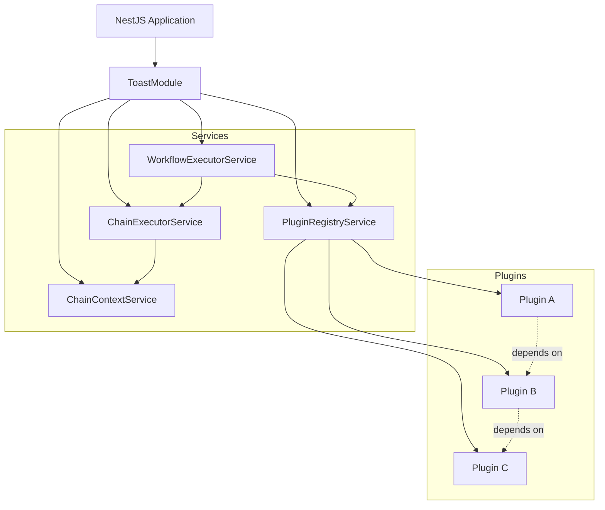
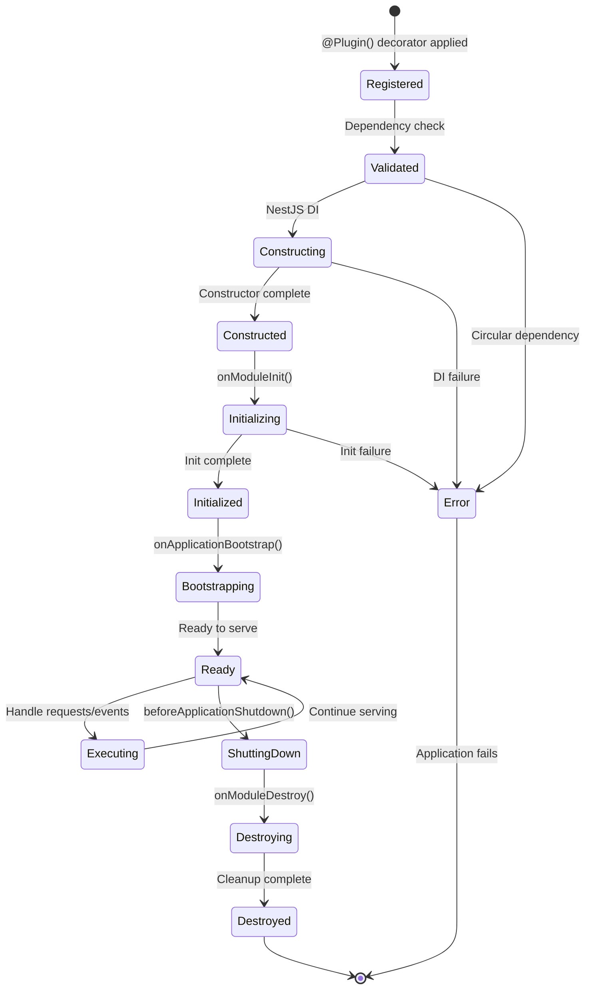
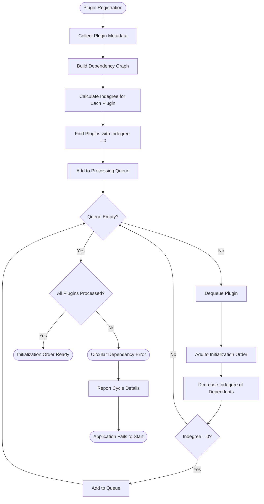
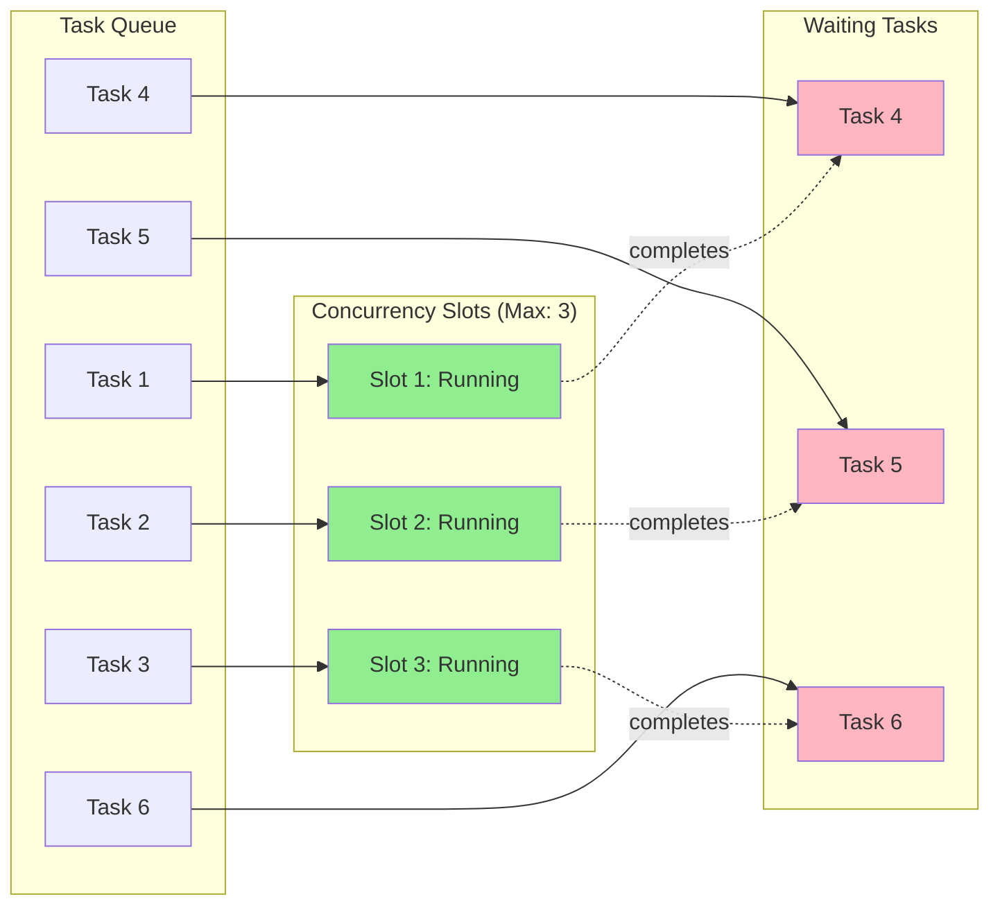
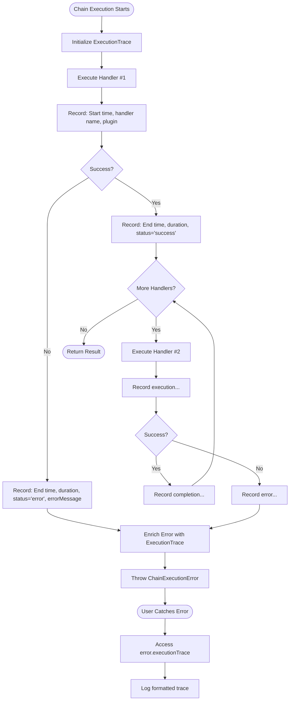
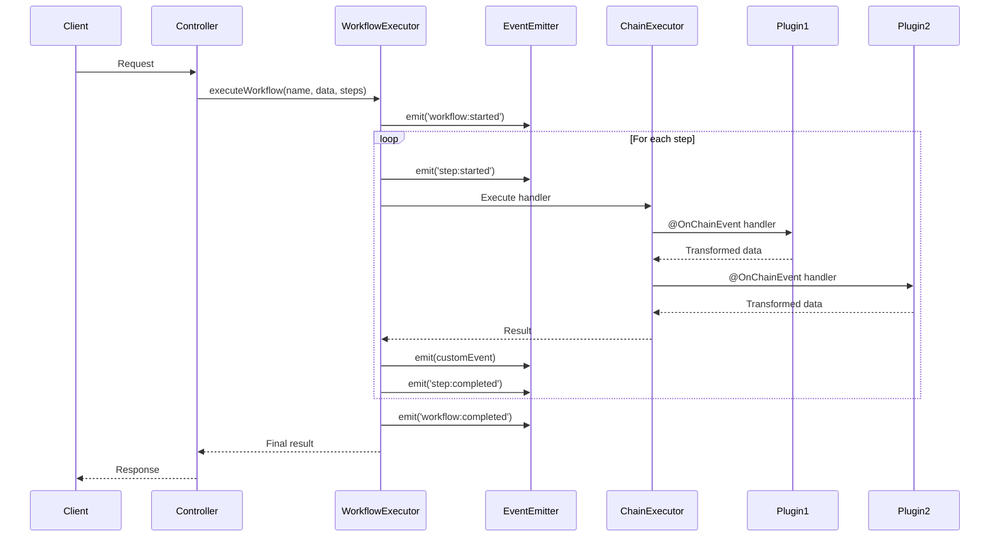
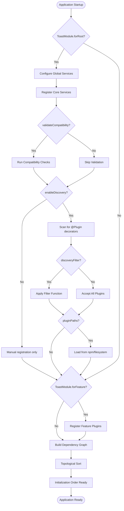
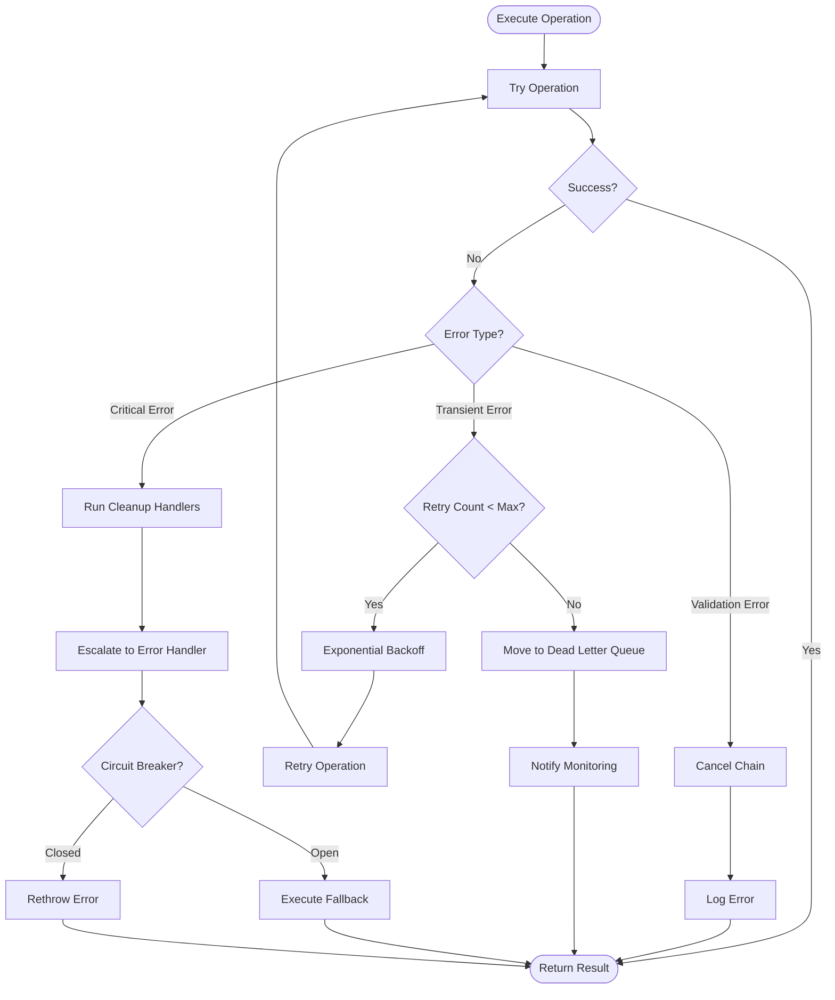

# @azerothian/toast

A NestJS library for plugin architecture, chain execution, and workflow orchestration.

## Table of Contents

1. [Installation](#installation)
2. [Module System Support](#module-system-support)
   - [ESM (Recommended)](#esm-recommended)
   - [CommonJS Support](#commonjs-support)
   - [Package Configuration](#package-configuration)
   - [TypeScript Configuration](#typescript-configuration)
   - [Import Examples](#import-examples)
   - [Choosing a Module System](#choosing-a-module-system)
3. [Development](#development)
4. [Testing](#testing)
   - [Testing Overview](#testing-overview)
   - [Testing Setup](#testing-setup)
   - [Positive Test Cases](#positive-test-cases)
   - [Negative Test Cases](#negative-test-cases)
   - [Integration Tests](#integration-tests)
   - [Performance Tests](#performance-tests)
   - [Test Utilities](#test-utilities)
5. [Quick Start](#quick-start)
6. [Use Cases](#use-cases)
   - [Multi-Tenant SaaS Platform](#multi-tenant-saas-platform)
   - [Data Processing Pipeline](#data-processing-pipeline)
   - [Microservices Orchestration](#microservices-orchestration)
   - [Content Moderation Pipeline](#content-moderation-pipeline)
   - [Feature Flag System](#feature-flag-system)
   - [Background Job Processing](#background-job-processing)
7. [Core Concepts](#core-concepts)
8. [Plugin System](#plugin-system)
   - [@Plugin decorator](#plugin-decorator)
   - [PluginRegistryService](#pluginregistryservice)
   - [Lifecycle hooks](#lifecycle-hooks)
   - [Dependency management](#dependency-management)
   - [Dependency resolution and topological sorting](#dependency-resolution-and-topological-sorting)
9. [Chain Execution](#chain-execution)
   - [ChainContextService](#chaincontextservice)
   - [ChainExecutorService](#chainexecutorservice)
   - [Waterfall execution](#waterfall-execution)
   - [Cancellation](#cancellation)
   - [Parallel execution](#parallel-execution)
   - [Race and allSettled](#race-and-allsettled)
   - [Concurrency control](#concurrency-control)
10. [Workflow Orchestration](#workflow-orchestration)
   - [WorkflowExecutorService](#workflowexecutorservice)
   - [Event-driven workflows](#event-driven-workflows)
   - [Working with ChainEvent](#working-with-chainevent)
   - [Pipeline stages](#pipeline-stages)
11. [Configuration](#configuration)
   - [ToastModule.forRoot() options](#toastmoduleforroot-options)
   - [ToastModule.forFeature()](#toastmoduleforfeature)
12. [API Reference](#api-reference)
   - [Decorators](#decorators)
   - [Services](#services)
   - [Interfaces](#interfaces)
13. [Advanced Patterns](#advanced-patterns)
   - [Conditional loading](#conditional-loading)
   - [Compatibility validation](#compatibility-validation)
   - [Dynamic modules](#dynamic-modules)
14. [Integration Examples](#integration-examples)

---

## Installation

### Installation with ESM (Recommended)

```bash
npm install @azerothian/toast
```

Ensure your `package.json` includes:

```json
{
  "type": "module"
}
```

### Installation with CommonJS

```bash
npm install @azerothian/toast
```

Ensure your `package.json` includes:

```json
{
  "type": "commonjs"
}
```

> **📖 For detailed module system configuration, see [Module System Support](#module-system-support)**

### Peer Dependencies

Ensure you have the following peer dependencies installed:

```bash
npm install @nestjs/common @nestjs/core @nestjs/config @nestjs/event-emitter
```

| Package | Version | Purpose |
|---------|---------|---------|
| `@nestjs/common` | ^10.0.0 | Core NestJS decorators and utilities |
| `@nestjs/core` | ^10.0.0 | NestJS runtime and dependency injection |
| `@nestjs/config` | ^3.0.0 | Configuration management |
| `@nestjs/event-emitter` | ^2.0.0 | Event-driven architecture support |

---

## Module System Support

@azerothian/toast supports both **ESM (ECMAScript Modules)** and **CommonJS** module systems, enabling seamless integration with any NestJS project regardless of your chosen module format.

### ESM (Recommended)

ESM is the modern JavaScript module standard with first-class TypeScript support and better tree-shaking capabilities.

**Installation with ESM:**

```bash
npm install @azerothian/toast
```

**package.json configuration:**

```json
{
  "type": "module"
}
```

**Basic import example:**

```typescript
import { ToastModule } from '@azerothian/toast';
import { Plugin } from '@azerothian/toast';
import { ChainExecutorService } from '@azerothian/toast';
```

### CommonJS Support

CommonJS remains fully supported for legacy projects and specific deployment environments.

**Installation with CommonJS:**

```bash
npm install @azerothian/toast
```

**package.json configuration:**

```json
{
  "type": "commonjs"
}
```

**Basic require example:**

```typescript
const { ToastModule } = require('@azerothian/toast');
const { Plugin } = require('@azerothian/toast');
const { ChainExecutorService } = require('@azerothian/toast');
```

### Package Configuration

**Architecture Overview:**



The library uses conditional exports to provide optimal bundles for each module system:

```json
{
  "type": "module",
  "main": "./dist/index.cjs",
  "module": "./dist/index.mjs",
  "types": "./dist/index.d.ts",
  "exports": {
    ".": {
      "import": {
        "types": "./dist/index.d.ts",
        "default": "./dist/index.mjs"
      },
      "require": {
        "types": "./dist/index.d.cts",
        "default": "./dist/index.cjs"
      }
    }
  }
}
```

This configuration ensures:
- **ESM projects** receive `.mjs` bundles with `.d.ts` types
- **CommonJS projects** receive `.cjs` bundles with `.d.cts` types
- **Tree-shaking** works optimally in ESM builds
- **Backwards compatibility** with older tooling

### TypeScript Configuration

Configure TypeScript based on your chosen module system:

| Setting | ESM | CommonJS |
|---------|-----|----------|
| `module` | `"ES2020"` or `"ESNext"` | `"CommonJS"` |
| `moduleResolution` | `"node16"` or `"bundler"` | `"node"` |
| `esModuleInterop` | Optional | `true` (recommended) |
| `allowSyntheticDefaultImports` | Optional | `true` (recommended) |

**ESM tsconfig.json:**

```json
{
  "compilerOptions": {
    "module": "ES2020",
    "moduleResolution": "node16",
    "target": "ES2020",
    "lib": ["ES2020"],
    "esModuleInterop": true
  }
}
```

**CommonJS tsconfig.json:**

```json
{
  "compilerOptions": {
    "module": "CommonJS",
    "moduleResolution": "node",
    "target": "ES2020",
    "lib": ["ES2020"],
    "esModuleInterop": true,
    "allowSyntheticDefaultImports": true
  }
}
```

### Import Examples

All major exports are available in both module systems:

| Export | ESM | CommonJS |
|--------|-----|----------|
| **ToastModule** | `import { ToastModule } from '@azerothian/toast';` | `const { ToastModule } = require('@azerothian/toast');` |
| **@Plugin decorator** | `import { Plugin } from '@azerothian/toast';` | `const { Plugin } = require('@azerothian/toast');` |
| **@OnChainEvent decorator** | `import { OnChainEvent } from '@azerothian/toast';` | `const { OnChainEvent } = require('@azerothian/toast');` |
| **PluginRegistryService** | `import { PluginRegistryService } from '@azerothian/toast';` | `const { PluginRegistryService } = require('@azerothian/toast');` |
| **ChainContextService** | `import { ChainContextService } from '@azerothian/toast';` | `const { ChainContextService } = require('@azerothian/toast');` |
| **ChainExecutorService** | `import { ChainExecutorService } from '@azerothian/toast';` | `const { ChainExecutorService } = require('@azerothian/toast');` |
| **WorkflowExecutorService** | `import { WorkflowExecutorService } from '@azerothian/toast';` | `const { WorkflowExecutorService } = require('@azerothian/toast');` |
| **Type imports** | `import type { PluginMetadata, ChainEvent } from '@azerothian/toast';` | `const { PluginMetadata, ChainEvent } = require('@azerothian/toast');` |

### Choosing a Module System

**Choose ESM if:**
- ✅ Starting a new project
- ✅ Using modern tooling (Vite, esbuild, Rollup)
- ✅ Want better tree-shaking and smaller bundles
- ✅ Working with async top-level imports
- ✅ Following modern JavaScript standards

**Choose CommonJS if:**
- ✅ Working with legacy codebases
- ✅ Using older tooling or deployment environments
- ✅ Need dynamic require() capabilities
- ✅ Integrating with CommonJS-only dependencies
- ✅ Specific runtime constraints require it

**Migration Path:**

Converting from CommonJS to ESM is straightforward:

1. Update `package.json`: Add `"type": "module"`
2. Update `tsconfig.json`: Set `"module": "ES2020"` and `"moduleResolution": "node16"`
3. Replace `require()` with `import`
4. Replace `module.exports` with `export`
5. Update file extensions if using `.js` files (rename to `.mjs` or keep as `.js` with `"type": "module"`)

---

## Development

@azerothian/toast is developed using TypeScript and Turborepo for monorepo management, enabling modular architecture and efficient build orchestration.

### Technology Stack

| Technology | Purpose |
|------------|---------|
| **TypeScript** | Type-safe development with full IDE support |
| **Turborepo** | Monorepo build system with intelligent caching |
| **NestJS** | Application framework and dependency injection |
| **Jest** | Unit and integration testing |
| **ESLint** | Code quality and style enforcement |

### Monorepo Structure

```
toast/
├── packages/
│   ├── core/           # Core library with plugin system
│   │   ├── src/
│   │   │   ├── decorators/
│   │   │   ├── services/
│   │   │   └── interfaces/
│   │   └── package.json
│   ├── chain/          # Chain execution utilities
│   │   ├── src/
│   │   │   ├── chain-context.service.ts
│   │   │   └── chain-executor.service.ts
│   │   └── package.json
│   └── workflow/       # Workflow orchestration
│       ├── src/
│       │   └── workflow-executor.service.ts
│       └── package.json
├── apps/
│   └── examples/       # Example applications
│       ├── basic/
│       ├── advanced/
│       └── production/
├── turbo.json          # Turborepo configuration
└── package.json        # Workspace root
```

### Build Commands

```bash
# Install dependencies
npm install

# Build all packages
npm run build

# Build specific package
npm run build --filter=@azerothian/toast-core

# Run tests
npm test

# Run tests in watch mode
npm run test:watch

# Lint code
npm run lint

# Type check
npm run type-check
```

### Development Workflow

1. **Package Development**: Work in individual packages under `packages/`
2. **Internal Dependencies**: Packages can depend on each other via workspace protocol
3. **Incremental Builds**: Turborepo caches build outputs for unchanged packages
4. **Parallel Execution**: Tests and builds run in parallel across packages
5. **Type Safety**: Shared TypeScript types ensure consistency across packages

### Turborepo Configuration

The `turbo.json` file defines the build pipeline:

```json
{
  "pipeline": {
    "build": {
      "dependsOn": ["^build"],
      "outputs": ["dist/**"]
    },
    "test": {
      "dependsOn": ["build"],
      "outputs": ["coverage/**"]
    },
    "lint": {
      "outputs": []
    }
  }
}
```

### Build Strategy for Dual Module Support

The library is built to support both ESM and CommonJS module systems using dual builds:

**Build Outputs:**

```
dist/
├── index.mjs          # ESM bundle
├── index.cjs          # CommonJS bundle
├── index.d.ts         # TypeScript definitions (ESM)
├── index.d.cts        # TypeScript definitions (CommonJS)
└── ...
```

**Build Tools:**

The project can use tools like **tsup** or **Rollup** to generate dual builds:

```typescript
// tsup.config.ts example
import { defineConfig } from 'tsup';

export default defineConfig({
  entry: ['src/index.ts'],
  format: ['esm', 'cjs'],
  dts: true,
  splitting: false,
  sourcemap: true,
  clean: true,
});
```

**Benefits:**

- ✅ **Automatic Format Selection**: Node.js and bundlers select the correct format based on package.json configuration
- ✅ **Type Safety**: Separate `.d.ts` and `.d.cts` files ensure proper TypeScript resolution
- ✅ **Optimal Performance**: ESM enables better tree-shaking and code splitting
- ✅ **Backwards Compatibility**: CommonJS ensures compatibility with legacy projects

---

## Testing

### Testing Overview

@azerothian/toast uses **Vitest** as its testing framework, providing fast, ESM-native test execution with excellent NestJS compatibility.

**Why Vitest?**

- ⚡ **Fast**: Vite-powered with instant hot module replacement
- 🎯 **ESM-Native**: First-class ESM support without configuration
- 🔄 **Compatible**: Works seamlessly with NestJS testing patterns
- 📊 **Coverage**: Built-in coverage reporting with v8
- 🛠️ **Developer Experience**: Great error messages and debugging

**Test Organization:**

```
src/
├── __tests__/
│   ├── unit/
│   │   ├── plugin-registry.spec.ts
│   │   ├── chain-executor.spec.ts
│   │   └── workflow-executor.spec.ts
│   ├── integration/
│   │   ├── plugin-lifecycle.spec.ts
│   │   └── complex-workflows.spec.ts
│   └── e2e/
│       └── application.spec.ts
└── test-utils/
    ├── test-plugin-factory.ts
    └── mock-context.ts
```

### Testing Setup

**vitest.config.ts:**

```typescript
import { defineConfig } from 'vitest/config';

export default defineConfig({
  test: {
    globals: true,
    environment: 'node',
    coverage: {
      provider: 'v8',
      reporter: ['text', 'json', 'html'],
      exclude: [
        '**/*.spec.ts',
        '**/*.test.ts',
        '**/dist/**',
        '**/node_modules/**',
      ],
      lines: 80,
      functions: 80,
      branches: 80,
      statements: 80,
    },
    include: ['src/**/*.spec.ts'],
    setupFiles: ['./test/setup.ts'],
  },
});
```

**test/setup.ts:**

```typescript
import { beforeAll, afterAll } from 'vitest';

beforeAll(() => {
  // Global test setup
});

afterAll(() => {
  // Global test cleanup
});
```

### Positive Test Cases

#### Plugin System Tests

```typescript
import { describe, it, expect, beforeEach } from 'vitest';
import { Test } from '@nestjs/testing';
import { ToastModule, PluginRegistryService, Plugin } from '@azerothian/toast';
import { Injectable } from '@nestjs/common';

describe('PluginRegistryService', () => {
  let registry: PluginRegistryService;

  @Plugin({ name: 'test-plugin', version: '1.0.0' })
  @Injectable()
  class TestPlugin {}

  beforeEach(async () => {
    const module = await Test.createTestingModule({
      imports: [ToastModule.forRoot()],
      providers: [TestPlugin],
    }).compile();

    registry = module.get<PluginRegistryService>(PluginRegistryService);
  });

  it('should register plugin successfully', () => {
    expect(registry.hasPlugin('test-plugin')).toBe(true);
  });

  it('should retrieve plugin instance', () => {
    const plugin = registry.getPlugin<TestPlugin>('test-plugin');
    expect(plugin).toBeInstanceOf(TestPlugin);
  });

  it('should return plugin metadata', () => {
    const metadata = registry.getPluginMetadata('test-plugin');
    expect(metadata).toEqual({
      name: 'test-plugin',
      version: '1.0.0',
    });
  });
});
```

#### Dependency Resolution Tests

```typescript
describe('Dependency Resolution', () => {
  @Plugin({ name: 'base', version: '1.0.0' })
  @Injectable()
  class BasePlugin {}

  @Plugin({ name: 'dependent', version: '1.0.0', dependencies: ['base'] })
  @Injectable()
  class DependentPlugin {}

  it('should resolve dependencies in correct order', async () => {
    const module = await Test.createTestingModule({
      imports: [ToastModule.forRoot()],
      providers: [BasePlugin, DependentPlugin],
    }).compile();

    const registry = module.get<PluginRegistryService>(PluginRegistryService);
    const order = registry.getInitializationOrder();

    expect(order.indexOf('base')).toBeLessThan(order.indexOf('dependent'));
  });
});
```

#### Chain Execution Tests

```typescript
describe('ChainExecutorService', () => {
  let executor: ChainExecutorService;

  beforeEach(async () => {
    const module = await Test.createTestingModule({
      imports: [ToastModule.forRoot()],
    }).compile();

    executor = module.get<ChainExecutorService>(ChainExecutorService);
  });

  it('should execute waterfall chain successfully', async () => {
    const result = await executor.waterfall(1, [
      async (n) => n + 1,
      async (n) => n * 2,
      async (n) => n + 10,
    ]);

    expect(result).toBe(14); // ((1 + 1) * 2) + 10
  });

  it('should execute parallel operations', async () => {
    const results = await executor.parallel('test', [
      async (s) => s.toUpperCase(),
      async (s) => s.length,
      async (s) => s.repeat(2),
    ]);

    expect(results).toEqual(['TEST', 4, 'testtest']);
  });

  it('should return first result in race', async () => {
    const result = await executor.race(5, [
      async (n) => {
        await new Promise(resolve => setTimeout(resolve, 100));
        return n * 2;
      },
      async (n) => n + 1, // Fastest
      async (n) => {
        await new Promise(resolve => setTimeout(resolve, 200));
        return n * 3;
      },
    ]);

    expect(result).toBe(6); // 5 + 1 (fastest operation)
  });
});
```

#### Workflow Execution Tests

```typescript
describe('WorkflowExecutorService', () => {
  let workflowExecutor: WorkflowExecutorService;
  const events: string[] = [];

  beforeEach(async () => {
    const module = await Test.createTestingModule({
      imports: [
        ToastModule.forRoot(),
        EventEmitterModule.forRoot(),
      ],
    }).compile();

    workflowExecutor = module.get<WorkflowExecutorService>(WorkflowExecutorService);
    events.length = 0;
  });

  it('should execute workflow with event emission', async () => {
    const result = await workflowExecutor.executeWorkflow('test-workflow', { value: 1 }, [
      {
        name: 'step1',
        handler: async (data) => ({ ...data, step1: true }),
        emitEvent: 'step1:completed',
      },
      {
        name: 'step2',
        handler: async (data) => ({ ...data, step2: true }),
        emitEvent: 'step2:completed',
      },
    ]);

    expect(result).toEqual({ value: 1, step1: true, step2: true });
  });
});
```

### Negative Test Cases

#### Circular Dependency Detection

```typescript
describe('Circular Dependency Detection', () => {
  @Plugin({ name: 'plugin-a', version: '1.0.0', dependencies: ['plugin-b'] })
  @Injectable()
  class PluginA {}

  @Plugin({ name: 'plugin-b', version: '1.0.0', dependencies: ['plugin-c'] })
  @Injectable()
  class PluginB {}

  @Plugin({ name: 'plugin-c', version: '1.0.0', dependencies: ['plugin-a'] })
  @Injectable()
  class PluginC {}

  it('should throw error on circular dependencies', async () => {
    await expect(async () => {
      const module = await Test.createTestingModule({
        imports: [ToastModule.forRoot()],
        providers: [PluginA, PluginB, PluginC],
      }).compile();
    }).rejects.toThrow('Circular dependency detected');
  });
});
```

#### Missing Dependencies

```typescript
describe('Missing Dependencies', () => {
  @Plugin({ name: 'dependent', version: '1.0.0', dependencies: ['missing'] })
  @Injectable()
  class DependentPlugin {}

  it('should throw error on missing required dependency', async () => {
    await expect(async () => {
      await Test.createTestingModule({
        imports: [ToastModule.forRoot()],
        providers: [DependentPlugin],
      }).compile();
    }).rejects.toThrow();
  });
});
```

#### Incompatible Plugins

```typescript
describe('Incompatible Plugins', () => {
  @Plugin({ name: 'plugin-a', version: '1.0.0', incompatibleWith: ['plugin-b'] })
  @Injectable()
  class PluginA {}

  @Plugin({ name: 'plugin-b', version: '1.0.0' })
  @Injectable()
  class PluginB {}

  it('should throw error when incompatible plugins are loaded', async () => {
    await expect(async () => {
      await Test.createTestingModule({
        imports: [ToastModule.forRoot({ validateCompatibility: true })],
        providers: [PluginA, PluginB],
      }).compile();
    }).rejects.toThrow('incompatible');
  });
});
```

#### Chain Cancellation

```typescript
describe('Chain Cancellation', () => {
  let executor: ChainExecutorService;
  let context: ChainContextService;

  beforeEach(async () => {
    const module = await Test.createTestingModule({
      imports: [ToastModule.forRoot()],
    }).compile();

    executor = module.get<ChainExecutorService>(ChainExecutorService);
    context = module.get<ChainContextService>(ChainContextService);
  });

  it('should stop execution when cancelled', async () => {
    const executed: number[] = [];

    const result = await executor.waterfall(1, [
      async (n) => {
        executed.push(1);
        return n + 1;
      },
      async (n) => {
        executed.push(2);
        context.cancel(new Error('Cancelled'));
        return n + 1;
      },
      async (n) => {
        executed.push(3); // Should not execute
        return n + 1;
      },
    ]);

    expect(executed).toEqual([1, 2]);
    expect(context.isCancelled()).toBe(true);
  });
});
```

#### Timeout Enforcement

```typescript
describe('Timeout Enforcement', () => {
  it('should timeout long-running operations', async () => {
    const executor = new ChainExecutorService();

    await expect(async () => {
      await executor.waterfall(1, [
        async (n) => {
          await new Promise(resolve => setTimeout(resolve, 5000));
          return n;
        },
      ], { timeout: 100 });
    }).rejects.toThrow('timeout');
  });
});
```

### Integration Tests

#### Complete Plugin Lifecycle

```typescript
describe('Plugin Lifecycle Integration', () => {
  let initCalled = false;
  let bootstrapCalled = false;
  let destroyCalled = false;

  @Plugin({ name: 'lifecycle-test', version: '1.0.0' })
  @Injectable()
  class LifecyclePlugin implements OnModuleInit, OnApplicationBootstrap, OnModuleDestroy {
    async onModuleInit() {
      initCalled = true;
    }

    async onApplicationBootstrap() {
      bootstrapCalled = true;
    }

    async onModuleDestroy() {
      destroyCalled = true;
    }
  }

  it('should execute all lifecycle hooks in order', async () => {
    const module = await Test.createTestingModule({
      imports: [ToastModule.forRoot()],
      providers: [LifecyclePlugin],
    }).compile();

    await module.init();
    expect(initCalled).toBe(true);

    await module.close();
    expect(destroyCalled).toBe(true);
  });
});
```

#### Complex Dependency Graph

```typescript
describe('Complex Dependency Graph', () => {
  @Plugin({ name: 'config', version: '1.0.0' })
  @Injectable()
  class ConfigPlugin {}

  @Plugin({ name: 'logger', version: '1.0.0', dependencies: ['config'] })
  @Injectable()
  class LoggerPlugin {}

  @Plugin({ name: 'database', version: '1.0.0', dependencies: ['config', 'logger'] })
  @Injectable()
  class DatabasePlugin {}

  @Plugin({ name: 'cache', version: '1.0.0', dependencies: ['config'] })
  @Injectable()
  class CachePlugin {}

  @Plugin({ name: 'auth', version: '1.0.0', dependencies: ['database', 'cache'] })
  @Injectable()
  class AuthPlugin {}

  it('should resolve complex dependency graph', async () => {
    const module = await Test.createTestingModule({
      imports: [ToastModule.forRoot()],
      providers: [ConfigPlugin, LoggerPlugin, DatabasePlugin, CachePlugin, AuthPlugin],
    }).compile();

    const registry = module.get<PluginRegistryService>(PluginRegistryService);
    const order = registry.getInitializationOrder();

    // Config should be first
    expect(order[0]).toBe('config');

    // Auth should be last
    expect(order[order.length - 1]).toBe('auth');

    // Database and cache should come before auth
    expect(order.indexOf('database')).toBeLessThan(order.indexOf('auth'));
    expect(order.indexOf('cache')).toBeLessThan(order.indexOf('auth'));
  });
});
```

### Performance Tests

```typescript
describe('Performance Tests', () => {
  it('should execute 100 parallel plugins within 1 second', async () => {
    const module = await Test.createTestingModule({
      imports: [ToastModule.forRoot()],
    }).compile();

    const executor = module.get<ChainExecutorService>(ChainExecutorService);

    const handlers = Array.from({ length: 100 }, (_, i) =>
      async (input: number) => input + i
    );

    const start = Date.now();
    const results = await executor.parallel(0, handlers);
    const duration = Date.now() - start;

    expect(duration).toBeLessThan(1000);
    expect(results).toHaveLength(100);
  });

  it('should handle large context objects efficiently', async () => {
    const largeData = {
      items: Array.from({ length: 10000 }, (_, i) => ({ id: i, value: `item-${i}` })),
    };

    const module = await Test.createTestingModule({
      imports: [ToastModule.forRoot()],
    }).compile();

    const executor = module.get<ChainExecutorService>(ChainExecutorService);

    const start = Date.now();
    await executor.waterfall(largeData, [
      async (data) => ({ ...data, processed: true }),
      async (data) => ({ ...data, validated: true }),
    ]);
    const duration = Date.now() - start;

    expect(duration).toBeLessThan(100);
  });
});
```

### Test Utilities

**test-utils/test-plugin-factory.ts:**

```typescript
import { Plugin } from '@azerothian/toast';
import { Injectable } from '@nestjs/common';

export interface TestPluginOptions {
  name: string;
  version?: string;
  dependencies?: string[];
  optionalDependencies?: string[];
  incompatibleWith?: string[];
}

export function createTestPlugin(options: TestPluginOptions) {
  @Plugin({
    name: options.name,
    version: options.version || '1.0.0',
    dependencies: options.dependencies,
    optionalDependencies: options.optionalDependencies,
    incompatibleWith: options.incompatibleWith,
  })
  @Injectable()
  class TestPlugin {
    public initialized = false;
    public bootstrapped = false;

    async onModuleInit() {
      this.initialized = true;
    }

    async onApplicationBootstrap() {
      this.bootstrapped = true;
    }
  }

  return TestPlugin;
}
```

**test-utils/mock-context.ts:**

```typescript
import { ChainContext } from '@azerothian/toast';

export function createMockContext(overrides?: Partial<ChainContext>): ChainContext {
  return {
    cancelled: false,
    results: new Map(),
    ...overrides,
  };
}
```

---

## Quick Start

### 1. Import ToastModule

**ESM (Recommended):**

```typescript
// app.module.ts
import { Module } from '@nestjs/common';
import { ToastModule } from '@azerothian/toast';

@Module({
  imports: [
    ToastModule.forRoot({
      validateCompatibility: true,
      enableDiscovery: true,
    }),
  ],
})
export class AppModule {}
```

<details>
<summary>CommonJS Alternative</summary>

```typescript
// app.module.ts
const { Module } = require('@nestjs/common');
const { ToastModule } = require('@azerothian/toast');

@Module({
  imports: [
    ToastModule.forRoot({
      validateCompatibility: true,
      enableDiscovery: true,
    }),
  ],
})
export class AppModule {}
```

</details>

### 2. Create a Plugin

**ESM (Recommended):**

```typescript
// plugins/database/database.plugin.ts
import { Injectable, OnModuleInit, OnModuleDestroy } from '@nestjs/common';
import { Plugin } from '@azerothian/toast';
import { ConfigService } from '@nestjs/config';

@Plugin({
  name: 'database',
  version: '1.0.0',
})
@Injectable()
export class DatabasePlugin implements OnModuleInit, OnModuleDestroy {
  private pool: Pool;

  constructor(private readonly configService: ConfigService) {}

  async onModuleInit(): Promise<void> {
    const config = this.configService.get('database');
    this.pool = await createPool(config);
  }

  async onModuleDestroy(): Promise<void> {
    await this.pool.end();
  }

  getPool(): Pool {
    return this.pool;
  }
}
```

<details>
<summary>CommonJS Alternative</summary>

```typescript
// plugins/database/database.plugin.ts
const { Injectable, OnModuleInit, OnModuleDestroy } = require('@nestjs/common');
const { Plugin } = require('@azerothian/toast');
const { ConfigService } = require('@nestjs/config');

@Plugin({
  name: 'database',
  version: '1.0.0',
})
@Injectable()
export class DatabasePlugin implements OnModuleInit, OnModuleDestroy {
  private pool: Pool;

  constructor(private readonly configService: ConfigService) {}

  async onModuleInit(): Promise<void> {
    const config = this.configService.get('database');
    this.pool = await createPool(config);
  }

  async onModuleDestroy(): Promise<void> {
    await this.pool.end();
  }

  getPool(): Pool {
    return this.pool;
  }
}
```

</details>

### 3. Register the Plugin

**ESM (Recommended):**

```typescript
// plugins/database/database.module.ts
import { Module } from '@nestjs/common';
import { ToastModule } from '@azerothian/toast';
import { DatabasePlugin } from './database.plugin';

@Module({
  imports: [ToastModule.forFeature()],
  providers: [DatabasePlugin],
  exports: [DatabasePlugin],
})
export class DatabaseModule {}
```

<details>
<summary>CommonJS Alternative</summary>

```typescript
// plugins/database/database.module.ts
const { Module } = require('@nestjs/common');
const { ToastModule } = require('@azerothian/toast');
const { DatabasePlugin } = require('./database.plugin');

@Module({
  imports: [ToastModule.forFeature()],
  providers: [DatabasePlugin],
  exports: [DatabasePlugin],
})
export class DatabaseModule {}
```

</details>

### 4. Use Chain Execution

**ESM (Recommended):**

```typescript
// services/order.service.ts
import { Injectable } from '@nestjs/common';
import { ChainExecutorService } from '@azerothian/toast';

@Injectable()
export class OrderService {
  constructor(private readonly chainExecutor: ChainExecutorService) {}

  async processOrder(order: Order): Promise<Order> {
    return this.chainExecutor.waterfall(order, [
      async (o) => this.validateOrder(o),
      async (o) => this.calculateTotals(o),
      async (o) => this.applyDiscounts(o),
      async (o) => this.processPayment(o),
    ]);
  }
}
```

<details>
<summary>CommonJS Alternative</summary>

```typescript
// services/order.service.ts
const { Injectable } = require('@nestjs/common');
const { ChainExecutorService } = require('@azerothian/toast');

@Injectable()
export class OrderService {
  constructor(private readonly chainExecutor: ChainExecutorService) {}

  async processOrder(order: Order): Promise<Order> {
    return this.chainExecutor.waterfall(order, [
      async (o) => this.validateOrder(o),
      async (o) => this.calculateTotals(o),
      async (o) => this.applyDiscounts(o),
      async (o) => this.processPayment(o),
    ]);
  }
}
```

</details>

---

## Use Cases

This section demonstrates real-world applications of @azerothian/toast across different architectural patterns and business domains.

### Multi-Tenant SaaS Platform

**Scenario**: E-commerce platform with tenant-specific customizations and order processing workflows.

**Challenge**: Each tenant requires different validation rules, pricing calculations, tax computations, and payment processing logic that must execute in the correct order.

**Solution**: Use waterfall execution with dependency-ordered plugins to ensure each tenant's customizations are applied correctly.

```typescript
// plugins/tenant-validator.plugin.ts
import { Injectable } from '@nestjs/common';
import { Plugin, OnChainEvent } from '@azerothian/toast';

interface Order {
  tenantId: string;
  items: Array<{ id: string; quantity: number }>;
  total?: number;
  tax?: number;
}

@Plugin({ name: 'tenant-validator', version: '1.0.0' })
@Injectable()
export class TenantValidatorPlugin {
  @OnChainEvent('order:process')
  async validateTenant(order: Order): Promise<Order> {
    const tenant = await this.tenantService.findById(order.tenantId);

    if (!tenant.active) {
      throw new Error('Tenant is not active');
    }

    return {
      ...order,
      tenantConfig: tenant.config,
    };
  }
}

// plugins/pricing-calculator.plugin.ts
@Plugin({
  name: 'pricing-calculator',
  version: '1.0.0',
  dependencies: ['tenant-validator'], // Runs after tenant validation
})
@Injectable()
export class PricingCalculatorPlugin {
  @OnChainEvent('order:process')
  async calculatePricing(order: Order): Promise<Order> {
    const prices = await this.getPricesForTenant(order.tenantId, order.items);

    const total = order.items.reduce((sum, item) => {
      const price = prices[item.id] || 0;
      return sum + (price * item.quantity);
    }, 0);

    return { ...order, total };
  }
}

// plugins/tax-calculator.plugin.ts
@Plugin({
  name: 'tax-calculator',
  version: '1.0.0',
  dependencies: ['pricing-calculator'], // Runs after pricing
})
@Injectable()
export class TaxCalculatorPlugin {
  @OnChainEvent('order:process')
  async calculateTax(order: Order): Promise<Order> {
    const taxRate = await this.getTaxRateForTenant(order.tenantId);
    const tax = order.total * taxRate;

    return {
      ...order,
      tax,
      total: order.total + tax,
    };
  }
}

// plugins/payment-processor.plugin.ts
@Plugin({
  name: 'payment-processor',
  version: '1.0.0',
  dependencies: ['tax-calculator'], // Runs after tax calculation
})
@Injectable()
export class PaymentProcessorPlugin {
  @OnChainEvent('order:process')
  async processPayment(order: Order): Promise<Order> {
    const paymentResult = await this.paymentGateway.charge(
      order.tenantId,
      order.total,
    );

    return {
      ...order,
      paymentId: paymentResult.id,
      paid: true,
    };
  }
}

// services/order.service.ts
@Injectable()
export class OrderService {
  constructor(private readonly workflowExecutor: WorkflowExecutorService) {}

  async processOrder(order: Order): Promise<Order> {
    // Plugins execute in dependency order automatically
    return this.workflowExecutor.executeWorkflow('order-processing', order, [
      {
        name: 'process',
        handler: async (o) => o, // Plugins handle via @OnChainEvent
        emitEvent: 'order:process',
      },
    ]);
  }
}
```

**Benefits**:
- ✅ Tenant-specific customizations through plugin dependencies
- ✅ Guaranteed execution order through topological sorting
- ✅ Easy to add new processing steps without modifying existing code
- ✅ Type-safe data transformation through the pipeline

### Data Processing Pipeline

**Scenario**: ETL (Extract, Transform, Load) pipeline for analytics data processing.

**Challenge**: Extract data from multiple sources, transform it through multiple stages, and load it into a data warehouse with proper error handling and observability.

**Solution**: Use pipeline execution with named stages and timing information for monitoring.

```typescript
// services/etl.service.ts
import { Injectable } from '@nestjs/common';
import { ChainExecutorService } from '@azerothian/toast';

interface RawData {
  source: string;
  records: any[];
}

interface TransformedData extends RawData {
  normalized?: boolean;
  validated?: boolean;
  enriched?: boolean;
  loaded?: boolean;
}

@Injectable()
export class ETLService {
  constructor(
    private readonly chainExecutor: ChainExecutorService,
    private readonly logger: Logger,
  ) {}

  async processData(sources: string[]): Promise<void> {
    // Extract from multiple sources in parallel
    const rawDataSets = await this.chainExecutor.parallel(sources,
      sources.map(source => async () => this.extract(source))
    );

    // Process each dataset through transformation pipeline
    for (const rawData of rawDataSets) {
      const { output, timing } = await this.chainExecutor.pipeline<RawData, TransformedData>(
        rawData,
        [
          { name: 'normalize', handler: async (d) => this.normalize(d) },
          { name: 'validate', handler: async (d) => this.validate(d) },
          { name: 'enrich', handler: async (d) => this.enrich(d) },
          { name: 'load', handler: async (d) => this.load(d) },
        ],
      );

      // Log timing for each stage
      this.logPipelineTiming(rawData.source, timing);
    }
  }

  private async extract(source: string): Promise<RawData> {
    const records = await this.dataSource.fetch(source);
    return { source, records };
  }

  private async normalize(data: RawData): Promise<TransformedData> {
    const normalized = data.records.map(r => this.normalizeRecord(r));
    return { ...data, records: normalized, normalized: true };
  }

  private async validate(data: TransformedData): Promise<TransformedData> {
    const validated = data.records.filter(r => this.isValid(r));
    this.logger.log(`Validated ${validated.length}/${data.records.length} records`);
    return { ...data, records: validated, validated: true };
  }

  private async enrich(data: TransformedData): Promise<TransformedData> {
    const enriched = await Promise.all(
      data.records.map(r => this.enrichRecord(r))
    );
    return { ...data, records: enriched, enriched: true };
  }

  private async load(data: TransformedData): Promise<TransformedData> {
    await this.warehouse.bulkInsert(data.records);
    return { ...data, loaded: true };
  }

  private logPipelineTiming(source: string, timing: Map<string, number>): void {
    const total = Array.from(timing.values()).reduce((a, b) => a + b, 0);
    this.logger.log(`Pipeline for ${source} completed in ${total}ms`, {
      source,
      stages: Object.fromEntries(timing),
      total,
    });
  }
}
```

**Benefits**:
- ✅ Parallel extraction from multiple sources
- ✅ Sequential transformation with timing metrics
- ✅ Built-in observability through pipeline stages
- ✅ Easy to add new transformation steps

### Microservices Orchestration

**Scenario**: Order fulfillment system coordinating inventory, payment, and shipping services.

**Challenge**: Coordinate multiple microservices with different response times, handle failures gracefully, and select the fastest shipping provider.

**Solution**: Use parallel execution for independent services and race execution for shipping provider selection.

```typescript
// services/fulfillment.service.ts
import { Injectable } from '@nestjs/common';
import { ChainExecutorService } from '@azerothian/toast';

interface Order {
  id: string;
  items: Array<{ sku: string; quantity: number }>;
  customerId: string;
  shippingAddress: Address;
}

interface FulfillmentResult {
  inventoryReserved: boolean;
  paymentProcessed: boolean;
  shippingProvider: string;
  estimatedDelivery: Date;
}

@Injectable()
export class FulfillmentService {
  constructor(
    private readonly chainExecutor: ChainExecutorService,
    private readonly inventoryService: InventoryService,
    private readonly paymentService: PaymentService,
    private readonly shippingService: ShippingService,
  ) {}

  async fulfillOrder(order: Order): Promise<FulfillmentResult> {
    // Execute inventory and payment checks in parallel
    const [inventoryResult, paymentResult] = await this.chainExecutor.parallel(
      order,
      [
        async (o) => this.reserveInventory(o),
        async (o) => this.processPayment(o),
      ]
    );

    // Select fastest shipping provider using race
    const shippingQuote = await this.chainExecutor.race(order, [
      async (o) => this.shippingService.getQuote('fedex', o),
      async (o) => this.shippingService.getQuote('ups', o),
      async (o) => this.shippingService.getQuote('dhl', o),
    ]);

    return {
      inventoryReserved: inventoryResult.success,
      paymentProcessed: paymentResult.success,
      shippingProvider: shippingQuote.provider,
      estimatedDelivery: shippingQuote.estimatedDelivery,
    };
  }

  private async reserveInventory(order: Order) {
    return this.inventoryService.reserve(order.items);
  }

  private async processPayment(order: Order) {
    return this.paymentService.charge(order.customerId, order.total);
  }
}
```

**Benefits**:
- ✅ Parallel execution reduces total latency
- ✅ Race execution selects fastest provider
- ✅ Independent service failures are isolated
- ✅ Easy to add new shipping providers

### Content Moderation Pipeline

**Scenario**: Multi-stage content validation before publishing user-generated content.

**Challenge**: Apply multiple validation layers (spam detection, profanity filtering, AI analysis, human review) in sequence with the ability to cancel at any stage.

**Solution**: Use waterfall execution with cancellation support to stop processing when content fails validation.

```typescript
// plugins/content-moderation/spam-detector.plugin.ts
import { Injectable } from '@nestjs/common';
import { Plugin, OnChainEvent, ChainContextService } from '@azerothian/toast';

interface Content {
  id: string;
  text: string;
  authorId: string;
  validated?: boolean;
  moderationFlags?: string[];
}

@Plugin({ name: 'spam-detector', version: '1.0.0' })
@Injectable()
export class SpamDetectorPlugin {
  constructor(private readonly chainContext: ChainContextService) {}

  @OnChainEvent('content:validate')
  async detectSpam(content: Content): Promise<Content> {
    const isSpam = await this.checkSpam(content.text);

    if (isSpam) {
      // Cancel the chain - no further processing
      this.chainContext.cancel(new Error('Spam detected'));
      return content;
    }

    return {
      ...content,
      moderationFlags: [...(content.moderationFlags || []), 'spam-checked'],
    };
  }
}

@Plugin({
  name: 'profanity-filter',
  version: '1.0.0',
  dependencies: ['spam-detector'],
})
@Injectable()
export class ProfanityFilterPlugin {
  constructor(private readonly chainContext: ChainContextService) {}

  @OnChainEvent('content:validate')
  async filterProfanity(content: Content): Promise<Content> {
    const hasProfanity = await this.detectProfanity(content.text);

    if (hasProfanity) {
      this.chainContext.cancel(new Error('Profanity detected'));
      return content;
    }

    return {
      ...content,
      moderationFlags: [...(content.moderationFlags || []), 'profanity-checked'],
    };
  }
}

@Plugin({
  name: 'ai-analyzer',
  version: '1.0.0',
  dependencies: ['profanity-filter'],
})
@Injectable()
export class AIAnalyzerPlugin {
  @OnChainEvent('content:validate')
  async analyzeContent(content: Content): Promise<Content> {
    const analysis = await this.aiService.analyze(content.text);

    return {
      ...content,
      aiScore: analysis.score,
      moderationFlags: [...(content.moderationFlags || []), 'ai-analyzed'],
    };
  }
}

@Plugin({
  name: 'human-review',
  version: '1.0.0',
  dependencies: ['ai-analyzer'],
})
@Injectable()
export class HumanReviewPlugin {
  @OnChainEvent('content:validate')
  async queueForReview(content: Content): Promise<Content> {
    // Only queue low-confidence content for human review
    if (content.aiScore < 0.7) {
      await this.reviewQueue.add(content);

      return {
        ...content,
        validated: false,
        requiresHumanReview: true,
      };
    }

    return {
      ...content,
      validated: true,
    };
  }
}

// services/content.service.ts
@Injectable()
export class ContentService {
  constructor(
    private readonly workflowExecutor: WorkflowExecutorService,
    private readonly chainContext: ChainContextService,
  ) {}

  async validateContent(content: Content): Promise<Content> {
    const result = await this.workflowExecutor.executeWorkflow(
      'content-validation',
      content,
      [
        {
          name: 'validate',
          handler: async (c) => c,
          emitEvent: 'content:validate',
        },
      ],
    );

    if (this.chainContext.isCancelled()) {
      const reason = this.chainContext.getReason();
      throw new ValidationError(reason.message);
    }

    return result;
  }
}
```

**Benefits**:
- ✅ Early termination when content fails validation
- ✅ Progressive validation layers
- ✅ Flexible human review integration
- ✅ Clear audit trail through moderation flags

### Feature Flag System

**Scenario**: Dynamic plugin loading based on feature flags and tenant configuration.

**Challenge**: Load different sets of plugins based on runtime configuration without restarting the application.

**Solution**: Use conditional plugin loading with ConfigService integration.

```typescript
// app.module.ts
import { Module, DynamicModule } from '@nestjs/common';
import { ConfigModule, ConfigService } from '@nestjs/config';
import { ToastModule } from '@azerothian/toast';

@Module({})
export class AppModule {
  static forRoot(): DynamicModule {
    const imports = [
      ConfigModule.forRoot({ isGlobal: true }),
      ToastModule.forRoot({
        enableDiscovery: true,
        discoveryFilter: (metadata) => {
          // Filter plugins based on feature flags
          const configService = new ConfigService();
          const enabledFeatures = configService.get<string[]>('ENABLED_FEATURES') || [];

          // Check if plugin's feature is enabled
          const requiredFeature = metadata.tags?.find(tag => tag.startsWith('feature:'));
          if (requiredFeature) {
            const featureName = requiredFeature.replace('feature:', '');
            return enabledFeatures.includes(featureName);
          }

          return true; // Load plugins without feature tags
        },
      }),
    ];

    return {
      module: AppModule,
      imports,
    };
  }
}

// plugins/analytics.plugin.ts
@Plugin({
  name: 'analytics',
  version: '1.0.0',
  tags: ['feature:analytics'], // Only loads if 'analytics' feature is enabled
})
@Injectable()
export class AnalyticsPlugin {
  @OnChainEvent('**')
  async trackEvent(data: any): Promise<any> {
    await this.analytics.track(data);
    return data;
  }
}

// plugins/advanced-search.plugin.ts
@Plugin({
  name: 'advanced-search',
  version: '1.0.0',
  tags: ['feature:advanced-search'],
})
@Injectable()
export class AdvancedSearchPlugin {
  // Only available when feature flag is enabled
}
```

**Benefits**:
- ✅ Runtime feature toggling
- ✅ Gradual rollout capabilities
- ✅ A/B testing support
- ✅ Tenant-specific features

### Background Job Processing

**Scenario**: Queue-based task processing with priority, retries, and timeout handling.

**Challenge**: Process background jobs with proper error handling, retry logic, and concurrency control.

**Solution**: Use workflow execution with timeout and retry configuration, combined with concurrency control.

```typescript
// services/job-processor.service.ts
import { Injectable } from '@nestjs/common';
import { ChainExecutorService, WorkflowExecutorService } from '@azerothian/toast';

interface Job {
  id: string;
  type: string;
  payload: any;
  priority: number;
  retries: number;
  maxRetries: number;
}

@Injectable()
export class JobProcessorService {
  constructor(
    private readonly workflowExecutor: WorkflowExecutorService,
    private readonly chainExecutor: ChainExecutorService,
  ) {}

  async processJobQueue(jobs: Job[]): Promise<void> {
    // Sort by priority
    const sortedJobs = jobs.sort((a, b) => b.priority - a.priority);

    // Process with concurrency limit
    const handlers = sortedJobs.map(job => async () => this.processJob(job));

    const results = await this.chainExecutor.allSettled(null, handlers, {
      concurrency: 5, // Process 5 jobs at a time
    });

    // Handle failures
    const failed = results.filter(r => r.status === 'rejected');
    for (const failure of failed) {
      await this.handleFailure(failure);
    }
  }

  private async processJob(job: Job): Promise<Job> {
    try {
      const result = await this.workflowExecutor.executeWorkflow(
        `job-${job.type}`,
        job,
        [
          {
            name: 'validate',
            handler: async (j) => this.validateJob(j),
            emitEvent: (data) => ({
              name: 'job:validated',
              data,
              timestamp: Date.now(),
              tags: ['background-job'],
              metadata: { jobType: data.type },
            }),
          },
          {
            name: 'execute',
            handler: async (j) => this.executeJob(j),
            emitEvent: (data) => ({
              name: 'job:executed',
              data,
              timestamp: Date.now(),
              tags: ['background-job', 'completed'],
            }),
          },
        ],
        {
          timeout: 30000, // 30 second timeout
        },
      );

      return result;
    } catch (error) {
      if (job.retries < job.maxRetries) {
        // Retry with exponential backoff
        await this.retryJob({ ...job, retries: job.retries + 1 });
      } else {
        // Move to dead letter queue
        await this.deadLetterQueue.add(job);
      }
      throw error;
    }
  }

  private async validateJob(job: Job): Promise<Job> {
    // Validation logic
    return job;
  }

  private async executeJob(job: Job): Promise<Job> {
    // Execute based on job type
    const handler = this.getJobHandler(job.type);
    await handler(job.payload);
    return job;
  }

  private async retryJob(job: Job): Promise<void> {
    const delay = Math.pow(2, job.retries) * 1000; // Exponential backoff
    setTimeout(() => this.processJob(job), delay);
  }
}
```

**Benefits**:
- ✅ Priority-based processing
- ✅ Automatic retry with exponential backoff
- ✅ Concurrency control to prevent overload
- ✅ Timeout enforcement
- ✅ Dead letter queue for failed jobs

### Debugging Complex Chains with Execution Tracing

**Scenario**: Multi-tenant order processing with complex validation, pricing, and payment workflows requiring detailed debugging.

**Challenge**: When orders fail processing, developers need to understand:
- Which validation rules were applied
- How long pricing calculations took
- At what point the failure occurred
- What data was being processed when it failed

**Solution**: Enable execution tracking to capture full call chain with timing and context.

```typescript
// app.module.ts
import { Module } from '@nestjs/common';
import { ToastModule } from '@azerothian/toast';

@Module({
  imports: [
    ToastModule.forRoot({
      executionTracking: {
        defaultFormat: 'timeline',
      },
    }),
  ],
})
export class AppModule {}

// services/order-debug.service.ts
import { Injectable, Logger } from '@nestjs/common';
import {
  WorkflowExecutorService,
  ChainExecutionError
} from '@azerothian/toast';

interface Order {
  id: string;
  tenantId: string;
  items: Array<{ id: string; quantity: number }>;
  total?: number;
}

@Injectable()
export class OrderDebugService {
  private readonly logger = new Logger(OrderDebugService.name);

  constructor(
    private readonly workflowExecutor: WorkflowExecutorService,
  ) {}

  async processOrderWithDetailedLogging(order: Order): Promise<Order> {
    try {
      return await this.workflowExecutor.executeWorkflow(
        'order-processing',
        order,
        [
          {
            name: 'validate-tenant',
            handler: async (o) => this.validateTenant(o),
            emitEvent: 'order:process',
          },
          {
            name: 'calculate-pricing',
            handler: async (o) => this.calculatePricing(o),
            emitEvent: 'order:priced',
          },
          {
            name: 'process-payment',
            handler: async (o) => this.processPayment(o),
            emitEvent: 'order:paid',
          },
        ],
      );
    } catch (error) {
      if (error instanceof ChainExecutionError) {
        // Log detailed execution trace to monitoring
        this.logger.error({
          orderId: order.id,
          tenantId: order.tenantId,
          message: error.message,
          trace: error.executionTrace,
          failedAt: error.executionTrace.handlers.find(h => h.status === 'error'),
          totalHandlers: error.executionTrace.handlers.length,
          totalDuration: error.executionTrace.totalDuration,
        });

        // Pretty print for development
        if (process.env.NODE_ENV === 'development') {
          console.error('\n=== Order Processing Failed ===');
          console.error(error.formattedTrace);
          console.error('==============================\n');
        }

        // Send to APM/monitoring (e.g., DataDog, New Relic)
        this.sendToMonitoring({
          errorType: 'order_processing_failure',
          orderId: order.id,
          tenantId: order.tenantId,
          executionTrace: error.executionTrace.handlers.map(h => ({
            handler: h.handlerName,
            plugin: h.pluginName,
            event: h.eventName,
            duration: h.duration,
            status: h.status,
            error: h.errorMessage,
          })),
          totalDuration: error.executionTrace.totalDuration,
          failurePoint: error.executionTrace.handlers.findIndex(h => h.status === 'error') + 1,
        });
      }

      throw error;
    }
  }

  private async validateTenant(order: Order): Promise<Order> {
    // Simulated tenant validation
    const tenant = await this.fetchTenant(order.tenantId);
    if (!tenant.active) {
      throw new Error('Tenant is inactive');
    }
    return { ...order, tenantValidated: true };
  }

  private async calculatePricing(order: Order): Promise<Order> {
    // Simulated pricing calculation
    const total = order.items.reduce((sum, item) => sum + (item.quantity * 10), 0);
    return { ...order, total };
  }

  private async processPayment(order: Order): Promise<Order> {
    // Simulated payment processing
    if (!order.total || order.total === 0) {
      throw new Error('Invalid order total');
    }
    return { ...order, paid: true };
  }

  private async fetchTenant(tenantId: string): Promise<{ active: boolean }> {
    // Simulated tenant fetch
    return { active: true };
  }

  private sendToMonitoring(data: any): void {
    // Send to your monitoring/APM service
    // e.g., DataDog, New Relic, Sentry, etc.
    this.logger.debug('Sending trace to monitoring service', data);
  }
}

// Example output when an error occurs:
//
// === Order Processing Failed ===
// Chain Execution Timeline:
//   0ms     ├─ START
//   12ms    ├─✓ [tenant-validator] validateTenant() (order:process)
//   45ms    ├─✓ [pricing-calculator] calculatePricing() (order:priced)
//   53ms    ├─✗ [payment-processor] processPayment() (order:paid)
//           │   Error: Payment gateway timeout
//   53ms    └─ END (FAILED)
// ==============================
//
// Logged JSON to monitoring:
// {
//   "errorType": "order_processing_failure",
//   "orderId": "order-123",
//   "tenantId": "tenant-456",
//   "executionTrace": [
//     {
//       "handler": "validateTenant",
//       "plugin": "tenant-validator",
//       "event": "order:process",
//       "duration": 12,
//       "status": "success"
//     },
//     {
//       "handler": "calculatePricing",
//       "plugin": "pricing-calculator",
//       "event": "order:priced",
//       "duration": 33,
//       "status": "success"
//     },
//     {
//       "handler": "processPayment",
//       "plugin": "payment-processor",
//       "event": "order:paid",
//       "duration": 8,
//       "status": "error",
//       "error": "Payment gateway timeout"
//     }
//   ],
//   "totalDuration": 53,
//   "failurePoint": 3
// }
```

**Benefits**:
- ✅ Complete visibility into execution flow
- ✅ Precise performance profiling per handler
- ✅ Rich error context for debugging production issues
- ✅ Structured logging integration for monitoring systems
- ✅ Development-friendly console output with timeline format
- ✅ APM/monitoring integration for production observability

---

## Core Concepts

### Architecture Overview

@azerothian/toast provides three core capabilities:

| Capability | Purpose | Primary Service |
|------------|---------|-----------------|
| **Plugin System** | Modular, discoverable components with metadata | `PluginRegistryService` |
| **Chain Execution** | Sequential and parallel operation execution | `ChainExecutorService` + `ChainContextService` |
| **Workflow Orchestration** | Event-driven, multi-step workflows | `WorkflowExecutorService` |

### Module Structure

```typescript
// Root Module
import { ToastModule } from '@azerothian/toast';

@Module({
  imports: [
    ToastModule.forRoot({
      validateCompatibility: true,
      enableDiscovery: true,
    }),
  ],
})
export class AppModule {}

// Feature Module
@Module({
  imports: [ToastModule.forFeature()],
  providers: [MyPlugin],
})
export class MyFeatureModule {}
```

### Key Exports

```typescript
// Decorators
@Plugin({ name, version, dependencies?, incompatibleWith? })
@OnChainEvent(eventName)

// Services
PluginRegistryService    // Discovery, metadata, dependency ordering
ChainContextService      // Async context for chain state (cancellation, results)
ChainExecutorService     // Waterfall/parallel/race execution
WorkflowExecutorService  // Event-driven workflow orchestration

// Interfaces
PluginMetadata
PluginInstance
ChainContext
ChainHandler<T>
ChainEvent<T>
WorkflowStep
```

---

## Plugin System

> **Note on Module Systems**: All code examples in this section use ESM syntax. For CommonJS equivalents, refer to the [Module System Support](#module-system-support) section or use the expandable "CommonJS Alternative" sections where provided.

The plugin system enables modular, discoverable components with rich metadata, dependency management, and lifecycle hooks.

### @Plugin Decorator

Mark a class as a discoverable plugin with metadata:

```typescript
import { Plugin } from '@azerothian/toast';

@Plugin({
  name: 'user-service',
  version: '2.0.0',
  dependencies: ['database', 'auth'],
  optionalDependencies: ['cache'],
  incompatibleWith: ['legacy-user-service'],
})
@Injectable()
export class UserPlugin implements OnModuleInit {
  async onModuleInit(): Promise<void> {
    // Initialization logic
  }
}
```

#### Decorator Options

| Option | Type | Description |
|--------|------|-------------|
| `name` | `string` | Unique plugin identifier |
| `version` | `string` | Semantic version string |
| `dependencies` | `string[]` | Required plugins that must be loaded first |
| `optionalDependencies` | `string[]` | Optional plugins to load if available |
| `incompatibleWith` | `string[]` | Plugins that cannot coexist with this one |

### PluginRegistryService

The registry provides runtime access to all discovered plugins:

```typescript
import { Injectable, OnModuleInit } from '@nestjs/common';
import { PluginRegistryService, PluginMetadata } from '@azerothian/toast';

@Injectable()
export class MyService {
  constructor(private readonly pluginRegistry: PluginRegistryService) {}

  async listPlugins(): Promise<void> {
    // Get a specific plugin
    const dbPlugin = this.pluginRegistry.getPlugin<DatabasePlugin>('database');

    // Check if a plugin exists
    if (this.pluginRegistry.hasPlugin('cache')) {
      // Use cache plugin
    }

    // Get all registered plugins
    const allPlugins = this.pluginRegistry.getAllPlugins();

    // Get dependency-ordered initialization sequence
    const initOrder = this.pluginRegistry.getInitializationOrder();

    // Get metadata for a plugin
    const metadata = this.pluginRegistry.getPluginMetadata('user-service');
  }
}
```

#### Registry API

| Method | Returns | Description |
|--------|---------|-------------|
| `getPlugin<T>(name)` | `T \| undefined` | Get plugin instance by name |
| `hasPlugin(name)` | `boolean` | Check if plugin is registered |
| `getAllPlugins()` | `PluginInfo[]` | Get all plugins with metadata |
| `getPluginMetadata(name)` | `PluginMetadata \| undefined` | Get plugin metadata |
| `getInitializationOrder()` | `string[]` | Get topologically sorted plugin names |

### Lifecycle Hooks

**Plugin Lifecycle States:**



Plugins integrate with NestJS lifecycle hooks:

| Hook | When Triggered | Use Case |
|------|----------------|----------|
| Constructor | Dependencies injected | Inject services via constructor |
| `OnModuleInit` | After module initialized | Initialize resources, validate config |
| `OnApplicationBootstrap` | After all modules initialized | Start background tasks, open connections |
| `BeforeApplicationShutdown` | Before connections close | Graceful shutdown preparation |
| `OnModuleDestroy` | When application stops | Clean up resources |

```typescript
import {
  Injectable,
  OnModuleInit,
  OnApplicationBootstrap,
  OnModuleDestroy,
  BeforeApplicationShutdown,
} from '@nestjs/common';
import { Plugin } from '@azerothian/toast';

@Plugin({ name: 'my-plugin', version: '1.0.0' })
@Injectable()
export class MyPlugin
  implements OnModuleInit, OnApplicationBootstrap, OnModuleDestroy, BeforeApplicationShutdown
{
  constructor(
    private readonly configService: ConfigService,
    private readonly otherPlugin: OtherPlugin,
  ) {}

  async onModuleInit(): Promise<void> {
    // Initialize resources, validate config
  }

  async onApplicationBootstrap(): Promise<void> {
    // Start background tasks, open connections
  }

  async beforeApplicationShutdown(signal?: string): Promise<void> {
    // Graceful shutdown preparation
  }

  async onModuleDestroy(): Promise<void> {
    // Clean up resources
  }
}
```

### Dependency Management

#### Required Dependencies

Specify plugins that must be loaded before this one:

```typescript
@Plugin({
  name: 'auth',
  version: '1.0.0',
  dependencies: ['database', 'config'],
})
@Injectable()
export class AuthPlugin {
  constructor(
    private readonly database: DatabasePlugin,
  ) {}
}
```

#### Optional Dependencies

Specify plugins to use if available:

```typescript
@Plugin({
  name: 'api',
  version: '1.0.0',
  optionalDependencies: ['cache', 'metrics'],
})
@Injectable()
export class ApiPlugin {
  constructor(
    @Optional() private readonly cache?: CachePlugin,
    @Optional() private readonly metrics?: MetricsPlugin,
  ) {}

  async getData(key: string): Promise<Data> {
    // Use cache if available
    if (this.cache) {
      const cached = await this.cache.get(key);
      if (cached) return cached;
    }

    const data = await this.fetchData(key);

    // Track metrics if available
    this.metrics?.increment('api.fetch');

    return data;
  }
}
```

#### Dynamic Provider Selection

Use dynamic modules for alternative implementations:

```typescript
// plugins/auth/auth.module.ts
import { Module, DynamicModule } from '@nestjs/common';
import { ToastModule } from '@azerothian/toast';

@Module({})
export class AuthModule {
  static register(options?: { cacheProvider?: 'redis' | 'memcached' }): DynamicModule {
    const imports = [
      ToastModule.forFeature(),
      ConfigModule,
      DatabaseModule,
    ];

    // Select cache provider dynamically
    const cacheProvider = options?.cacheProvider || process.env.CACHE_PROVIDER;
    if (cacheProvider === 'redis') {
      imports.push(RedisModule);
    } else if (cacheProvider === 'memcached') {
      imports.push(MemcachedModule);
    }

    return {
      module: AuthModule,
      imports,
      providers: [AuthPlugin],
      exports: [AuthPlugin],
    };
  }
}
```

#### Dependency Resolution and Topological Sorting

@azerothian/toast uses **topological sorting** with **Kahn's algorithm** to determine the correct order for plugin initialization and @OnChainEvent handler execution. This ensures dependencies are always initialized/executed before their dependents.

**Dependency Resolution Flow:**



**Why Topological Sorting?**

When you have plugins with dependencies like this:
- Plugin A depends on nothing
- Plugin B depends on A
- Plugin C depends on A and B
- Plugin D depends on C

The system must determine the correct initialization order: `A → B → C → D`

**Algorithm: Kahn's Algorithm (BFS-based)**

```typescript
class DependencyGraph {
  private adjacencyList: Map<string, string[]>;

  constructor() {
    this.adjacencyList = new Map<string, string[]>();
  }

  addVertex(vertex: string): void {
    if (!this.adjacencyList.has(vertex)) {
      this.adjacencyList.set(vertex, []);
    }
  }

  addEdge(from: string, to: string): void {
    if (this.adjacencyList.has(from)) {
      this.adjacencyList.get(from)?.push(to);
    } else {
      throw new Error(`Vertex ${from} does not exist in the graph.`);
    }
  }

  topologicalSort(): string[] {
    const indegree: Map<string, number> = new Map();
    const queue: string[] = [];
    const result: string[] = [];

    // Calculate indegree for each vertex
    for (const [vertex, neighbors] of this.adjacencyList) {
      indegree.set(vertex, indegree.get(vertex) || 0);
      for (const neighbor of neighbors) {
        indegree.set(neighbor, (indegree.get(neighbor) || 0) + 1);
      }
    }

    // Initialize queue with vertices having indegree of 0
    for (const vertex of indegree.keys()) {
      if (indegree.get(vertex) === 0) {
        queue.push(vertex);
      }
    }

    // Topological sort using Kahn's algorithm
    while (queue.length > 0) {
      const vertex = queue.shift()!;
      result.push(vertex);

      const neighbors = this.adjacencyList.get(vertex) || [];
      for (const neighbor of neighbors) {
        indegree.set(neighbor, indegree.get(neighbor)! - 1);
        if (indegree.get(neighbor) === 0) {
          queue.push(neighbor);
        }
      }
    }

    // Cycle detection
    if (result.length !== this.adjacencyList.size) {
      const missingVertices = Array.from(this.adjacencyList.keys())
        .filter((vertex) => !result.includes(vertex));

      throw new DependencyCycleError({
        message: 'Circular dependency detected',
        result,
        adjacencyList: this.adjacencyList,
        missingVertices,
      });
    }

    return result;
  }
}
```

**How It Works:**

1. **Build Adjacency List**: Create a graph where each plugin points to its dependencies
2. **Calculate Indegree**: Count how many plugins depend on each plugin
3. **Initialize Queue**: Start with plugins that have no dependencies (indegree = 0)
4. **Process Queue**:
   - Remove a plugin from the queue
   - Add it to the result (this is the next plugin to initialize)
   - Decrease indegree of its dependents
   - Add dependents with indegree 0 to the queue
5. **Cycle Detection**: If not all plugins are in the result, there's a circular dependency

**Plugin Initialization Order**

The `PluginRegistryService.getInitializationOrder()` method uses topological sort to determine initialization order:

```typescript
// Example plugin dependencies
@Plugin({ name: 'config', version: '1.0.0' })
export class ConfigPlugin {}

@Plugin({ name: 'database', version: '1.0.0', dependencies: ['config'] })
export class DatabasePlugin {}

@Plugin({ name: 'auth', version: '1.0.0', dependencies: ['database', 'config'] })
export class AuthPlugin {}

@Plugin({ name: 'api', version: '1.0.0', dependencies: ['auth'] })
export class ApiPlugin {}

// Graph representation:
// config → database → auth → api
//   ↓                   ↑
//   └───────────────────┘

// Topological sort result:
// ['config', 'database', 'auth', 'api']
```

**@OnChainEvent Execution Order**

When multiple plugins register handlers for the same ChainEvent, they execute in dependency order:

```typescript
@Plugin({ name: 'logger', version: '1.0.0' })
export class LoggerPlugin {
  @OnChainEvent('order:created')
  async handleOrderCreated(order: Order): Promise<Order> {
    console.log('Logger: order created');
    return { ...order, logged: true };
  }
}

@Plugin({ name: 'validator', version: '1.0.0', dependencies: ['logger'] })
export class ValidatorPlugin {
  @OnChainEvent('order:created')
  async handleOrderCreated(order: Order): Promise<Order> {
    // Executes AFTER logger (receives { ...order, logged: true })
    console.log('Validator: validating order');
    return { ...order, validated: true };
  }
}

@Plugin({ name: 'payment', version: '1.0.0', dependencies: ['validator'] })
export class PaymentPlugin {
  @OnChainEvent('order:created')
  async handleOrderCreated(order: Order): Promise<Order> {
    // Executes AFTER validator (receives { ...order, logged: true, validated: true })
    console.log('Payment: processing payment');
    return { ...order, paid: true };
  }
}

// Execution order: logger → validator → payment
// Final result: { ...order, logged: true, validated: true, paid: true }
```

**Cycle Detection**

Circular dependencies are detected and reported with detailed error information:

```typescript
// BAD: Circular dependency
@Plugin({ name: 'A', version: '1.0.0', dependencies: ['B'] })
export class PluginA {}

@Plugin({ name: 'B', version: '1.0.0', dependencies: ['C'] })
export class PluginB {}

@Plugin({ name: 'C', version: '1.0.0', dependencies: ['A'] })  // Cycle!
export class PluginC {}

// Error thrown during initialization:
// DependencyCycleError: Circular dependency detected
// Missing vertices: ['A', 'B', 'C']
// Result: []
// Adjacency list: { A: ['B'], B: ['C'], C: ['A'] }
```

**Error Handling**

```typescript
export interface DependencyCycleErrorOpts {
  message: string;
  result: string[];
  adjacencyList: Map<string, string[]>;
  missingVertices: string[];
}

export class DependencyCycleError extends Error {
  result: string[];
  adjacencyList: Map<string, string[]>;
  missingVertices: string[];

  constructor(opts: DependencyCycleErrorOpts) {
    super(opts.message);
    this.name = 'DependencyCycleError';
    this.result = opts.result;
    this.adjacencyList = opts.adjacencyList;
    this.missingVertices = opts.missingVertices;
  }
}
```

**Complex Dependency Graph Example**

```typescript
// Real-world example with multiple dependency paths
@Plugin({ name: 'config', version: '1.0.0' })
export class ConfigPlugin {}

@Plugin({ name: 'logger', version: '1.0.0', dependencies: ['config'] })
export class LoggerPlugin {}

@Plugin({ name: 'database', version: '1.0.0', dependencies: ['config', 'logger'] })
export class DatabasePlugin {}

@Plugin({ name: 'cache', version: '1.0.0', dependencies: ['config'] })
export class CachePlugin {}

@Plugin({ name: 'auth', version: '1.0.0', dependencies: ['database', 'cache'] })
export class AuthPlugin {}

@Plugin({ name: 'api', version: '1.0.0', dependencies: ['auth', 'logger'] })
export class ApiPlugin {}

// Dependency graph:
//              config
//             /  |  \
//           /    |    \
//      logger  cache  (direct to database)
//         |      |      |
//         |      |   database
//         |      |   /
//         |    auth
//         |   /
//        api

// Valid topological sort (one possible order):
// ['config', 'logger', 'cache', 'database', 'auth', 'api']

// Or alternatively:
// ['config', 'cache', 'logger', 'database', 'auth', 'api']

// Both are valid - the algorithm guarantees dependencies come before dependents
```

**Best Practices**

1. **Avoid Circular Dependencies**: Design plugins to have clear dependency hierarchies
2. **Use Optional Dependencies**: When a dependency is not critical, mark it as optional
3. **Keep Dependency Chains Short**: Deep dependency chains can make debugging difficult
4. **Group Related Plugins**: Plugins that work together should have consistent naming
5. **Document Dependencies**: Comment why each dependency is needed

**Performance Considerations**

- **Time Complexity**: O(V + E) where V = vertices (plugins), E = edges (dependencies)
- **Space Complexity**: O(V + E) for adjacency list storage
- **Initialization**: Topological sort runs once during application startup
- **Event Execution**: Handler order is cached, no runtime sorting needed

---

## Chain Execution

> **Note on Module Systems**: All code examples in this section use ESM syntax. For CommonJS equivalents, refer to the [Module System Support](#module-system-support) section or use the expandable "CommonJS Alternative" sections where provided.

The chain execution system provides utilities for executing operations in sequence or parallel with full control over execution flow.

**Key Innovation: AsyncLocalStorage for Context Management**

Unlike traditional approaches that require passing context objects through every function parameter, @azerothian/toast uses Node.js `AsyncLocalStorage` to maintain chain state (cancellation, intermediate results) accessible from anywhere in the call stack. This means:

- ✅ **No parameter threading**: Services deep in your call stack can cancel or check status
- ✅ **Cleaner interfaces**: Handler functions only receive and return data
- ✅ **Flexible architecture**: Add cancellation to existing code without refactoring signatures
- ✅ **Framework integration**: Works seamlessly with dependency injection and decorators

### ChainContextService

The `ChainContextService` manages chain execution context using Node.js `AsyncLocalStorage`. This allows any service in the call stack to check or set cancellation state without passing context through parameters.

#### Why AsyncLocalStorage?

**❌ Traditional Pattern (Context Threading)**
```typescript
// Every function must accept and pass context
interface Context {
  cancelled: boolean;
  reason?: Error;
}

async function processOrder(order: Order, context: Context): Promise<Order> {
  const validated = await validateOrder(order, context);
  if (context.cancelled) return validated;

  const calculated = await calculateTotals(validated, context);
  if (context.cancelled) return calculated;

  return processPayment(calculated, context);
}

async function validateOrder(order: Order, context: Context): Promise<Order> {
  // Must pass context to nested calls
  const result = await deepValidation(order, context);
  return result;
}

async function deepValidation(order: Order, context: Context): Promise<Order> {
  if (!order.items.length) {
    context.cancelled = true;  // Mutate shared context
    context.reason = new Error('No items');
  }
  return order;
}
```

**✅ @azerothian/toast Pattern (AsyncLocalStorage)**
```typescript
// Clean interfaces - no context parameter needed
async function processOrder(order: Order): Promise<Order> {
  return chainExecutor.waterfall(order, [
    (o) => validateOrder(o),
    (o) => calculateTotals(o),
    (o) => processPayment(o),
  ]);
}

@Injectable()
export class ValidatorService {
  constructor(private readonly chainContext: ChainContextService) {}

  async validateOrder(order: Order): Promise<Order> {
    // Inject ChainContextService anywhere in the call stack
    const result = await this.deepValidation(order);
    return result;
  }

  private async deepValidation(order: Order): Promise<Order> {
    if (!order.items.length) {
      // Cancel from any depth - no parameter threading required
      this.chainContext.cancel(new Error('No items'));
    }
    return order;
  }
}
```

#### Basic Usage

```typescript
import { Injectable } from '@nestjs/common';
import { ChainContextService } from '@azerothian/toast';

@Injectable()
export class ValidatorService {
  constructor(private readonly chainContext: ChainContextService) {}

  async validate(order: Order): Promise<Order> {
    if (!order.items.length) {
      // Cancel from anywhere in the call stack
      this.chainContext.cancel(new Error('Order has no items'));
      return order;
    }
    return order;
  }
}
```

#### Context API

| Method | Signature | Description |
|--------|-----------|-------------|
| `run` | `<T>(fn: () => Promise<T>): Promise<T>` | Execute function within a new context |
| `cancel` | `(reason?: Error): void` | Mark the current chain as cancelled |
| `isCancelled` | `(): boolean` | Check if the current chain is cancelled |
| `getContext` | `(): ChainContext \| undefined` | Get the current context (if any) |
| `getReason` | `(): Error \| undefined` | Get the cancellation reason |
| `setResult` | `(key: string, value: any): void` | Store an intermediate result |
| `getResult` | `<T>(key: string): T \| undefined` | Retrieve an intermediate result |

### ChainExecutorService

**Chain Execution Modes:**

```mermaid
graph TB
    subgraph Waterfall["Waterfall (Sequential)"]
        W1[Input] --> W2[Handler 1]
        W2 --> W3[Handler 2]
        W3 --> W4[Handler 3]
        W4 --> W5[Output]
    end

    subgraph Parallel["Parallel (Concurrent)"]
        P1[Input] --> P2[Handler 1]
        P1 --> P3[Handler 2]
        P1 --> P4[Handler 3]
        P2 --> P5[Collect Results]
        P3 --> P5
        P4 --> P5
        P5 --> P6[Output Array]
    end

    subgraph Race["Race (First Wins)"]
        R1[Input] --> R2[Handler 1]
        R1 --> R3[Handler 2]
        R1 --> R4[Handler 3]
        R2 -.-> R5[First Result]
        R3 -.-> R5
        R4 -.-> R5
        R5 --> R6[Output]
    end

    subgraph AllSettled["AllSettled (All Results)"]
        A1[Input] --> A2[Handler 1]
        A1 --> A3[Handler 2]
        A1 --> A4[Handler 3]
        A2 --> A5[Collect with Status]
        A3 --> A5
        A4 --> A5
        A5 --> A6["Output: [{status, value/reason}]"]
    end
```



The executor runs handlers within a context managed by `ChainContextService`:

```typescript
import { Injectable } from '@nestjs/common';
import { ChainExecutorService, ChainContextService } from '@azerothian/toast';

@Injectable()
export class MyService {
  constructor(
    private readonly chainExecutor: ChainExecutorService,
    private readonly chainContext: ChainContextService,
  ) {}
}
```

### Waterfall Execution

Execute handlers in sequence, passing each result to the next:

```typescript
async processData(input: Data): Promise<Data> {
  const result = await this.chainExecutor.waterfall(input, [
    async (data) => {
      // Transform step 1
      return { ...data, validated: true };
    },
    async (data) => {
      // Transform step 2
      return { ...data, enriched: true };
    },
    async (data) => {
      // Transform step 3
      return { ...data, processed: true };
    },
  ]);

  return result;
}
```

### Cancellation

> **💡 AsyncLocalStorage-Powered Cancellation**
>
> Cancellation uses Node.js `AsyncLocalStorage`, enabling any service at any depth in your call stack to cancel chain execution without parameter threading. Simply inject `ChainContextService` and call `cancel()` - no need to modify function signatures or pass context objects through every layer.
>
> **Benefits:**
> - Cancel from deeply nested services without refactoring
> - Maintain clean function signatures focused on business logic
> - Works seamlessly with NestJS dependency injection
> - No performance overhead from parameter passing

#### Cancel from a Nested Service

```typescript
// services/validator.service.ts
@Injectable()
export class ValidatorService {
  constructor(private readonly chainContext: ChainContextService) {}

  async validateOrder(order: Order): Promise<Order> {
    const errors = await this.runValidations(order);

    if (errors.length > 0) {
      // Cancel the chain from deep in the call stack
      this.chainContext.cancel(new ValidationError(errors));
      return order;
    }

    return order;
  }
}

// services/order.service.ts
@Injectable()
export class OrderService {
  constructor(
    private readonly chainExecutor: ChainExecutorService,
    private readonly chainContext: ChainContextService,
    private readonly validator: ValidatorService,
  ) {}

  async processOrder(order: Order): Promise<Order> {
    const result = await this.chainExecutor.waterfall(order, [
      (o) => this.validator.validateOrder(o),  // Can cancel internally
      (o) => this.calculateTotals(o),          // Skipped if cancelled
      (o) => this.processPayment(o),           // Skipped if cancelled
    ]);

    // Check if cancelled after execution
    if (this.chainContext.isCancelled()) {
      throw this.chainContext.getReason();
    }

    return result;
  }
}
```

#### Cancel with Error Handling

```typescript
async processWithErrorHandling(data: Data): Promise<Result> {
  const result = await this.chainExecutor.waterfall(data, [
    async (d) => this.step1(d),
    async (d) => this.step2(d),
    async (d) => this.step3(d),
  ]);

  if (this.chainContext.isCancelled()) {
    const reason = this.chainContext.getReason();
    this.logger.error('Chain cancelled', reason);
    throw reason;
  }

  return result;
}
```

#### Store Intermediate Results

```typescript
async processWithResults(input: Data): Promise<ProcessedData> {
  const result = await this.chainExecutor.waterfall(input, [
    async (data) => {
      const validated = await this.validate(data);
      this.chainContext.setResult('validation', validated);
      return validated;
    },
    async (data) => {
      const enriched = await this.enrich(data);
      this.chainContext.setResult('enrichment', enriched);
      return enriched;
    },
  ]);

  // Access intermediate results
  const validationResult = this.chainContext.getResult('validation');

  return result;
}
```

#### Cancellation with Execution Trace

When execution tracking is enabled, cancelled chains include detailed execution history:

```typescript
// services/validator.service.ts
@Injectable()
export class ValidatorService {
  constructor(private readonly chainContext: ChainContextService) {}

  async validateOrder(order: Order): Promise<Order> {
    const errors = await this.runValidations(order);

    if (errors.length > 0) {
      // Cancel with error - trace automatically attached when tracking enabled
      this.chainContext.cancel(new ValidationError(errors));
      return order;
    }
    return order;
  }
}

// services/order.service.ts
@Injectable()
export class OrderService {
  constructor(
    private readonly chainExecutor: ChainExecutorService,
    private readonly chainContext: ChainContextService,
    private readonly validator: ValidatorService,
  ) {}

  async processOrder(order: Order): Promise<Order> {
    const result = await this.chainExecutor.waterfall(order, [
      (o) => this.validator.validateOrder(o),
      (o) => this.calculateTotals(o),
      (o) => this.processPayment(o),
    ]);

    // Check if cancelled after execution
    if (this.chainContext.isCancelled()) {
      const error = this.chainContext.getReason();

      if (error instanceof ChainExecutionError) {
        // Access execution history leading to cancellation
        console.log(error.formattedTrace);
        // Output:
        // Chain Execution Trace:
        //   ✗ #1 validateOrder() - 15.23ms
        //       Error: Validation failed: Invalid items
        //
        // Total duration: 15.23ms (cancelled)
      }

      throw error;
    }

    return result;
  }
}

### Parallel Execution

Execute all handlers simultaneously:

```typescript
async fetchAllData(userId: string): Promise<UserData[]> {
  const results = await this.chainExecutor.parallel(userId, [
    async (id) => this.fetchProfile(id),
    async (id) => this.fetchOrders(id),
    async (id) => this.fetchPreferences(id),
  ]);

  return results; // [profile, orders, preferences]
}
```

### Race and allSettled

#### Race Execution

Return the first successful result:

```typescript
async fetchFromFastestSource(key: string): Promise<Data> {
  return this.chainExecutor.race(key, [
    async (k) => this.fetchFromCache(k),
    async (k) => this.fetchFromDatabase(k),
    async (k) => this.fetchFromApi(k),
  ]);
}
```

#### All Settled Execution

Execute all and collect results with status:

```typescript
async sendNotifications(userId: string): Promise<void> {
  const results = await this.chainExecutor.allSettled(userId, [
    async (id) => this.sendEmail(id),
    async (id) => this.sendPush(id),
    async (id) => this.sendSms(id),
  ]);

  const failures = results.filter(r => r.status === 'rejected');
  if (failures.length > 0) {
    this.logger.warn(`${failures.length} notifications failed`);
  }
}
```

### Concurrency Control

**Concurrency Control Flow:**



Limit the number of concurrent operations:

```typescript
async processItems(items: Item[]): Promise<Result[]> {
  const handlers = items.map(item => async () => this.processItem(item));

  return this.chainExecutor.parallel(null, handlers, {
    concurrency: 5, // Max 5 concurrent operations
  });
}
```

### Pipeline Execution

Execute named stages with timing information:

```typescript
async processOrder(order: Order): Promise<ProcessedOrder> {
  const { output, timing } = await this.chainExecutor.pipeline<Order, ProcessedOrder>(
    order,
    [
      { name: 'validate', handler: async (o) => this.validate(o) },
      { name: 'enrich', handler: async (o) => this.enrich(o) },
      { name: 'calculate', handler: async (o) => this.calculate(o) },
      { name: 'persist', handler: async (o) => this.persist(o) },
    ],
  );

  // Log timing
  for (const [stage, ms] of timing) {
    this.logger.debug(`Stage ${stage} took ${ms}ms`);
  }

  return output;
}
```

---

## Execution Tracking and Error Tracing

> **Note on Module Systems**: All code examples in this section use ESM syntax. For CommonJS equivalents, refer to the [Module System Support](#module-system-support) section or use the expandable "CommonJS Alternative" sections where provided.

@azerothian/toast provides comprehensive execution tracking that captures the full call chain history. When errors occur, they are automatically enriched with detailed traces showing which handlers executed, in what order, and how long each took.

**Key Benefits:**
- 🔍 **Debug Complex Chains**: See exactly which handlers executed before failure
- ⏱️ **Performance Insights**: Track duration of each handler in the chain
- 🎯 **Error Context**: Understand the execution path leading to errors
- 🏷️ **Plugin Attribution**: Identify which plugin's handler caused issues

### Execution Record Interface

Execution tracking captures detailed information about each handler in the chain:

```typescript
interface HandlerExecutionRecord {
  // Handler identification
  handlerName: string;           // Method name (e.g., 'validateOrder')
  pluginName?: string;           // Plugin name (e.g., 'tenant-validator')
  eventName: string;             // Event name (e.g., 'order:process')

  // Execution metadata
  executionOrder: number;        // Position in chain (1-indexed)
  startTime: number;             // High-resolution timestamp
  endTime?: number;              // High-resolution timestamp
  duration?: number;             // Milliseconds

  // Status
  status: 'success' | 'error' | 'cancelled' | 'skipped';
  errorMessage?: string;         // Error message if failed
}

interface ExecutionTrace {
  handlers: HandlerExecutionRecord[];
  totalDuration: number;
  chainStartTime: number;
  cancelled: boolean;
  cancelledAtIndex?: number;
}
```

### ChainExecutionError Class

When errors occur during chain execution, they are automatically wrapped in a `ChainExecutionError` that includes the complete execution trace:

```typescript
class ChainExecutionError extends Error {
  readonly originalError: Error;
  readonly executionTrace: ExecutionTrace;
  readonly formattedTrace: string;

  constructor(originalError: Error, trace: ExecutionTrace) {
    super(originalError.message);
    this.name = 'ChainExecutionError';
    this.originalError = originalError;
    this.executionTrace = trace;
    this.formattedTrace = this.formatTrace(trace);

    // Preserve original stack
    if (originalError.stack) {
      this.stack = `${originalError.stack}\n\n${this.formattedTrace}`;
    }
  }

  toJSON(): object {
    return {
      name: this.name,
      message: this.message,
      originalError: {
        name: this.originalError.name,
        message: this.originalError.message,
      },
      executionTrace: this.executionTrace,
    };
  }
}
```

### Usage Examples

#### Example 1: Basic Error Tracing

```typescript
try {
  await chainExecutor.waterfall(order, [
    (o) => validateOrder(o),
    (o) => calculatePricing(o),
    (o) => processPayment(o),  // Throws error here
  ]);
} catch (error) {
  if (error instanceof ChainExecutionError) {
    console.log(error.formattedTrace);
    // Output:
    // Chain Execution Trace:
    //   ✓ #1 validateOrder() - 12.34ms
    //   ✓ #2 calculatePricing() - 45.67ms
    //   ✗ #3 processPayment() - 8.90ms
    //       Error: Payment gateway timeout
    //
    // Total duration: 66.91ms
  }
}
```

#### Example 2: @OnChainEvent Handler Tracing

When multiple `@OnChainEvent` handlers execute for the same event, the trace shows all handlers in dependency order:

```typescript
@Plugin({ name: 'payment', version: '1.0.0', dependencies: ['pricing'] })
export class PaymentPlugin {
  @OnChainEvent('order:process')
  async processPayment(order: Order): Promise<Order> {
    // If this throws, trace shows all previous handlers
    throw new Error('Payment failed');
  }
}

// Error trace output:
// Chain Execution Trace:
//   ✓ #1 [tenant-validator] validateTenant() (order:process) - 10ms
//   ✓ #2 [pricing-calculator] calculatePricing() (order:process) - 25ms
//   ✗ #3 [payment] processPayment() (order:process) - 5ms
//       Error: Payment failed
```

#### Example 3: Accessing Trace Programmatically

```typescript
try {
  await workflowExecutor.executeWorkflow('order-processing', order, steps);
} catch (error) {
  if (error instanceof ChainExecutionError) {
    // Access structured trace data
    const trace = error.executionTrace;

    console.log(`Total handlers executed: ${trace.handlers.length}`);
    console.log(`Failed at handler #${trace.handlers.findIndex(h => h.status === 'error') + 1}`);
    console.log(`Total time before failure: ${trace.totalDuration}ms`);

    // Log to monitoring system
    logger.error({
      message: error.message,
      executionTrace: trace.handlers.map(h => ({
        handler: h.handlerName,
        plugin: h.pluginName,
        duration: h.duration,
        status: h.status,
      })),
    });
  }
}
```

### Configuration Options

Enable and configure execution tracking in your module configuration:

```typescript
// Module configuration
ToastModule.forRoot({
  executionTracking: {
    enabled: true,                    // Enable tracking (default: true)
    captureInputSnapshots: false,     // Capture handler inputs (default: false)
    captureOutputSnapshots: false,    // Capture handler outputs (default: false)
    maxHandlerRecords: 100,           // Max records to keep (default: 100)
    defaultFormat: 'compact',         // Trace format (default: 'compact')
  },
})

// Runtime toggle
chainContext.setTrackingEnabled(false);
```

### Trace Formats

Execution traces can be formatted in multiple ways for different use cases:

#### Compact Format (Default)

Best for console output and quick debugging:

```
Chain Execution Trace:
  ✓ #1 [logger] logEvent() (order:created) - 2ms
  ✓ #2 [validator] validateOrder() (order:created) - 15ms
  ✗ #3 [payment] processPayment() (order:created) - 8ms
      Error: Invalid payment method

Total duration: 25ms
```

#### Timeline Format

Shows execution as a timeline with visual hierarchy:

```
Chain Execution Timeline:
  0ms     ├─ START
  2ms     ├─✓ [logger] logEvent()
  17ms    ├─✓ [validator] validateOrder()
  25ms    ├─✗ [payment] processPayment()
          │   Error: Invalid payment method
  25ms    └─ END (FAILED)
```

#### JSON Format

Structured format for logging systems and monitoring:

```json
{
  "handlers": [
    {
      "handlerName": "logEvent",
      "pluginName": "logger",
      "eventName": "order:created",
      "executionOrder": 1,
      "duration": 2,
      "status": "success"
    },
    {
      "handlerName": "processPayment",
      "pluginName": "payment",
      "eventName": "order:created",
      "executionOrder": 3,
      "duration": 8,
      "status": "error",
      "errorMessage": "Invalid payment method"
    }
  ],
  "totalDuration": 25,
  "cancelled": false
}
```

### Execution Flow Diagram



### Async Handler Support

All execution tracking fully supports asynchronous handlers. Timing information accurately captures async operation duration:

```typescript
@Injectable()
export class AsyncHandlerService {
  constructor(
    private readonly chainExecutor: ChainExecutorService,
    private readonly http: HttpService,
  ) {}

  async processWithAsyncHandlers(data: Data): Promise<Data> {
    try {
      return await this.chainExecutor.waterfall(data, [
        // Async handler #1
        async (d) => {
          const result = await this.http.get('/api/validate', { data: d });
          return result.data;
        },
        // Async handler #2
        async (d) => {
          await this.delay(100); // Simulate async operation
          return { ...d, processed: true };
        },
        // Async handler #3
        async (d) => {
          const saved = await this.database.save(d);
          return saved;
        },
      ]);
    } catch (error) {
      if (error instanceof ChainExecutionError) {
        // Trace shows accurate timing for all async operations
        console.log(error.formattedTrace);
        // Output:
        // Chain Execution Trace:
        //   ✓ #1 asyncHandler() - 145.23ms  (HTTP call)
        //   ✓ #2 asyncHandler() - 102.45ms  (Delay)
        //   ✗ #3 asyncHandler() - 67.89ms   (Database error)
        //       Error: Database connection failed
      }
      throw error;
    }
  }

  private delay(ms: number): Promise<void> {
    return new Promise(resolve => setTimeout(resolve, ms));
  }
}
```

> **💡 Async Timing Accuracy**
>
> Execution tracking uses high-resolution timestamps (`performance.now()` or `process.hrtime()`) to accurately measure async handler duration, including time spent waiting for promises, HTTP requests, database queries, and other I/O operations.

---

## Workflow Orchestration

> **Note on Module Systems**: All code examples in this section use ESM syntax. For CommonJS equivalents, refer to the [Module System Support](#module-system-support) section or use the expandable "CommonJS Alternative" sections where provided.

The `WorkflowExecutorService` combines chain execution with event emission for complex, observable workflows.

### WorkflowExecutorService

**Workflow Execution Sequence:**



```typescript
import { Injectable } from '@nestjs/common';
import { WorkflowExecutorService } from '@azerothian/toast';

@Injectable()
export class OrderService {
  constructor(private readonly workflowExecutor: WorkflowExecutorService) {}
}
```

### Event-Driven Workflows

Execute workflows that emit events at each step:

```typescript
async processOrder(order: Order): Promise<Order> {
  return this.workflowExecutor.executeWorkflow('order-processing', order, [
    {
      name: 'validate',
      handler: async (o) => this.validateOrder(o),
      emitEvent: 'order:validated',
    },
    {
      name: 'payment',
      handler: async (o) => this.processPayment(o),
      emitEvent: 'order:paid',
    },
    {
      name: 'fulfill',
      handler: async (o) => this.fulfillOrder(o),
      emitEvent: 'order:fulfilled',
    },
  ]);
}
```

This emits the following events:

| Event | When |
|-------|------|
| `workflow:order-processing:started` | Workflow begins |
| `workflow:order-processing:step:validate:started` | Step begins |
| `order:validated` | Step completes (custom event) |
| `workflow:order-processing:step:validate:completed` | Step completes |
| `workflow:order-processing:completed` | Workflow completes |

### Listening to Workflow Events

Workflow events come in two types:

1. **Workflow Lifecycle Events** - Standard NestJS events emitted by WorkflowExecutorService
2. **Custom Step Events** - ChainEvents emitted from workflow steps

```typescript
import { Injectable } from '@nestjs/common';
import { OnEvent } from '@nestjs/event-emitter';
import { OnChainEvent } from '@azerothian/toast';

@Injectable()
export class OrderNotificationService {
  // Custom ChainEvents from workflow steps (use @OnChainEvent)
  @OnChainEvent('order:validated')
  async handleOrderValidated(order: Order): Promise<Order> {
    await this.sendConfirmationEmail(order);
    return order;
  }

  @OnChainEvent('order:paid')
  async handleOrderPaid(order: Order): Promise<Order> {
    await this.sendPaymentReceipt(order);
    return order;
  }

  // Workflow lifecycle events (use @OnEvent)
  @OnEvent('workflow:order-processing:completed')
  async handleWorkflowCompleted(payload: { data: Order }): Promise<void> {
    await this.notifyWarehouse(payload.data);
  }

  @OnEvent('workflow:order-processing:started')
  async handleWorkflowStarted(payload: { workflowName: string }): Promise<void> {
    this.logger.log(`Workflow ${payload.workflowName} started`);
  }
}
```

> **Note**: Custom events emitted via `emitEvent` in workflow steps are ChainEvents and should use `@OnChainEvent`. Workflow lifecycle events (started, completed, step:started, step:completed) are standard NestJS events and use `@OnEvent`.

### Working with ChainEvent

The `ChainEvent` interface provides a standardized structure for workflow and chain events, enabling rich metadata, tagging, and distributed tracing.

#### Basic ChainEvent Structure

The `ChainEvent` interface defines the structure used internally by the framework and when emitting events via factory functions:

```typescript
import { ChainEvent } from '@azerothian/toast';

const event: ChainEvent<Order> = {
  name: 'order:validated',
  data: order,
  timestamp: Date.now(),
  tags: ['business', 'critical'],
  metadata: {
    validatedBy: 'ValidatorService',
    rulesApplied: ['stock-check', 'price-validation'],
  },
  context: {
    executionId: 'exec-123',
    duration: 45,
  },
};
```

> **Note**: Event handlers decorated with `@OnChainEvent` receive only the `data` field directly (e.g., `Order`), not the full `ChainEvent` wrapper. The metadata, tags, and context can be accessed via `ChainContextService.getCurrentEvent()` when needed.

#### Using ChainEvent with Workflows

You can use ChainEvent in two ways: simple string events or rich ChainEvent factories.

**Simple String Event (Backward Compatible)**
```typescript
async processOrder(order: Order): Promise<Order> {
  return this.workflowExecutor.executeWorkflow('order-processing', order, [
    {
      name: 'validate',
      handler: async (o) => this.validateOrder(o),
      emitEvent: 'order:validated',  // Simple string
    },
  ]);
}
```

**ChainEvent Factory (Rich Metadata)**
```typescript
async processOrder(order: Order): Promise<Order> {
  return this.workflowExecutor.executeWorkflow('order-processing', order, [
    {
      name: 'validate',
      handler: async (o) => this.validateOrder(o),
      emitEvent: (data) => ({
        name: 'order:validated',
        data,
        timestamp: Date.now(),
        tags: ['business', 'validation'],
        metadata: {
          itemCount: data.items.length,
          totalAmount: data.total,
          validationLevel: 'strict',
        },
        context: {
          executionId: this.generateExecutionId(),
        },
      }),
    },
    {
      name: 'payment',
      handler: async (o) => this.processPayment(o),
      emitEvent: (data) => ({
        name: 'order:paid',
        data,
        timestamp: Date.now(),
        tags: ['business', 'payment', 'critical'],
        metadata: {
          paymentMethod: data.paymentMethod,
          amount: data.total,
          currency: 'USD',
        },
      }),
    },
  ]);
}
```

#### Listening to ChainEvent

Event listeners use the `@OnChainEvent` decorator and receive the data payload directly:

```typescript
import { Injectable } from '@nestjs/common';
import { OnChainEvent } from '@azerothian/toast';

@Injectable()
export class OrderAnalyticsService {
  @OnChainEvent('order:validated')
  async handleOrderValidated(order: Order): Promise<Order> {
    // Access the data directly
    this.logger.log({
      message: 'Order validated',
      orderId: order.id,
    });

    // Business analytics
    await this.trackOrderValidation(order);

    // Return data (optionally transformed)
    return order;
  }
}
```

> **Note**: The ChainEvent wrapper (with metadata, tags, context, timestamp) is managed internally by the framework. Handlers receive and return the data payload directly, keeping the API clean and focused on business logic.

#### Multiple Plugins Handling the Same ChainEvent

When multiple plugins register handlers for the same ChainEvent, the system executes them **sequentially** in the order determined by the plugin dependency graph. Each handler receives the data from the previous handler, enabling transformation chains.

**Execution Order**

Plugins with dependencies execute after their dependencies:

```typescript
import { Plugin, OnChainEvent } from '@azerothian/toast';

@Plugin({
  name: 'logger',
  version: '1.0.0',
})
@Injectable()
export class LoggerPlugin {
  @OnChainEvent('order:validated')
  async handleOrderValidated(order: Order): Promise<Order> {
    console.log('Logging order validation:', order);

    // Return enriched data
    return {
      ...order,
      logged: true,
      loggedAt: Date.now(),
    };
  }
}

@Plugin({
  name: 'notification',
  version: '1.0.0',
  dependencies: ['logger'], // Executes after logger
})
@Injectable()
export class NotificationPlugin {
  @OnChainEvent('order:validated')
  async handleOrderValidated(order: Order): Promise<Order> {
    // Receives enriched data from logger handler
    console.log('Order was logged:', order.logged); // true

    await this.sendEmail(order);

    return {
      ...order,
      notified: true,
    };
  }
}
```

**Data Transformation Chain**

Each handler can transform the data, and the next handler receives the transformed version:

```typescript
// Execution flow:
// 1. LoggerPlugin receives:     { id: 1, total: 100 }
//    Returns:                    { id: 1, total: 100, logged: true, loggedAt: 1234567890 }
//
// 2. NotificationPlugin receives: { id: 1, total: 100, logged: true, loggedAt: 1234567890 }
//    Returns:                      { id: 1, total: 100, logged: true, loggedAt: 1234567890, notified: true }
//
// Final data: { id: 1, total: 100, logged: true, loggedAt: 1234567890, notified: true }
```

**Cancellation in ChainEvent Handlers**

Any handler in the chain can prevent further processing by throwing an error:

```typescript
@Plugin({
  name: 'fraud-detector',
  version: '1.0.0',
})
@Injectable()
export class FraudDetectorPlugin {
  @OnChainEvent('order:validated')
  async handleOrderValidated(order: Order): Promise<Order> {
    if (this.isFraudulent(order)) {
      // Throw to cancel the chain - subsequent handlers won't execute
      throw new FraudError('Fraudulent order detected');
    }

    return {
      ...order,
      fraudCheck: 'passed',
    };
  }
}

@Plugin({
  name: 'fulfillment',
  version: '1.0.0',
  dependencies: ['fraud-detector'],
})
@Injectable()
export class FulfillmentPlugin {
  @OnChainEvent('order:validated')
  async handleOrderValidated(order: Order): Promise<Order> {
    // Won't execute if fraud-detector throws
    await this.scheduleShipment(order);

    return {
      ...order,
      shipmentScheduled: true,
    };
  }
}
```

**Error Tracing in ChainEvent Handlers**

When execution tracking is enabled, errors thrown by `@OnChainEvent` handlers include detailed traces showing all handlers that executed before the failure:

```typescript
@Plugin({ name: 'logger', version: '1.0.0' })
@Injectable()
export class LoggerPlugin {
  @OnChainEvent('order:validated')
  async handleOrderValidated(order: Order): Promise<Order> {
    // Handler #1 - executes first
    console.log('Logging order validation:', order);
    return { ...order, logged: true };
  }
}

@Plugin({ name: 'validator', version: '1.0.0', dependencies: ['logger'] })
@Injectable()
export class ValidatorPlugin {
  @OnChainEvent('order:validated')
  async handleOrderValidated(order: Order): Promise<Order> {
    // Handler #2 - executes second
    if (!order.items.length) {
      // Error trace will show logger handler executed successfully first
      throw new Error('No items in order');
    }
    return { ...order, validated: true };
  }
}

// Error output includes both handlers:
// Chain Execution Trace:
//   ✓ #1 [logger] handleOrderValidated() (order:validated) - 2ms
//   ✗ #2 [validator] handleOrderValidated() (order:validated) - 1ms
//       Error: No items in order
//
// Total duration: 3ms
```

The execution trace shows:
- Which plugin's handler failed (`[validator]`)
- Which handlers executed successfully before the error (`[logger]`)
- Execution order based on plugin dependencies
- Timing for each handler
- The event name that triggered the handlers

**Early Termination with finish()**

A handler can mark processing as finished using `ChainContextService.finish()` to skip remaining handlers. The returned data from that handler becomes the final result:

```typescript
import { ChainContextService } from '@azerothian/toast';

@Plugin({
  name: 'cache-checker',
  version: '1.0.0',
})
@Injectable()
export class CacheCheckerPlugin {
  constructor(private readonly chainContext: ChainContextService) {}

  @OnChainEvent('data:fetch')
  async handleDataFetch(request: FetchRequest): Promise<any> {
    const cached = await this.cache.get(request.key);

    if (cached) {
      // Mark chain as finished - remaining handlers will be skipped
      this.chainContext.finish();

      // The returned data becomes the final result
      return {
        ...cached,
        fromCache: true,
      };
    }

    // Continue to next handler
    return request;
  }
}

@Plugin({
  name: 'database-fetcher',
  version: '1.0.0',
  dependencies: ['cache-checker'],
})
@Injectable()
export class DatabaseFetcherPlugin {
  @OnChainEvent('data:fetch')
  async handleDataFetch(request: FetchRequest): Promise<any> {
    // Only executes if cache-checker didn't call finish()
    const data = await this.db.query(request.key);

    return {
      ...data,
      fromCache: false,
    };
  }
}
```

When a handler calls `this.chainContext.finish()`, the chain terminates immediately after that handler completes, and the data returned by that handler is used as the final result. Like cancellation, the finish state is managed via `AsyncLocalStorage`, so it can be called from anywhere in the handler's call stack.

#### Event Filtering by Tags

Use the ChainEvent metadata (accessed via `ChainContextService`) to filter and route events:

```typescript
import { ChainContextService } from '@azerothian/toast';

@Injectable()
export class CriticalEventHandler {
  constructor(private readonly chainContext: ChainContextService) {}

  @OnChainEvent('order:**')
  async handleOrderEvent(order: Order): Promise<Order> {
    // Access ChainEvent metadata via context
    const event = this.chainContext.getCurrentEvent();

    // Only process critical events
    if (event?.tags?.includes('critical')) {
      await this.escalate(order);
    }

    return order;
  }
}

@Injectable()
export class MetricsService {
  constructor(private readonly chainContext: ChainContextService) {}

  @OnChainEvent('**')  // Listen to all events
  async collectMetrics(data: any): Promise<any> {
    // Access event metadata via context
    const event = this.chainContext.getCurrentEvent();

    if (event) {
      // Collect metrics from all events
      this.metrics.increment(`events.${event.name}`);

      // Track by tag
      event.tags?.forEach(tag => {
        this.metrics.increment(`events.tag.${tag}`);
      });

      // Track duration if available
      if (event.context?.duration) {
        this.metrics.histogram(`events.${event.name}.duration`, event.context.duration);
      }
    }

    return data;
  }
}
```

#### Distributed Tracing with Execution Context

Use the `context` field for distributed tracing across services:

```typescript
async processNestedWorkflow(order: Order): Promise<Order> {
  const parentExecutionId = this.generateExecutionId();

  // Parent workflow
  const result = await this.workflowExecutor.executeWorkflow(
    'parent-workflow',
    order,
    [
      {
        name: 'process',
        handler: async (o) => {
          // Child workflow inherits parent context
          return this.childWorkflow(o, parentExecutionId);
        },
        emitEvent: (data) => ({
          name: 'parent:completed',
          data,
          timestamp: Date.now(),
          context: {
            executionId: parentExecutionId,
          },
        }),
      },
    ],
  );

  return result;
}

private async childWorkflow(order: Order, parentId: string): Promise<Order> {
  return this.workflowExecutor.executeWorkflow('child-workflow', order, [
    {
      name: 'child-step',
      handler: async (o) => this.processChild(o),
      emitEvent: (data) => ({
        name: 'child:completed',
        data,
        timestamp: Date.now(),
        context: {
          executionId: this.generateExecutionId(),
          parentExecutionId: parentId,  // Link to parent
        },
      }),
    },
  ]);
}
```

#### Custom Metadata for Observability

Add application-specific metadata for debugging and monitoring:

```typescript
{
  name: 'validate',
  handler: async (order) => this.validateOrder(order),
  emitEvent: (data) => ({
    name: 'order:validated',
    data,
    timestamp: Date.now(),
    tags: ['validation', 'business'],
    metadata: {
      // Business context
      customerId: data.customerId,
      region: data.shippingAddress.country,

      // Technical context
      validatorVersion: '2.0.0',
      rulesEngine: 'strict',
      cacheHit: false,

      // Performance metrics
      itemsValidated: data.items.length,
      validationTimeMs: 42,

      // Feature flags
      experimentGroup: 'control',
      featureFlags: ['new-validation', 'fraud-check-v2'],
    },
    context: {
      executionId: this.generateExecutionId(),
      duration: 42,
    },
  }),
}
```

### Pipeline Stages

Define complex multi-stage pipelines:

```typescript
async processDocument(doc: Document): Promise<ProcessedDocument> {
  const { output, timing } = await this.chainExecutor.pipeline<Document, ProcessedDocument>(
    doc,
    [
      { name: 'parse', handler: async (d) => this.parseDocument(d) },
      { name: 'extract', handler: async (d) => this.extractEntities(d) },
      { name: 'classify', handler: async (d) => this.classifyContent(d) },
      { name: 'index', handler: async (d) => this.indexDocument(d) },
    ],
  );

  this.logger.log(`Document processed in ${Array.from(timing.values()).reduce((a, b) => a + b, 0)}ms`);
  return output;
}
```

---

## Configuration

> **Note on Module Systems**: All code examples in this section use ESM syntax. For CommonJS equivalents, refer to the [Module System Support](#module-system-support) section or use the expandable "CommonJS Alternative" sections where provided.

### ToastModule.forRoot() Options

**Module Configuration Flow:**



Configure the root module with these options:

```typescript
ToastModule.forRoot({
  validateCompatibility: true,
  enableDiscovery: true,
  discoveryFilter: (metadata) => metadata.version.startsWith('2.'),
})
```

| Option | Type | Default | Description |
|--------|------|---------|-------------|
| `validateCompatibility` | `boolean` | `true` | Validate plugin compatibility on startup |
| `enableDiscovery` | `boolean` | `true` | Enable automatic plugin discovery |
| `discoveryFilter` | `(metadata: PluginMetadata) => boolean` | `undefined` | Filter which plugins to register |
| `pluginPaths` | `string[]` | `undefined` | Array of paths to dynamically load plugins from (npm packages or file paths) |
| `executionTracking` | `ExecutionTrackingConfig` | `undefined` | Execution tracking configuration |
| `executionTracking.enabled` | `boolean` | `true` | Enable execution tracking globally |
| `executionTracking.captureInputSnapshots` | `boolean` | `false` | Capture handler input data (memory intensive) |
| `executionTracking.captureOutputSnapshots` | `boolean` | `false` | Capture handler output data (memory intensive) |
| `executionTracking.maxHandlerRecords` | `number` | `100` | Maximum number of handler records to keep |
| `executionTracking.defaultFormat` | `'compact' \| 'timeline' \| 'json'` | `'compact'` | Default trace format |

### ToastModule.forFeature()

Import in feature modules to enable plugin discovery:

```typescript
@Module({
  imports: [ToastModule.forFeature()],
  providers: [MyPlugin],
})
export class MyFeatureModule {}
```

### Dynamic Plugin Loading

Load plugins dynamically from npm packages or file system paths using the `pluginPaths` option. This is useful for:
- Loading plugins from external npm packages
- Loading plugins from local directories during development
- Enabling runtime plugin configuration

#### Basic Usage

```typescript
ToastModule.forRoot({
  pluginPaths: [
    'my-plugin-package',           // npm package
    '@company/custom-plugins',     // scoped npm package
    './plugins/custom',            // relative file path
    '/absolute/path/to/plugins',   // absolute file path
  ],
})
```

#### Loading from npm Packages

```typescript
@Module({
  imports: [
    ToastModule.forRoot({
      pluginPaths: [
        '@azerothian/toast-logging',
        '@azerothian/toast-metrics',
        '@mycompany/toast-plugins',
      ],
    }),
  ],
})
export class AppModule {}
```

Each npm package is imported using dynamic `import()` and scanned for `@Plugin()` decorated classes.

#### Loading from File System

```typescript
@Module({
  imports: [
    ToastModule.forRoot({
      pluginPaths: [
        './plugins',                    // relative to project root
        '../shared-plugins',            // relative path up one level
        '/opt/application/plugins',     // absolute path
      ],
    }),
  ],
})
export class AppModule {}
```

File paths can be relative (resolved from the application root) or absolute.

#### Mixing Both Approaches

```typescript
@Module({
  imports: [
    ToastModule.forRoot({
      pluginPaths: [
        // Production plugins from npm
        '@azerothian/toast-auth',
        '@company/production-plugins',

        // Development plugins from local files
        process.env.NODE_ENV === 'development' ? './plugins/dev' : null,
      ].filter(Boolean),
    }),
  ],
})
export class AppModule {}
```

#### Loading Behavior

- **Dynamic Imports**: Each path is loaded using `import()` statements at runtime
- **Automatic Registration**: Loaded modules are scanned for `@Plugin()` decorated classes
- **Module Initialization**: Loading occurs during the NestJS module initialization phase
- **Plugin Discovery**: Loaded plugins are automatically registered with `PluginRegistryService`
- **Error Handling**: Errors during loading are logged and handled gracefully without crashing the application
- **Compatibility Validation**: If `validateCompatibility: true`, loaded plugins are validated before registration

#### Error Handling Example

```typescript
ToastModule.forRoot({
  pluginPaths: [
    'potentially-missing-package',  // Won't crash if missing
    './might-not-exist',            // Won't crash if missing
  ],
  validateCompatibility: true,      // Still validates successfully loaded plugins
})
```

If a path cannot be loaded, the error is logged but the application continues initialization with the successfully loaded plugins.

### Environment Configuration

Use `@nestjs/config` for environment-based configuration:

```typescript
// config/database.config.ts
import { registerAs } from '@nestjs/config';

export default registerAs('database', () => ({
  host: process.env.DB_HOST || 'localhost',
  port: parseInt(process.env.DB_PORT, 10) || 5432,
  username: process.env.DB_USER || 'postgres',
  password: process.env.DB_PASSWORD || 'password',
  database: process.env.DB_NAME || 'app',
}));
```

```typescript
// app.module.ts
import { ConfigModule } from '@nestjs/config';
import { ToastModule } from '@azerothian/toast';
import databaseConfig from './config/database.config';

@Module({
  imports: [
    ConfigModule.forRoot({
      isGlobal: true,
      load: [databaseConfig],
    }),
    ToastModule.forRoot(),
  ],
})
export class AppModule {}
```

```typescript
// Usage in plugins
import { ConfigService } from '@nestjs/config';

@Plugin({ name: 'database', version: '1.0.0' })
@Injectable()
export class DatabasePlugin {
  constructor(private readonly configService: ConfigService) {}

  connect(): void {
    const host = this.configService.get<string>('database.host');
    const port = this.configService.get<number>('database.port');
    const dbConfig = this.configService.get('database');
  }
}
```

---

## API Reference

> **Note on Module Systems**: All code examples in this section use ESM syntax. For CommonJS equivalents, refer to the [Module System Support](#module-system-support) section or use the expandable "CommonJS Alternative" sections where provided.

### Decorators

#### @Plugin(metadata: PluginMetadata)

Marks a class as a discoverable plugin.

**Import:**
- ESM: `import { Plugin } from '@azerothian/toast';`
- CommonJS: `const { Plugin } = require('@azerothian/toast');`

```typescript
interface PluginMetadata {
  name: string;
  version: string;
  dependencies?: string[];
  optionalDependencies?: string[];
  incompatibleWith?: string[];
}
```

**Example:**

```typescript
import { Plugin } from '@azerothian/toast';
import { Injectable } from '@nestjs/common';

@Plugin({
  name: 'my-plugin',
  version: '1.0.0',
  dependencies: ['other-plugin'],
})
@Injectable()
export class MyPlugin {}
```

#### @OnChainEvent(eventName: string)

Marks a method as a ChainEvent handler. When multiple plugins register handlers for the same event, they execute sequentially in plugin dependency order.

**Import:**
- ESM: `import { OnChainEvent } from '@azerothian/toast';`
- CommonJS: `const { OnChainEvent } = require('@azerothian/toast');`

```typescript
import { Injectable } from '@nestjs/common';
import { OnChainEvent } from '@azerothian/toast';

@Injectable()
export class OrderHandler {
  @OnChainEvent('order:validated')
  async handleOrderValidated(order: Order): Promise<Order> {
    // Handler receives data directly (not wrapped in ChainEvent)
    console.log('Processing order:', order.id);

    // Can transform and return data
    return {
      ...order,
      processed: true,
    };
  }

  @OnChainEvent('order:**')  // Wildcard pattern
  async handleAllOrderEvents(data: any): Promise<any> {
    // Matches all events starting with 'order:'
    return data;
  }
}
```

**Key Features:**
- Handlers receive the data payload directly (e.g., `Order`), not wrapped in `ChainEvent`
- Access ChainEvent metadata via `ChainContextService.getCurrentEvent()`
- Multiple handlers for the same event execute sequentially by dependency order
- Return value is passed to the next handler in the chain
- Can call `ChainContextService.cancel()` or `finish()` to control execution flow

### Services

#### PluginRegistryService

**Import:**
- ESM: `import { PluginRegistryService } from '@azerothian/toast';`
- CommonJS: `const { PluginRegistryService } = require('@azerothian/toast');`

| Method | Signature | Description |
|--------|-----------|-------------|
| `getPlugin` | `<T>(name: string): T \| undefined` | Get plugin instance by name |
| `hasPlugin` | `(name: string): boolean` | Check if plugin exists |
| `getAllPlugins` | `(): PluginInfo[]` | Get all plugins |
| `getPluginMetadata` | `(name: string): PluginMetadata \| undefined` | Get plugin metadata |
| `getInitializationOrder` | `(): string[]` | Get topologically sorted names |

#### ChainContextService

**Import:**
- ESM: `import { ChainContextService } from '@azerothian/toast';`
- CommonJS: `const { ChainContextService } = require('@azerothian/toast');`

| Method | Signature | Description |
|--------|-----------|-------------|
| `run` | `<T>(fn: () => Promise<T>): Promise<T>` | Execute within new context |
| `cancel` | `(reason?: Error): void` | Cancel the current chain |
| `isCancelled` | `(): boolean` | Check cancellation status |
| `finish` | `(): void` | Mark chain as finished (skip remaining handlers) |
| `isFinished` | `(): boolean` | Check if chain is marked as finished |
| `getContext` | `(): ChainContext \| undefined` | Get current context |
| `getReason` | `(): Error \| undefined` | Get cancellation reason |
| `getCurrentEvent` | `<T>(): ChainEvent<T> \| undefined` | Get current ChainEvent metadata (for @OnChainEvent handlers) |
| `setResult` | `(key: string, value: any): void` | Store intermediate result |
| `getResult` | `<T>(key: string): T \| undefined` | Retrieve intermediate result |
| `getExecutionTrace` | `(): ExecutionTrace \| undefined` | Get current execution trace (when tracking enabled) |
| `setTrackingEnabled` | `(enabled: boolean): void` | Enable/disable tracking at runtime |
| `isTrackingEnabled` | `(): boolean` | Check if tracking is enabled |

#### ChainExecutorService

**Import:**
- ESM: `import { ChainExecutorService } from '@azerothian/toast';`
- CommonJS: `const { ChainExecutorService } = require('@azerothian/toast');`

| Method | Signature | Description |
|--------|-----------|-------------|
| `waterfall` | `<T>(initial: T, handlers: ChainHandler<T>[]): Promise<T>` | Sequential execution |
| `parallel` | `<T, R>(input: T, handlers: ((input: T) => Promise<R>)[], options?): Promise<R[]>` | Concurrent execution |
| `race` | `<T, R>(input: T, handlers: ((input: T) => Promise<R>)[]): Promise<R>` | First result wins |
| `allSettled` | `<T, R>(input: T, handlers: ((input: T) => Promise<R>)[]): Promise<PromiseSettledResult<R>[]>` | All results with status |
| `pipeline` | `<TIn, TOut>(input: TIn, stages: PipelineStage[]): Promise<PipelineResult<TOut>>` | Named stages with timing |

#### WorkflowExecutorService

**Import:**
- ESM: `import { WorkflowExecutorService } from '@azerothian/toast';`
- CommonJS: `const { WorkflowExecutorService } = require('@azerothian/toast');`

| Method | Signature | Description |
|--------|-----------|-------------|
| `executeWorkflow` | `<T>(name: string, data: T, steps: WorkflowStep<T>[]): Promise<T>` | Event-driven workflow |

### Interfaces

```typescript
// Chain handler function type (no context parameter - use ChainContextService)
type ChainHandler<T> = (input: T) => Promise<T>;

// Chain execution context (managed by AsyncLocalStorage)
interface ChainContext {
  cancelled: boolean;
  reason?: Error;
  results: Map<string, any>;
}

// Standardized event structure for workflow and chain events
interface ChainEvent<T = any> {
  name: string;                    // Event name (e.g., 'order:validated')
  data: T;                         // Event payload
  workflow?: string;               // Workflow name if emitted from workflow
  step?: string;                   // Step name if emitted from workflow step
  timestamp: number;               // Unix timestamp (milliseconds)
  tags?: string[];                 // Classification tags (e.g., ['critical', 'business'])
  metadata?: Record<string, any>;  // Custom metadata for observability
  context?: {                      // Execution context for tracing
    executionId?: string;          // Unique execution identifier
    parentExecutionId?: string;    // Parent execution for nested workflows
    duration?: number;             // Step/workflow duration in milliseconds
  };
}

// Pipeline stage definition
interface PipelineStage<T = any> {
  name: string;
  handler: (data: T) => Promise<T>;
}

// Pipeline execution result
interface PipelineResult<T> {
  output: T;
  timing: Map<string, number>;
}

// Workflow step definition
interface WorkflowStep<T> {
  name: string;
  handler: (data: T) => Promise<T>;
  emitEvent?: string | ((data: T) => ChainEvent<T>);  // Simple string or ChainEvent factory
}

// Plugin information
interface PluginInfo {
  name: string;
  instance: any;
  metadata: PluginMetadata;
}

// Execution tracking interfaces
interface HandlerExecutionRecord {
  handlerName: string;           // Method name (e.g., 'validateOrder')
  pluginName?: string;           // Plugin name (e.g., 'tenant-validator')
  eventName: string;             // Event name (e.g., 'order:process')
  executionOrder: number;        // Position in chain (1-indexed)
  startTime: number;             // High-resolution timestamp
  endTime?: number;              // High-resolution timestamp
  duration?: number;             // Milliseconds
  status: 'success' | 'error' | 'cancelled' | 'skipped';
  errorMessage?: string;         // Error message if failed
}

interface ExecutionTrace {
  handlers: HandlerExecutionRecord[];
  totalDuration: number;
  chainStartTime: number;
  cancelled: boolean;
  cancelledAtIndex?: number;
}

/**
 * Enhanced error class with execution trace information
 */
class ChainExecutionError extends Error {
  /** Original error that was thrown */
  readonly originalError: Error;

  /** Detailed execution history */
  readonly executionTrace: ExecutionTrace;

  /** Human-readable formatted trace */
  readonly formattedTrace: string;

  /** Serialize error with trace for logging */
  toJSON(): object;
}
```

---

## Advanced Patterns

> **Note on Module Systems**: All code examples in this section use ESM syntax. For CommonJS equivalents, refer to the [Module System Support](#module-system-support) section or use the expandable "CommonJS Alternative" sections where provided.

**Error Handling Flow:**



### Conditional Loading

Load plugins based on environment or configuration:

```typescript
// app.module.ts
import { Module, DynamicModule } from '@nestjs/common';
import { ToastModule } from '@azerothian/toast';

@Module({})
export class AppModule {
  static forRoot(): DynamicModule {
    const imports = [
      ConfigModule.forRoot({ isGlobal: true }),
      ToastModule.forRoot(),
      DatabaseModule,
    ];

    // Conditional loading based on environment
    if (process.env.CACHE_ENABLED === 'true') {
      imports.push(CacheModule);
    }

    if (process.env.NODE_ENV === 'development') {
      imports.push(DevToolsModule);
    }

    // Load modules based on feature flags
    const enabledFeatures = (process.env.FEATURES || '').split(',');

    if (enabledFeatures.includes('analytics')) {
      imports.push(AnalyticsModule);
    }

    if (enabledFeatures.includes('notifications')) {
      imports.push(NotificationModule);
    }

    return {
      module: AppModule,
      imports,
    };
  }
}
```

### Compatibility Validation

Validate that incompatible plugins are not loaded together:

```typescript
// The CompatibilityValidatorService runs automatically when
// ToastModule.forRoot({ validateCompatibility: true }) is configured

// Manual validation example
import { Injectable, OnModuleInit, Logger } from '@nestjs/common';
import { PluginRegistryService } from '@azerothian/toast';

@Injectable()
export class CompatibilityValidatorService implements OnModuleInit {
  private readonly logger = new Logger(CompatibilityValidatorService.name);

  constructor(private readonly pluginRegistry: PluginRegistryService) {}

  async onModuleInit(): Promise<void> {
    const plugins = this.pluginRegistry.getAllPlugins();

    for (const plugin of plugins) {
      const incompatible = plugin.metadata.incompatibleWith || [];

      for (const incompatibleName of incompatible) {
        if (this.pluginRegistry.hasPlugin(incompatibleName)) {
          const message = `Plugin "${plugin.name}" is incompatible with "${incompatibleName}". ` +
            `Both cannot be loaded simultaneously.`;
          this.logger.error(message);
          throw new Error(message);
        }
      }
    }

    this.logger.log('All plugin compatibility checks passed');
  }
}
```

### Dynamic Modules

Create modules that configure themselves based on options:

```typescript
import { Module, DynamicModule } from '@nestjs/common';
import { ToastModule } from '@azerothian/toast';

export interface CacheModuleOptions {
  provider: 'redis' | 'memcached' | 'memory';
  ttl?: number;
}

@Module({})
export class CacheModule {
  static register(options: CacheModuleOptions): DynamicModule {
    const providers = [];

    switch (options.provider) {
      case 'redis':
        providers.push(RedisCachePlugin);
        break;
      case 'memcached':
        providers.push(MemcachedCachePlugin);
        break;
      default:
        providers.push(MemoryCachePlugin);
    }

    providers.push({
      provide: 'CACHE_OPTIONS',
      useValue: options,
    });

    return {
      module: CacheModule,
      imports: [ToastModule.forFeature()],
      providers,
      exports: providers,
    };
  }
}
```

---

## Integration Examples

> **Note on Module Systems**: All code examples in this section use ESM syntax. For CommonJS equivalents, refer to the [Module System Support](#module-system-support) section or use the expandable "CommonJS Alternative" sections where provided.

### Complete Application Setup

**ESM (Recommended):**

```typescript
// main.ts
import { NestFactory } from '@nestjs/core';
import { AppModule } from './app.module';

async function bootstrap(): Promise<void> {
  const app = await NestFactory.create(AppModule, {
    logger: ['error', 'warn', 'log'],
  });

  app.enableShutdownHooks();

  process.on('unhandledRejection', (reason) => {
    console.error('Unhandled Rejection:', reason);
  });

  await app.listen(process.env.PORT || 3000);
  console.log('Application ready');
}

bootstrap();
```

<details>
<summary>CommonJS Alternative</summary>

```typescript
// main.ts
const { NestFactory } = require('@nestjs/core');
const { AppModule } = require('./app.module');

async function bootstrap() {
  const app = await NestFactory.create(AppModule, {
    logger: ['error', 'warn', 'log'],
  });

  app.enableShutdownHooks();

  process.on('unhandledRejection', (reason) => {
    console.error('Unhandled Rejection:', reason);
  });

  await app.listen(process.env.PORT || 3000);
  console.log('Application ready');
}

bootstrap();
```

</details>

**ESM (Recommended):**

```typescript
// app.module.ts
import { Module } from '@nestjs/common';
import { ConfigModule } from '@nestjs/config';
import { EventEmitterModule } from '@nestjs/event-emitter';
import { ToastModule } from '@azerothian/toast';
import { DatabaseModule } from './plugins/database/database.module';
import { AuthModule } from './plugins/auth/auth.module';
import { UserModule } from './features/user/user.module';

@Module({
  imports: [
    ConfigModule.forRoot({ isGlobal: true }),
    EventEmitterModule.forRoot({
      wildcard: true,
      delimiter: ':',
    }),
    ToastModule.forRoot({
      validateCompatibility: true,
      enableDiscovery: true,
    }),
    DatabaseModule,
    AuthModule.register(),
    UserModule,
  ],
})
export class AppModule {}
```

<details>
<summary>CommonJS Alternative</summary>

```typescript
// app.module.ts
const { Module } = require('@nestjs/common');
const { ConfigModule } = require('@nestjs/config');
const { EventEmitterModule } = require('@nestjs/event-emitter');
const { ToastModule } = require('@azerothian/toast');
const { DatabaseModule } = require('./plugins/database/database.module');
const { AuthModule } = require('./plugins/auth/auth.module');
const { UserModule } = require('./features/user/user.module');

@Module({
  imports: [
    ConfigModule.forRoot({ isGlobal: true }),
    EventEmitterModule.forRoot({
      wildcard: true,
      delimiter: ':',
    }),
    ToastModule.forRoot({
      validateCompatibility: true,
      enableDiscovery: true,
    }),
    DatabaseModule,
    AuthModule.register(),
    UserModule,
  ],
})
export class AppModule {}
```

> **Note**: Both ESM and CommonJS approaches are functionally identical. The choice depends on your project's module system configuration.

</details>

### Event-Driven Architecture

> **Note**: This section demonstrates standard NestJS event patterns using `@OnEvent` from `@nestjs/event-emitter`. For plugin handler chains with dependency-ordered execution, use `@OnChainEvent` as documented in the [Workflow Orchestration](#working-with-chainevent) section.

```typescript
// Setting up event emission
import { EventEmitter2 } from '@nestjs/event-emitter';

@Injectable()
export class UserService {
  constructor(private readonly eventEmitter: EventEmitter2) {}

  async createUser(data: CreateUserDto): Promise<User> {
    const user = await this.userRepo.create(data);
    this.eventEmitter.emit('user:created', { userId: user.id });
    return user;
  }
}

// Listening to events
import { OnEvent } from '@nestjs/event-emitter';

@Injectable()
export class NotificationService {
  @OnEvent('user:created')
  async handleUserCreated(payload: { userId: number }): Promise<void> {
    await this.sendWelcomeEmail(payload.userId);
  }

  @OnEvent('user:**') // Wildcard listener
  async handleAllUserEvents(payload: any): Promise<void> {
    await this.logUserEvent(payload);
  }
}
```

### Recommended Directory Structure

```
src/
├── app.module.ts           # Root module
├── main.ts                 # Bootstrap entry point
├── config/                 # Configuration
│   ├── database.config.ts
│   └── app.config.ts
├── plugins/                # Plugin modules
│   ├── database/
│   │   ├── database.module.ts
│   │   └── database.plugin.ts
│   ├── auth/
│   │   ├── auth.module.ts
│   │   └── auth.plugin.ts
│   └── cache/
│       ├── cache.module.ts
│       └── cache.plugin.ts
├── features/               # Feature modules
│   ├── user/
│   │   ├── user.module.ts
│   │   ├── user.service.ts
│   │   └── user.controller.ts
│   └── order/
│       ├── order.module.ts
│       ├── order.service.ts
│       └── order.controller.ts
└── shared/                 # Shared utilities
    ├── interceptors/
    ├── pipes/
    └── filters/
```

---

## Summary

@azerothian/toast provides a comprehensive toolkit for building modular NestJS applications:

1. **Plugin System** - `@Plugin()` decorator and `PluginRegistryService` for discoverable, metadata-rich components with dependency management and topological sorting

2. **Chain Execution** - `ChainExecutorService` and `ChainContextService` for waterfall, parallel, race, and pipeline execution patterns with `AsyncLocalStorage`-based cancellation (no context parameter threading)

3. **Workflow Orchestration** - `WorkflowExecutorService` for event-driven, multi-step workflows with automatic event emission and ChainEvent support

4. **Full NestJS Integration** - Works seamlessly with `@nestjs/config`, `@nestjs/event-emitter`, and NestJS lifecycle hooks

5. **Dual Module System Support** - Works seamlessly with both ESM and CommonJS through conditional exports and optimized builds

6. **Modern Package Configuration** - Uses package.json conditional exports for optimal compatibility across module systems

7. **Comprehensive Testing** - Vitest-based test suite with extensive positive and negative test case examples

8. **Real-World Use Cases** - Six practical examples demonstrating multi-tenant SaaS, ETL pipelines, microservices orchestration, content moderation, feature flags, and background job processing

9. **Visual Documentation** - Eight Mermaid diagrams illustrating architecture, dependency resolution, execution flows, lifecycle states, and error handling patterns

10. **Production-Ready** - Complete documentation with 40+ code examples, TypeScript configuration guides, and best practices for building scalable, maintainable applications

11. **Execution Tracing** - Automatic capture of handler execution history with detailed error traces showing the complete call chain, timing, and failure points for debugging complex workflows
