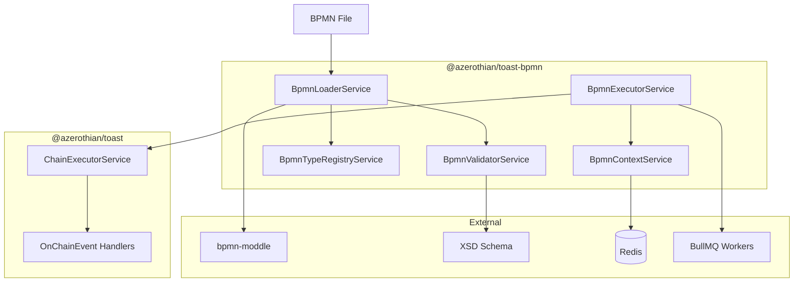

# @azerothian/toast-bpmn

A BPMN workflow extension for @azerothian/toast, enabling visual workflow orchestration with type-safe execution.

## Table of Contents

| # | Section | Lines |
|---|---------|-------|
| 1 | [Installation](#installation) | 61-112 |
| 2 | [Overview](#overview) | 114-194 |
| | - [Architecture](#architecture) | 116-160 |
| | - [Key Features](#key-features) | 162-194 |
| 3 | [bpmn-moddle Integration](#bpmn-moddle-integration) | 196-305 |
| | - [Loading BPMN Files](#loading-bpmn-files) | 198-237 |
| | - [Parsing and Validation](#parsing-and-validation) | 239-271 |
| | - [Type Extraction](#type-extraction) | 273-305 |
| 4 | [Decorators](#decorators) | 307-499 |
| | - [@BpmnProcess](#bpmnprocess) | 309-369 |
| | - [@BpmnTask](#bpmntask) | 371-415 |
| | - [@BpmnContext](#bpmncontext) | 417-461 |
| | - [@RegisterType](#registertype) | 463-499 |
| 5 | [Interfaces](#interfaces) | 501-685 |
| | - [BaseBpmnContext](#basebpmncontext) | 503-555 |
| | - [BpmnProcessDefinition](#bpmnprocessdefinition) | 557-597 |
| | - [BpmnTaskDefinition](#bpmntaskdefinition) | 599-629 |
| | - [Distributed Processing Types](#distributed-processing-types) | 631-685 |
| 6 | [Services](#services) | 687-859 |
| | - [BpmnLoaderService](#bpmnloaderservice) | 689-726 |
| | - [BpmnExecutorService](#bpmnexecutorservice) | 728-774 |
| | - [BpmnContextService](#bpmncontextservice) | 776-824 |
| | - [BpmnTypeRegistryService](#bpmntyperegistryservice) | 826-859 |
| 7 | [Triggers](#triggers) | 861-965 |
| | - [Manual Trigger](#manual-trigger) | 863-893 |
| | - [Timer Trigger](#timer-trigger) | 895-931 |
| | - [TypeScript Trigger](#typescript-trigger) | 933-965 |
| 8 | [Processing Modes](#processing-modes) | 967-1135 |
| | - [Inline Processing](#inline-processing) | 969-1011 |
| | - [Distributed Processing](#distributed-processing) | 1013-1096 |
| | - [Context Serialization](#context-serialization) | 1098-1135 |
| 9 | [Execution Types](#execution-types) | 1137-1217 |
| | - [Synchronous Execution](#synchronous-execution) | 1139-1175 |
| | - [Asynchronous Execution](#asynchronous-execution) | 1177-1217 |
| 10 | [Timing and Stacktraces](#timing-and-stacktraces) | 1219-1304 |
| | - [Task Timing](#task-timing) | 1221-1269 |
| | - [Stacktrace Capture](#stacktrace-capture) | 1271-1304 |
| 11 | [XSD Extension](#xsd-extension) | 1306-1452 |
| | - [Schema Definition](#schema-definition) | 1308-1370 |
| | - [Validation](#validation) | 1372-1452 |
| 12 | [Toast Integration](#toast-integration) | 1454-1570 |
| | - [ChainEvent Integration](#chainevent-integration) | 1456-1506 |
| | - [Module Configuration](#module-configuration) | 1508-1570 |
| 13 | [Examples](#examples) | 1572-1758 |
| | - [Basic Workflow](#basic-workflow) | 1574-1645 |
| | - [Distributed Workflow](#distributed-workflow) | 1647-1710 |
| | - [Complex Multi-Step Process](#complex-multi-step-process) | 1712-1758 |
| 14 | [API Reference](#api-reference) | 1760-1814 |
| 15 | [Test Cases](#test-cases) | 1825-2688 |
| | - [Positive Test Cases](#positive-test-cases) | 1827-2254 |
| | - [Negative Test Cases](#negative-test-cases) | 2256-2688 |
| 16 | [Use Cases](#use-cases) | 2690-3215 |
| | - [E-Commerce Order Processing](#e-commerce-order-processing) | 2692-2802 |
| | - [Loan Application Pipeline](#loan-application-pipeline) | 2804-2903 |
| | - [Document Approval Workflow](#document-approval-workflow) | 2905-3006 |
| | - [Async Background Processing](#async-background-processing) | 3008-3113 |
| | - [Multi-Service Integration](#multi-service-integration) | 3115-3215 |
| 17 | [Summary](#summary) | 3217-3230 |

---

## Installation

### Install Package

```bash
npm install @azerothian/toast-bpmn
```

### Peer Dependencies

Ensure you have the following peer dependencies installed:

```bash
npm install @azerothian/toast @nestjs/common @nestjs/core bpmn-moddle
```

For distributed processing, also install:

```bash
npm install bullmq ioredis
```

| Package | Version | Purpose |
|---------|---------|---------|
| `@azerothian/toast` | ^1.0.0 | Core toast framework |
| `@nestjs/common` | ^10.0.0 | Core NestJS decorators and utilities |
| `@nestjs/core` | ^10.0.0 | NestJS runtime and dependency injection |
| `bpmn-moddle` | ^8.0.0 | BPMN 2.0 XML parsing and modeling |
| `bullmq` | ^5.0.0 | Distributed job queue (optional) |
| `ioredis` | ^5.0.0 | Redis client for context storage (optional) |

### Module Registration

```typescript
import { Module } from '@nestjs/common';
import { ToastModule } from '@azerothian/toast';
import { ToastBpmnModule } from '@azerothian/toast-bpmn';

@Module({
  imports: [
    ToastModule.forRoot(),
    ToastBpmnModule.forRoot({
      bpmnPath: './workflows',
      validateOnLoad: true,
      processingMode: 'inline',
    }),
  ],
})
export class AppModule {}
```

---

## Overview

### Architecture



The architecture follows a layered approach:

1. **Loading Layer**: `BpmnLoaderService` uses `bpmn-moddle` to parse BPMN XML files
2. **Validation Layer**: `BpmnValidatorService` validates against XSD schema and type constraints
3. **Type Registry**: `BpmnTypeRegistryService` manages TypeScript types extracted from the project
4. **Execution Layer**: `BpmnExecutorService` orchestrates task execution via toast's `ChainExecutorService`
5. **Context Layer**: `BpmnContextService` manages process context with optional Redis persistence

### Key Features

| Feature | Description |
|---------|-------------|
| **Type-Safe Connections** | All BPMN sequence flows are constrained by TypeScript types |
| **ChainedEvent Tasks** | BPMN tasks map to `@OnChainEvent` handlers with validated I/O |
| **Flexible Processing** | Choose between inline loop or distributed BullMQ workers |
| **Context Tracking** | Automatic process ID and step tracking via `BaseBpmnContext` |
| **Sync/Async Modes** | Define execution type per process for immediate or deferred response |
| **Timing & Traces** | Built-in timing and stacktrace capture for debugging |
| **XSD Validation** | Custom BPMN extensions validated against XSD schema |

```typescript
// Type-safe workflow definition
interface OrderInput {
  orderId: string;
  items: Item[];
}

interface OrderOutput {
  success: boolean;
  trackingNumber?: string;
}

@BpmnProcess<OrderContext, OrderInput, OrderOutput>({
  name: 'order-fulfillment',
  executionType: 'async',
  processingMode: 'distributed',
})
export class OrderFulfillmentProcess {}
```

---

## bpmn-moddle Integration

### Loading BPMN Files

The `BpmnLoaderService` uses [bpmn-moddle](https://github.com/bpmn-io/bpmn-moddle) to parse BPMN 2.0 XML files into a traversable JavaScript object model.

```typescript
import { Injectable } from '@nestjs/common';
import { BpmnLoaderService } from '@azerothian/toast-bpmn';

@Injectable()
export class WorkflowService {
  constructor(private readonly bpmnLoader: BpmnLoaderService) {}

  async loadWorkflow(bpmnPath: string) {
    const definition = await this.bpmnLoader.load(bpmnPath);
    return definition;
  }
}
```

**Configuration Options:**

```typescript
ToastBpmnModule.forRoot({
  bpmnPath: './workflows',           // Base path for BPMN files
  validateOnLoad: true,              // Validate against XSD on load
  strictTypeChecking: true,          // Require all types to exist
  extensions: ['./custom-ext.json'], // Custom moddle extensions
});
```

**Directory Structure:**

```
workflows/
├── order-fulfillment.bpmn
├── user-registration.bpmn
├── payment-processing.bpmn
└── types/
    └── index.ts                     # Type definitions
```

### Parsing and Validation

When a BPMN file is loaded, toast-bpmn performs multi-stage validation:

```typescript
interface ValidationResult {
  valid: boolean;
  errors: ValidationError[];
  warnings: ValidationWarning[];
  typeConstraints: TypeConstraint[];
}

// Validation stages
const stages = [
  'xsd-schema',        // Validate against BPMN 2.0 XSD + extensions
  'type-constraints',  // Verify all connection types exist
  'handler-mapping',   // Ensure all tasks map to registered handlers
  'context-compat',    // Check context decorator compatibility
];
```

**Type Constraint Validation:**

```typescript
// BPMN sequence flow with type constraint
<bpmn:sequenceFlow id="Flow_1" sourceRef="Task_1" targetRef="Task_2">
  <toast:typeConstraint>
    <toast:type>OrderValidationResult</toast:type>
  </toast:typeConstraint>
</bpmn:sequenceFlow>
```

If `OrderValidationResult` is not found in the project's types, an error is thrown at load time.

### Type Extraction

Types are automatically extracted from your project using the TypeScript compiler API:

```typescript
// BpmnTypeRegistryService scans for @RegisterType decorators
@RegisterType()
export interface OrderValidationResult {
  valid: boolean;
  errors: string[];
  orderId: string;
}

@RegisterType()
export interface PaymentResult {
  transactionId: string;
  status: 'success' | 'failed' | 'pending';
}
```

**Automatic Type Discovery:**

```typescript
ToastBpmnModule.forRoot({
  typeDiscovery: {
    paths: ['./src/workflows/types/**/*.ts'],
    decoratorName: 'RegisterType',
    strict: true, // Fail if referenced type not found
  },
});
```

---

## Decorators

### @BpmnProcess

Defines a BPMN process with type-safe input, output, and context types.

```typescript
import { BpmnProcess } from '@azerothian/toast-bpmn';

interface OrderContext extends BaseBpmnContext {
  order: Order;
  customer: Customer;
  validationResult?: ValidationResult;
}

interface OrderInput {
  orderId: string;
  customerId: string;
}

interface OrderOutput {
  success: boolean;
  message: string;
  trackingNumber?: string;
}

@BpmnProcess<OrderContext, OrderInput, OrderOutput>({
  name: 'order-fulfillment',
  bpmnFile: 'order-fulfillment.bpmn',
  executionType: 'sync',       // 'sync' | 'async'
  processingMode: 'inline',    // 'inline' | 'distributed'
  timeout: 30000,              // Optional timeout in ms
})
export class OrderFulfillmentProcess {
  // Process-level handlers and hooks

  @OnProcessStart()
  async onStart(context: OrderContext) {
    console.log(`Starting process ${context.processId}`);
  }

  @OnProcessComplete()
  async onComplete(context: OrderContext, output: OrderOutput) {
    console.log(`Process completed: ${output.success}`);
  }

  @OnProcessError()
  async onError(context: OrderContext, error: Error) {
    console.error(`Process failed: ${error.message}`);
  }
}
```

**Decorator Options:**

| Option | Type | Description |
|--------|------|-------------|
| `name` | `string` | Unique process identifier |
| `bpmnFile` | `string` | Path to BPMN file (relative to bpmnPath) |
| `executionType` | `'sync' \| 'async'` | Determines response behavior |
| `processingMode` | `'inline' \| 'distributed'` | Task execution strategy |
| `timeout` | `number` | Optional process timeout in milliseconds |
| `retryPolicy` | `RetryPolicy` | Retry configuration for failed tasks |

### @BpmnTask

Defines a task handler that maps to a BPMN task element via ChainedEvent.

```typescript
import { BpmnTask } from '@azerothian/toast-bpmn';

@Injectable()
export class OrderValidationTasks {

  @BpmnTask<ValidateOrderInput, ValidateOrderOutput>({
    taskId: 'Task_ValidateOrder',
    inputType: 'ValidateOrderInput',
    outputType: 'ValidateOrderOutput',
  })
  @OnChainEvent<ValidateOrderOutput>('order.validate')
  async validateOrder(
    result: ValidateOrderOutput,
    input: ValidateOrderInput,
  ): Promise<ValidateOrderOutput> {
    // Validation logic
    const isValid = await this.validateOrderItems(input.items);

    return {
      valid: isValid,
      errors: isValid ? [] : ['Invalid items'],
      orderId: input.orderId,
    };
  }
}
```

The `@BpmnTask` decorator works in conjunction with `@OnChainEvent` to:
1. Register the handler with the BPMN task ID
2. Extract and validate input/output types at load time
3. Enable automatic type checking for sequence flow connections

**Task Options:**

| Option | Type | Description |
|--------|------|-------------|
| `taskId` | `string` | BPMN task element ID |
| `inputType` | `string` | Registered type name for input validation |
| `outputType` | `string` | Registered type name for output validation |
| `timeout` | `number` | Optional task-level timeout |
| `retryable` | `boolean` | Whether task can be retried on failure |

### @BpmnContext

Decorates a parameter to inject the BPMN context into a task handler.

```typescript
import { BpmnContext, BpmnTask } from '@azerothian/toast-bpmn';

@Injectable()
export class PaymentTasks {

  @BpmnTask({
    taskId: 'Task_ProcessPayment',
    inputType: 'PaymentInput',
    outputType: 'PaymentResult',
  })
  @OnChainEvent<PaymentResult, [OrderContext]>('payment.process')
  async processPayment(
    result: PaymentResult,
    input: PaymentInput,
    @BpmnContext() context: OrderContext,
  ): Promise<PaymentResult> {
    // Access context for process state
    console.log(`Processing payment for process: ${context.processId}`);
    console.log(`Current step: ${context.currentStep}`);

    // Context modifications are tracked
    context.paymentAttempts = (context.paymentAttempts || 0) + 1;

    return {
      transactionId: 'txn_123',
      status: 'success',
    };
  }
}
```

**Context Type Validation:**

If a handler uses `@BpmnContext()` with a type that doesn't match the process's context type, an error is thrown at load time:

```typescript
// This will throw an error at load time if OrderContext doesn't match
@BpmnTask({ taskId: 'Task_1' })
@OnChainEvent<void, [DifferentContext]>('task.execute')
async execute(input: unknown, @BpmnContext() context: DifferentContext) {} // Error!
```

### @RegisterType

Registers a TypeScript interface/type with the BPMN type registry for connection validation.

```typescript
import { RegisterType } from '@azerothian/toast-bpmn';

@RegisterType()
export interface OrderValidationResult {
  valid: boolean;
  errors: string[];
  orderId: string;
}

@RegisterType({ name: 'PaymentResultV2' }) // Custom name
export interface PaymentResult {
  transactionId: string;
  status: PaymentStatus;
  amount: number;
}

@RegisterType({ schema: orderItemSchema }) // With JSON schema
export interface OrderItem {
  productId: string;
  quantity: number;
  price: number;
}
```

**Options:**

| Option | Type | Description |
|--------|------|-------------|
| `name` | `string` | Optional custom name (defaults to interface name) |
| `schema` | `JSONSchema` | Optional JSON schema for runtime validation |

---

## Interfaces

### BaseBpmnContext

Base interface for all BPMN process contexts, providing automatic tracking.

```typescript
export interface BaseBpmnContext {
  /** Unique identifier for this process instance */
  processId: string;

  /** BPMN process definition name */
  processName: string;

  /** Current step/task being executed */
  currentStep: string;

  /** Previous step/task that was executed */
  previousStep?: string;

  /** Timestamp when process started */
  startedAt: Date;

  /** Step execution history */
  stepHistory: StepHistoryEntry[];

  /** Process variables (user-defined data) */
  variables: Record<string, unknown>;
}

export interface StepHistoryEntry {
  stepId: string;
  stepName: string;
  startedAt: Date;
  completedAt?: Date;
  duration?: number;
  status: 'completed' | 'failed' | 'skipped';
  error?: string;
}
```

**Extending BaseBpmnContext:**

```typescript
interface OrderContext extends BaseBpmnContext {
  // Process-specific data
  order: Order;
  customer: Customer;

  // Task results stored in context
  validationResult?: OrderValidationResult;
  paymentResult?: PaymentResult;
  shippingResult?: ShippingResult;
}
```

### BpmnProcessDefinition

Represents a parsed BPMN process with metadata.

```typescript
export interface BpmnProcessDefinition<
  TContext extends BaseBpmnContext = BaseBpmnContext,
  TInput = unknown,
  TOutput = unknown,
> {
  /** Process name/identifier */
  name: string;

  /** Path to source BPMN file */
  bpmnFile: string;

  /** Parsed bpmn-moddle definitions */
  definitions: ModdleDefinitions;

  /** All task definitions in the process */
  tasks: BpmnTaskDefinition[];

  /** Sequence flow connections with type constraints */
  flows: BpmnSequenceFlow[];

  /** Start events */
  startEvents: BpmnStartEvent[];

  /** End events */
  endEvents: BpmnEndEvent[];

  /** Execution configuration */
  executionType: 'sync' | 'async';
  processingMode: 'inline' | 'distributed';

  /** Type information */
  contextType: string;
  inputType: string;
  outputType: string;
}
```

### BpmnTaskDefinition

Represents a task within a BPMN process.

```typescript
export interface BpmnTaskDefinition {
  /** BPMN element ID */
  id: string;

  /** Task name/label */
  name: string;

  /** Task type (serviceTask, userTask, etc.) */
  type: BpmnTaskType;

  /** ChainEvent name for this task */
  chainEventName: string;

  /** Input type constraint */
  inputType: string;

  /** Output type constraint */
  outputType: string;

  /** Incoming sequence flows */
  incoming: string[];

  /** Outgoing sequence flows */
  outgoing: string[];
}
```

### Distributed Processing Types

Types for distributed processing with BullMQ and Redis.

```typescript
export interface DistributedTaskPayload<T = unknown> {
  /** Process instance ID */
  processId: string;

  /** Task definition ID */
  taskId: string;

  /** Serialized task input */
  input: T;

  /** Redis key for context */
  contextKey: string;

  /** Timestamp */
  timestamp: number;
}

export interface SerializedContext {
  /** JSON-serialized context data */
  data: string;

  /** Context type name for deserialization */
  typeName: string;

  /** Version for migration support */
  version: number;

  /** Checksum for integrity */
  checksum: string;
}

export interface TaskResult<T = unknown> {
  /** Whether task succeeded */
  success: boolean;

  /** Task output (if successful) */
  output?: T;

  /** Error message (if failed) */
  error?: string;

  /** Execution duration in ms */
  duration: number;

  /** Stacktrace (if error and enabled) */
  stacktrace?: string;
}
```

---

## Services

### BpmnLoaderService

Loads and parses BPMN files using bpmn-moddle.

```typescript
import { Injectable } from '@nestjs/common';
import { BpmnLoaderService } from '@azerothian/toast-bpmn';

@Injectable()
export class WorkflowManager {
  constructor(private readonly loader: BpmnLoaderService) {}

  async loadAllWorkflows() {
    // Load single file
    const orderProcess = await this.loader.load('order-fulfillment.bpmn');

    // Load all files in directory
    const allProcesses = await this.loader.loadDirectory('./workflows');

    // Load with custom extensions
    const customProcess = await this.loader.load('custom.bpmn', {
      extensions: ['./toast-extension.json'],
    });

    return allProcesses;
  }
}
```

**Methods:**

| Method | Description |
|--------|-------------|
| `load(path)` | Load single BPMN file |
| `loadDirectory(dir)` | Load all BPMN files in directory |
| `reload(name)` | Reload a previously loaded process |
| `getDefinition(name)` | Get loaded process definition |
| `validateFile(path)` | Validate BPMN file without loading |

### BpmnExecutorService

Executes BPMN processes, orchestrating task execution via toast's ChainExecutorService.

```typescript
import { Injectable } from '@nestjs/common';
import { BpmnExecutorService } from '@azerothian/toast-bpmn';

@Injectable()
export class OrderService {
  constructor(private readonly executor: BpmnExecutorService) {}

  async fulfillOrder(input: OrderInput): Promise<OrderOutput> {
    // Execute synchronously (waits for completion)
    const result = await this.executor.execute<OrderContext, OrderInput, OrderOutput>(
      'order-fulfillment',
      input,
    );

    return result;
  }

  async startOrderAsync(input: OrderInput): Promise<ProcessStartResult> {
    // Execute asynchronously (returns message ID)
    const { processId, messageId } = await this.executor.executeAsync(
      'order-fulfillment',
      input,
    );

    return { processId, messageId };
  }

  async getProcessStatus(processId: string) {
    return this.executor.getStatus(processId);
  }
}
```

**Methods:**

| Method | Description |
|--------|-------------|
| `execute(name, input)` | Execute process synchronously |
| `executeAsync(name, input)` | Start process asynchronously |
| `getStatus(processId)` | Get process execution status |
| `cancel(processId)` | Cancel running process |
| `retry(processId, taskId)` | Retry failed task |

### BpmnContextService

Manages BPMN process context with support for Redis persistence.

```typescript
import { Injectable } from '@nestjs/common';
import { BpmnContextService } from '@azerothian/toast-bpmn';

@Injectable()
export class ContextManager {
  constructor(private readonly contextService: BpmnContextService) {}

  async createContext<T extends BaseBpmnContext>(
    processName: string,
    initialData: Partial<T>,
  ): Promise<T> {
    return this.contextService.create<T>(processName, initialData);
  }

  async updateContext<T extends BaseBpmnContext>(
    processId: string,
    updates: Partial<T>,
  ): Promise<T> {
    return this.contextService.update<T>(processId, updates);
  }

  async getContext<T extends BaseBpmnContext>(
    processId: string,
  ): Promise<T | null> {
    return this.contextService.get<T>(processId);
  }
}
```

**Redis Configuration:**

```typescript
ToastBpmnModule.forRoot({
  context: {
    storage: 'redis',
    redis: {
      host: 'localhost',
      port: 6379,
      keyPrefix: 'bpmn:context:',
      ttl: 86400, // 24 hours
    },
  },
});
```

### BpmnTypeRegistryService

Manages registered types for connection validation.

```typescript
import { Injectable } from '@nestjs/common';
import { BpmnTypeRegistryService } from '@azerothian/toast-bpmn';

@Injectable()
export class TypeManager {
  constructor(private readonly typeRegistry: BpmnTypeRegistryService) {}

  registerTypes() {
    // Types are auto-registered via @RegisterType decorator
    // Manual registration also supported
    this.typeRegistry.register('CustomType', {
      properties: {
        id: { type: 'string' },
        value: { type: 'number' },
      },
    });
  }

  validateType(typeName: string, data: unknown): boolean {
    return this.typeRegistry.validate(typeName, data);
  }

  getTypeSchema(typeName: string) {
    return this.typeRegistry.getSchema(typeName);
  }
}
```

---

## Triggers

### Manual Trigger

Start a BPMN process manually from code.

```typescript
import { Injectable } from '@nestjs/common';
import { BpmnExecutorService, ManualTrigger } from '@azerothian/toast-bpmn';

@Injectable()
export class OrderController {
  constructor(private readonly executor: BpmnExecutorService) {}

  @Post('/orders')
  async createOrder(@Body() input: CreateOrderInput) {
    // Manual trigger via executor
    const result = await this.executor.execute('order-fulfillment', {
      orderId: input.orderId,
      items: input.items,
    });

    return result;
  }
}

// Or use ManualTrigger utility
@Injectable()
export class OrderTriggers {
  @ManualTrigger('order-fulfillment')
  triggerOrderFulfillment: (input: OrderInput) => Promise<OrderOutput>;
}
```

### Timer Trigger

Start BPMN processes on a schedule using timer events.

```typescript
import { TimerTrigger } from '@azerothian/toast-bpmn';

// BPMN Timer Start Event definition
<bpmn:startEvent id="StartEvent_Timer">
  <bpmn:timerEventDefinition>
    <bpmn:timeCycle>0 0 * * *</bpmn:timeCycle> <!-- Daily at midnight -->
  </bpmn:timerEventDefinition>
</bpmn:startEvent>

// Programmatic timer trigger
@Injectable()
export class ScheduledTriggers {
  @TimerTrigger({
    processName: 'daily-report',
    cron: '0 0 * * *',
    timezone: 'UTC',
  })
  async generateDailyReport() {
    return { date: new Date().toISOString() };
  }
}
```

**Timer Options:**

| Option | Type | Description |
|--------|------|-------------|
| `cron` | `string` | Cron expression |
| `timezone` | `string` | Timezone for cron |
| `interval` | `number` | Interval in milliseconds |
| `startDate` | `Date` | When to start triggering |
| `endDate` | `Date` | When to stop triggering |

### TypeScript Trigger

Trigger BPMN processes from TypeScript code with full type safety.

```typescript
import { TypeScriptTrigger, InjectBpmnTrigger } from '@azerothian/toast-bpmn';

// Define typed trigger
const OrderFulfillmentTrigger = TypeScriptTrigger<OrderInput, OrderOutput>(
  'order-fulfillment',
);

@Injectable()
export class OrderService {
  constructor(
    @InjectBpmnTrigger('order-fulfillment')
    private readonly triggerOrder: typeof OrderFulfillmentTrigger,
  ) {}

  async processOrder(orderId: string) {
    // Fully typed trigger invocation
    const result = await this.triggerOrder({
      orderId,
      items: [],
    });

    // result is typed as OrderOutput
    console.log(result.trackingNumber);
  }
}
```

---

## Processing Modes

### Inline Processing

Tasks execute sequentially in a loop within the same process.

```typescript
@BpmnProcess({
  name: 'quick-validation',
  processingMode: 'inline',
  executionType: 'sync',
})
export class QuickValidationProcess {}
```

**Execution Flow:**

```
┌─────────────────────────────────────────────────────┐
│                 Inline Processing                    │
├─────────────────────────────────────────────────────┤
│                                                      │
│   ┌──────────┐   ┌──────────┐   ┌──────────┐       │
│   │  Task 1  │ → │  Task 2  │ → │  Task 3  │       │
│   └──────────┘   └──────────┘   └──────────┘       │
│        ↓              ↓              ↓              │
│   [Execute]      [Execute]      [Execute]          │
│        ↓              ↓              ↓              │
│   [Continue]     [Continue]     [Complete]         │
│                                                      │
│   All tasks run in same process/thread              │
│   Context passed directly between tasks             │
│                                                      │
└─────────────────────────────────────────────────────┘
```

**Advantages:**
- Lower latency (no serialization overhead)
- Simpler debugging
- No external dependencies

**Use When:**
- Fast-executing tasks (< 1 second each)
- No need for distributed scaling
- Development/testing environments

### Distributed Processing

Tasks execute via BullMQ workers with Redis-based context storage.

```typescript
@BpmnProcess({
  name: 'order-fulfillment',
  processingMode: 'distributed',
  executionType: 'async',
})
export class OrderFulfillmentProcess {}

// Worker configuration
ToastBpmnModule.forRoot({
  processingMode: 'distributed',
  distributed: {
    redis: {
      host: 'localhost',
      port: 6379,
    },
    queues: {
      default: {
        concurrency: 5,
        limiter: {
          max: 100,
          duration: 1000,
        },
      },
    },
  },
});
```

**Execution Flow:**

```
┌─────────────────────────────────────────────────────┐
│              Distributed Processing                  │
├─────────────────────────────────────────────────────┤
│                                                      │
│   ┌──────────┐        ┌─────────────┐              │
│   │ Executor │───────▶│   BullMQ    │              │
│   └──────────┘        │   Queue     │              │
│                       └──────┬──────┘              │
│                              │                      │
│              ┌───────────────┼───────────────┐     │
│              ▼               ▼               ▼     │
│        ┌──────────┐   ┌──────────┐   ┌──────────┐ │
│        │ Worker 1 │   │ Worker 2 │   │ Worker 3 │ │
│        └────┬─────┘   └────┬─────┘   └────┬─────┘ │
│             │              │              │        │
│             ▼              ▼              ▼        │
│        ┌─────────────────────────────────────┐    │
│        │              Redis                   │    │
│        │    (Context Storage + Events)        │    │
│        └─────────────────────────────────────┘    │
│                                                    │
└────────────────────────────────────────────────────┘
```

**Predefined Chain Events for Serialization:**

```typescript
// Built-in events for context serialization/deserialization
export const BPMN_CONTEXT_SERIALIZE = 'bpmn.context.serialize';
export const BPMN_CONTEXT_DESERIALIZE = 'bpmn.context.deserialize';

// Usage in distributed tasks
@OnChainEvent<BaseBpmnContext>(BPMN_CONTEXT_DESERIALIZE)
async deserializeContext(
  payload: { contextKey: string },
): Promise<BaseBpmnContext> {
  // Retrieve and deserialize from Redis
  return this.contextService.deserialize(payload.contextKey);
}

@OnChainEvent<{ contextKey: string }>(BPMN_CONTEXT_SERIALIZE)
async serializeContext(
  context: BaseBpmnContext,
): Promise<{ contextKey: string }> {
  // Serialize and store in Redis
  return this.contextService.serialize(context);
}
```

### Context Serialization

For distributed processing, context must be serialized to Redis.

```typescript
// Automatic serialization via BpmnContextService
const contextService = new BpmnContextService(redisClient);

// Serialize context to Redis
const contextKey = await contextService.serialize(context);
// Returns: 'bpmn:context:order-fulfillment:abc123'

// Deserialize context from Redis
const restored = await contextService.deserialize<OrderContext>(contextKey);

// Context includes automatic tracking
console.log(restored.processId);      // 'abc123'
console.log(restored.currentStep);    // 'Task_ProcessPayment'
console.log(restored.stepHistory);    // [...previous steps...]
```

**Serialization Format:**

```typescript
interface SerializedContext {
  data: string;       // JSON.stringify(context)
  typeName: string;   // 'OrderContext'
  version: number;    // 1
  checksum: string;   // MD5 hash for integrity
}

// Storage structure in Redis
// Key: bpmn:context:{processName}:{processId}
// Value: SerializedContext as JSON
// TTL: Configurable (default 24 hours)
```

---

## Execution Types

### Synchronous Execution

The caller waits for the entire process to complete.

```typescript
@BpmnProcess({
  name: 'quick-validation',
  executionType: 'sync',
})
export class QuickValidationProcess {}

// Usage
const result = await executor.execute('quick-validation', input);
// Blocks until process completes
console.log(result); // Final output
```

**Sync Execution Flow:**

```
Client                    Executor                   Tasks
   │                          │                        │
   │──execute(input)─────────▶│                        │
   │                          │──execute Task 1───────▶│
   │                          │◀──────result──────────│
   │                          │──execute Task 2───────▶│
   │                          │◀──────result──────────│
   │                          │──execute Task N───────▶│
   │                          │◀──────result──────────│
   │◀────final result────────│                        │
   │                          │                        │
```

**Use When:**
- Short-running processes (< 30 seconds)
- Client needs immediate result
- Request-response patterns

### Asynchronous Execution

The caller receives a message ID immediately; process runs in background.

```typescript
@BpmnProcess({
  name: 'order-fulfillment',
  executionType: 'async',
})
export class OrderFulfillmentProcess {}

// Usage
const { processId, messageId } = await executor.executeAsync(
  'order-fulfillment',
  input,
);
// Returns immediately with tracking IDs

// Poll for status
const status = await executor.getStatus(processId);
// { status: 'running', currentStep: 'Task_ProcessPayment' }

// Or listen for completion event
@OnChainEvent<void>('bpmn.process.completed')
async onProcessComplete(event: ProcessCompletedEvent): Promise<void> {
  console.log(`Process ${event.processId} completed`);
}
```

**Async Response:**

```typescript
interface AsyncExecutionResult {
  processId: string;    // Unique process instance ID
  messageId: string;    // BullMQ job ID (if distributed)
  status: 'queued' | 'started';
  startedAt: Date;
}
```

---

## Timing and Stacktraces

### Task Timing

Every task execution is automatically timed.

```typescript
// Enable detailed timing
ToastBpmnModule.forRoot({
  timing: {
    enabled: true,
    includeQueueTime: true,    // For distributed mode
    precision: 'milliseconds', // 'milliseconds' | 'microseconds'
  },
});

// Access timing data
const execution = await executor.execute('my-process', input);

// Timing available in step history
for (const step of execution.context.stepHistory) {
  console.log(`${step.stepName}: ${step.duration}ms`);
}

// Aggregate timing
const timing = await executor.getTiming(processId);
console.log(`Total: ${timing.totalDuration}ms`);
console.log(`Queue time: ${timing.queueTime}ms`);
console.log(`Execution time: ${timing.executionTime}ms`);
```

**Timing Interface:**

```typescript
interface TaskTiming {
  taskId: string;
  taskName: string;
  startedAt: Date;
  completedAt: Date;
  duration: number;
  queueTime?: number;  // Time spent in queue (distributed)
}

interface ProcessTiming {
  processId: string;
  totalDuration: number;
  queueTime: number;
  executionTime: number;
  tasks: TaskTiming[];
}
```

### Stacktrace Capture

Capture stacktraces for debugging failures.

```typescript
// Enable stacktrace capture
ToastBpmnModule.forRoot({
  debugging: {
    captureStacktraces: true,
    stacktraceDepth: 10,
    includeNodeModules: false,
  },
});

// Stacktraces included in errors
try {
  await executor.execute('my-process', input);
} catch (error) {
  if (error instanceof BpmnExecutionError) {
    console.log('Failed at:', error.taskId);
    console.log('Stacktrace:', error.stacktrace);
    console.log('Context at failure:', error.context);
  }
}

// Also available in process status
const status = await executor.getStatus(processId);
if (status.status === 'failed') {
  console.log(status.error);
  console.log(status.stacktrace);
}
```

---

## XSD Extension

### Schema Definition

Custom XSD schema extends BPMN 2.0 for toast-bpmn elements.

```xml
<?xml version="1.0" encoding="UTF-8"?>
<xsd:schema
  xmlns:xsd="http://www.w3.org/2001/XMLSchema"
  xmlns:toast="http://azerothian.io/schema/toast-bpmn"
  xmlns:bpmn="http://www.omg.org/spec/BPMN/20100524/MODEL"
  targetNamespace="http://azerothian.io/schema/toast-bpmn"
  elementFormDefault="qualified">

  <!-- Type Constraint for Sequence Flows -->
  <xsd:element name="typeConstraint" type="toast:tTypeConstraint"/>
  <xsd:complexType name="tTypeConstraint">
    <xsd:sequence>
      <xsd:element name="type" type="xsd:string" minOccurs="1" maxOccurs="1"/>
      <xsd:element name="strict" type="xsd:boolean" default="true" minOccurs="0"/>
    </xsd:sequence>
  </xsd:complexType>

  <!-- Task Configuration -->
  <xsd:element name="taskConfig" type="toast:tTaskConfig"/>
  <xsd:complexType name="tTaskConfig">
    <xsd:sequence>
      <xsd:element name="chainEventName" type="xsd:string"/>
      <xsd:element name="inputType" type="xsd:string" minOccurs="0"/>
      <xsd:element name="outputType" type="xsd:string" minOccurs="0"/>
      <xsd:element name="timeout" type="xsd:int" minOccurs="0"/>
      <xsd:element name="retryable" type="xsd:boolean" default="false" minOccurs="0"/>
    </xsd:sequence>
  </xsd:complexType>

  <!-- Process Configuration -->
  <xsd:element name="processConfig" type="toast:tProcessConfig"/>
  <xsd:complexType name="tProcessConfig">
    <xsd:sequence>
      <xsd:element name="contextType" type="xsd:string"/>
      <xsd:element name="inputType" type="xsd:string"/>
      <xsd:element name="outputType" type="xsd:string"/>
      <xsd:element name="executionType" type="toast:tExecutionType"/>
      <xsd:element name="processingMode" type="toast:tProcessingMode"/>
    </xsd:sequence>
  </xsd:complexType>

  <!-- Enumerations -->
  <xsd:simpleType name="tExecutionType">
    <xsd:restriction base="xsd:string">
      <xsd:enumeration value="sync"/>
      <xsd:enumeration value="async"/>
    </xsd:restriction>
  </xsd:simpleType>

  <xsd:simpleType name="tProcessingMode">
    <xsd:restriction base="xsd:string">
      <xsd:enumeration value="inline"/>
      <xsd:enumeration value="distributed"/>
    </xsd:restriction>
  </xsd:simpleType>

</xsd:schema>
```

### Validation

BPMN files are validated against the extended schema.

```typescript
import { BpmnValidatorService } from '@azerothian/toast-bpmn';

@Injectable()
export class WorkflowValidator {
  constructor(private readonly validator: BpmnValidatorService) {}

  async validateWorkflow(bpmnPath: string) {
    const result = await this.validator.validate(bpmnPath);

    if (!result.valid) {
      for (const error of result.errors) {
        console.error(`Line ${error.line}: ${error.message}`);
      }
    }

    return result;
  }
}

// Validation happens automatically on load
ToastBpmnModule.forRoot({
  validateOnLoad: true,
  xsdPath: './schemas/toast-bpmn.xsd',
});
```

**BPMN File with Toast Extensions:**

```xml
<?xml version="1.0" encoding="UTF-8"?>
<bpmn:definitions
  xmlns:bpmn="http://www.omg.org/spec/BPMN/20100524/MODEL"
  xmlns:toast="http://azerothian.io/schema/toast-bpmn"
  xmlns:bpmndi="http://www.omg.org/spec/BPMN/20100524/DI">

  <bpmn:process id="OrderFulfillment" name="Order Fulfillment">
    <bpmn:extensionElements>
      <toast:processConfig>
        <toast:contextType>OrderContext</toast:contextType>
        <toast:inputType>OrderInput</toast:inputType>
        <toast:outputType>OrderOutput</toast:outputType>
        <toast:executionType>async</toast:executionType>
        <toast:processingMode>distributed</toast:processingMode>
      </toast:processConfig>
    </bpmn:extensionElements>

    <bpmn:startEvent id="Start"/>

    <bpmn:serviceTask id="Task_ValidateOrder" name="Validate Order">
      <bpmn:extensionElements>
        <toast:taskConfig>
          <toast:chainEventName>order.validate</toast:chainEventName>
          <toast:inputType>OrderInput</toast:inputType>
          <toast:outputType>ValidationResult</toast:outputType>
        </toast:taskConfig>
      </bpmn:extensionElements>
    </bpmn:serviceTask>

    <bpmn:sequenceFlow id="Flow_1" sourceRef="Start" targetRef="Task_ValidateOrder"/>

    <bpmn:sequenceFlow id="Flow_2" sourceRef="Task_ValidateOrder" targetRef="Task_ProcessPayment">
      <bpmn:extensionElements>
        <toast:typeConstraint>
          <toast:type>ValidationResult</toast:type>
        </toast:typeConstraint>
      </bpmn:extensionElements>
    </bpmn:sequenceFlow>

    <!-- More tasks and flows... -->

    <bpmn:endEvent id="End"/>
  </bpmn:process>
</bpmn:definitions>
```

---

## Toast Integration

### ChainEvent Integration

BPMN tasks map directly to toast `@OnChainEvent` handlers.

```typescript
import { OnChainEvent } from '@azerothian/toast';
import { BpmnTask, BpmnContext } from '@azerothian/toast-bpmn';

@Injectable()
export class OrderTasks {
  // BPMN task mapped to ChainEvent
  @BpmnTask({
    taskId: 'Task_ValidateOrder',
    inputType: 'OrderInput',
    outputType: 'ValidationResult',
  })
  @OnChainEvent<ValidationResult, [OrderContext]>('order.validate')
  async validateOrder(
    result: ValidationResult,
    input: OrderInput,
    @BpmnContext() context: OrderContext,
  ): Promise<ValidationResult> {
    // Validation logic
    return { valid: true, errors: [] };
  }

  // Multi-argument chain handler (toast feature)
  // First arg is chained return value, remaining args are constant initial arguments
  @BpmnTask({
    taskId: 'Task_ProcessPayment',
    inputType: 'PaymentInput',
    outputType: 'PaymentResult',
  })
  @OnChainEvent<PaymentResult, [OrderContext, string, PaymentMethod]>('payment.process')
  async processPayment(
    result: PaymentResult,
    @BpmnContext() context: OrderContext,
    currency: string,
    method: PaymentMethod,
  ): Promise<PaymentResult> {
    // Payment processing
    return { transactionId: 'txn_123', status: 'success' };
  }
}
```

**How It Works:**

1. BPMN task element has `toast:taskConfig` with `chainEventName`
2. `@BpmnTask` decorator registers the mapping
3. At runtime, `BpmnExecutorService` calls `ChainExecutorService.waterfall()`
4. Chain executor invokes the `@OnChainEvent` handler
5. Handler receives BPMN context via `@BpmnContext()` decorator

### Module Configuration

```typescript
import { Module } from '@nestjs/common';
import { ToastModule } from '@azerothian/toast';
import { ToastBpmnModule } from '@azerothian/toast-bpmn';

@Module({
  imports: [
    ToastModule.forRoot({
      plugins: [],
      tracing: { enabled: true },
    }),

    ToastBpmnModule.forRoot({
      // BPMN file location
      bpmnPath: './workflows',

      // Validation
      validateOnLoad: true,
      strictTypeChecking: true,

      // Processing
      processingMode: 'distributed',
      executionType: 'async',

      // Distributed config
      distributed: {
        redis: {
          host: process.env.REDIS_HOST || 'localhost',
          port: parseInt(process.env.REDIS_PORT || '6379'),
        },
        queues: {
          default: { concurrency: 10 },
          priority: { concurrency: 5 },
        },
      },

      // Context storage
      context: {
        storage: 'redis',
        ttl: 86400,
      },

      // Debugging
      timing: { enabled: true },
      debugging: {
        captureStacktraces: true,
        stacktraceDepth: 15,
      },

      // Type discovery
      typeDiscovery: {
        paths: ['./src/**/*.types.ts'],
        strict: true,
      },
    }),
  ],
})
export class AppModule {}
```

---

## Examples

### Basic Workflow

A simple inline workflow for order validation.

```typescript
// types/order.types.ts
import { RegisterType } from '@azerothian/toast-bpmn';

@RegisterType()
export interface OrderInput {
  orderId: string;
  items: OrderItem[];
  customerId: string;
}

@RegisterType()
export interface ValidationResult {
  valid: boolean;
  errors: string[];
}

@RegisterType()
export interface OrderOutput {
  orderId: string;
  status: 'approved' | 'rejected';
  message: string;
}

// context/order.context.ts
export interface OrderContext extends BaseBpmnContext {
  order: OrderInput;
  validationResult?: ValidationResult;
}

// processes/order-validation.process.ts
@BpmnProcess<OrderContext, OrderInput, OrderOutput>({
  name: 'order-validation',
  bpmnFile: 'order-validation.bpmn',
  executionType: 'sync',
  processingMode: 'inline',
})
export class OrderValidationProcess {}

// tasks/order.tasks.ts
@Injectable()
export class OrderTasks {
  @BpmnTask({ taskId: 'Task_Validate', inputType: 'OrderInput', outputType: 'ValidationResult' })
  @OnChainEvent<ValidationResult, [OrderContext]>('order.validate')
  async validate(
    result: ValidationResult,
    input: OrderInput,
    @BpmnContext() ctx: OrderContext,
  ): Promise<ValidationResult> {
    ctx.order = input;
    const valid = input.items.length > 0;
    return { valid, errors: valid ? [] : ['No items'] };
  }

  @BpmnTask({ taskId: 'Task_Approve', inputType: 'ValidationResult', outputType: 'OrderOutput' })
  @OnChainEvent<OrderOutput, [OrderContext]>('order.approve')
  async approve(
    result: OrderOutput,
    validation: ValidationResult,
    @BpmnContext() ctx: OrderContext,
  ): Promise<OrderOutput> {
    ctx.validationResult = validation;
    return {
      orderId: ctx.order.orderId,
      status: validation.valid ? 'approved' : 'rejected',
      message: validation.valid ? 'Order approved' : validation.errors.join(', '),
    };
  }
}
```

### Distributed Workflow

A distributed workflow for order fulfillment with BullMQ workers.

```typescript
// processes/order-fulfillment.process.ts
@BpmnProcess<OrderFulfillmentContext, OrderInput, FulfillmentOutput>({
  name: 'order-fulfillment',
  bpmnFile: 'order-fulfillment.bpmn',
  executionType: 'async',
  processingMode: 'distributed',
})
export class OrderFulfillmentProcess {
  @OnProcessStart()
  async onStart(ctx: OrderFulfillmentContext) {
    console.log(`Starting fulfillment for order ${ctx.variables.orderId}`);
  }

  @OnProcessComplete()
  async onComplete(ctx: OrderFulfillmentContext, output: FulfillmentOutput) {
    await this.notificationService.send(
      ctx.variables.customerId,
      `Order ${output.orderId} shipped! Tracking: ${output.trackingNumber}`,
    );
  }
}

// workers/fulfillment.worker.ts
@Injectable()
export class FulfillmentWorker {
  @BpmnTask({ taskId: 'Task_ReserveInventory' })
  @OnChainEvent<InventoryResult, [OrderFulfillmentContext]>('inventory.reserve')
  async reserveInventory(
    result: InventoryResult,
    input: InventoryRequest,
    @BpmnContext() ctx: OrderFulfillmentContext,
  ): Promise<InventoryResult> {
    // Long-running inventory operation
    const result = await this.inventoryService.reserve(input.items);
    return result;
  }

  @BpmnTask({ taskId: 'Task_ProcessPayment' })
  @OnChainEvent<PaymentResult, [OrderFulfillmentContext]>('payment.process')
  async processPayment(
    result: PaymentResult,
    input: PaymentRequest,
    @BpmnContext() ctx: OrderFulfillmentContext,
  ): Promise<PaymentResult> {
    // External payment gateway call
    const result = await this.paymentGateway.charge(input);
    return result;
  }

  @BpmnTask({ taskId: 'Task_CreateShipment' })
  @OnChainEvent<ShipmentResult, [OrderFulfillmentContext]>('shipping.create')
  async createShipment(
    result: ShipmentResult,
    input: ShipmentRequest,
    @BpmnContext() ctx: OrderFulfillmentContext,
  ): Promise<ShipmentResult> {
    // Shipping provider integration
    const result = await this.shippingProvider.createLabel(input);
    return result;
  }
}
```

### Complex Multi-Step Process

A complex workflow with gateways and parallel execution.

```typescript
// Complex BPMN with exclusive gateway
@BpmnProcess({
  name: 'loan-application',
  bpmnFile: 'loan-application.bpmn',
  executionType: 'async',
  processingMode: 'distributed',
})
export class LoanApplicationProcess {}

@Injectable()
export class LoanTasks {
  // Initial credit check
  @BpmnTask({ taskId: 'Task_CreditCheck' })
  @OnChainEvent<CreditResult>('loan.creditCheck')
  async creditCheck(input: LoanApplication): Promise<CreditResult> {
    return this.creditService.check(input.applicantId);
  }

  // Gateway condition handlers
  @BpmnTask({ taskId: 'Task_AutoApprove' })
  @OnChainEvent<LoanDecision, [LoanContext]>('loan.autoApprove')
  async autoApprove(result: LoanDecision, input: CreditResult, @BpmnContext() ctx: LoanContext): Promise<LoanDecision> {
    return { approved: true, reason: 'Auto-approved based on credit score' };
  }

  @BpmnTask({ taskId: 'Task_ManualReview' })
  @OnChainEvent<LoanDecision, [LoanContext]>('loan.manualReview')
  async manualReview(result: LoanDecision, input: CreditResult, @BpmnContext() ctx: LoanContext): Promise<LoanDecision> {
    // Create manual review task
    const reviewId = await this.reviewService.create(ctx);
    return { approved: false, pending: true, reviewId };
  }

  @BpmnTask({ taskId: 'Task_Reject' })
  @OnChainEvent<LoanDecision, [LoanContext]>('loan.reject')
  async reject(result: LoanDecision, input: CreditResult, @BpmnContext() ctx: LoanContext): Promise<LoanDecision> {
    return { approved: false, reason: 'Credit score below threshold' };
  }
}
```

---

## API Reference

### Decorators

| Decorator | Parameters | Description |
|-----------|------------|-------------|
| `@BpmnProcess<C, I, O>` | `BpmnProcessOptions` | Define a BPMN process class |
| `@BpmnTask` | `BpmnTaskOptions` | Map method to BPMN task |
| `@BpmnContext()` | - | Inject BPMN context into handler |
| `@RegisterType()` | `RegisterTypeOptions?` | Register type for validation |
| `@OnProcessStart()` | - | Hook for process start |
| `@OnProcessComplete()` | - | Hook for process completion |
| `@OnProcessError()` | - | Hook for process errors |
| `@ManualTrigger(name)` | `string` | Define manual trigger method |
| `@TimerTrigger(opts)` | `TimerTriggerOptions` | Define scheduled trigger |

### Services

| Service | Description |
|---------|-------------|
| `BpmnLoaderService` | Load and parse BPMN files |
| `BpmnExecutorService` | Execute BPMN processes |
| `BpmnContextService` | Manage process context |
| `BpmnTypeRegistryService` | Type registration and validation |
| `BpmnValidatorService` | BPMN file validation |

### Module Options

| Option | Type | Default | Description |
|--------|------|---------|-------------|
| `bpmnPath` | `string` | `'./workflows'` | Base path for BPMN files |
| `validateOnLoad` | `boolean` | `true` | Validate files on load |
| `strictTypeChecking` | `boolean` | `true` | Require all types to exist |
| `processingMode` | `'inline' \| 'distributed'` | `'inline'` | Default processing mode |
| `executionType` | `'sync' \| 'async'` | `'sync'` | Default execution type |
| `distributed` | `DistributedConfig` | - | BullMQ/Redis configuration |
| `context` | `ContextConfig` | - | Context storage configuration |
| `timing` | `TimingConfig` | - | Timing capture configuration |
| `debugging` | `DebuggingConfig` | - | Debug options |
| `typeDiscovery` | `TypeDiscoveryConfig` | - | Type auto-discovery |

### Events

| Event | Payload | Description |
|-------|---------|-------------|
| `bpmn.process.started` | `ProcessStartedEvent` | Process execution started |
| `bpmn.process.completed` | `ProcessCompletedEvent` | Process execution completed |
| `bpmn.process.failed` | `ProcessFailedEvent` | Process execution failed |
| `bpmn.task.started` | `TaskStartedEvent` | Task execution started |
| `bpmn.task.completed` | `TaskCompletedEvent` | Task execution completed |
| `bpmn.task.failed` | `TaskFailedEvent` | Task execution failed |
| `bpmn.context.serialize` | `ContextSerializeEvent` | Context serialization |
| `bpmn.context.deserialize` | `ContextDeserializeEvent` | Context deserialization |

---

## Test Cases

### Positive Test Cases

#### @BpmnProcess Decorator

**TC-P-001: Valid process registration with type parameters**

```typescript
// A correctly decorated process class should register and be discoverable
@BpmnProcess<OrderContext, OrderInput, OrderOutput>({
  name: 'order-processing',
  bpmnFile: 'order-processing.bpmn',
  executionType: 'sync',
  processingMode: 'inline',
})
export class OrderProcessingProcess {}

// Expected: Process registered with name 'order-processing'
// Expected: BpmnLoaderService.getProcess('order-processing') returns definition
// Expected: Definition has inputType=OrderInput, outputType=OrderOutput, contextType=OrderContext
```

**TC-P-002: Lifecycle hooks fire in correct order**

```typescript
@BpmnProcess<SimpleContext, SimpleInput, SimpleOutput>({
  name: 'lifecycle-test',
  bpmnFile: 'lifecycle-test.bpmn',
  executionType: 'sync',
  processingMode: 'inline',
})
export class LifecycleTestProcess {
  callOrder: string[] = [];

  @OnProcessStart()
  async onStart(ctx: SimpleContext) {
    this.callOrder.push('start');
  }

  @OnProcessComplete()
  async onComplete(ctx: SimpleContext, output: SimpleOutput) {
    this.callOrder.push('complete');
  }
}

// After execution:
// Expected: callOrder === ['start', 'complete']
```

#### @BpmnTask Decorator

**TC-P-003: Task mapped to BPMN element with correct input/output**

```typescript
@Injectable()
export class TaskMappingTests {
  @BpmnTask<OrderInput, ValidationResult>({
    taskId: 'Task_Validate',
    inputType: 'OrderInput',
    outputType: 'ValidationResult',
  })
  @OnChainEvent<ValidationResult, [OrderContext]>('task.validate')
  async validate(
    result: ValidationResult,
    input: OrderInput,
    @BpmnContext() ctx: OrderContext,
  ): Promise<ValidationResult> {
    return { valid: true, errors: [] };
  }
}

// Expected: Task registered with id 'Task_Validate'
// Expected: inputType resolves to OrderInput in type registry
// Expected: outputType resolves to ValidationResult in type registry
// Expected: Handler invoked via chain event 'task.validate'
```

**TC-P-004: Task timeout and retry options respected**

```typescript
@Injectable()
export class RetryableTaskTests {
  attempts = 0;

  @BpmnTask({
    taskId: 'Task_Retryable',
    inputType: 'SimpleInput',
    outputType: 'SimpleOutput',
    timeout: 5000,
    retryable: true,
  })
  @OnChainEvent<SimpleOutput>('task.retryable')
  async retryableTask(result: SimpleOutput, input: SimpleInput): Promise<SimpleOutput> {
    this.attempts++;
    if (this.attempts < 3) {
      throw new Error('Transient failure');
    }
    return { success: true };
  }
}

// Expected: Task retries up to configured retry count
// Expected: After retries, task succeeds on third attempt
// Expected: If timeout exceeded, task fails with TimeoutError
```

#### @BpmnContext Decorator

**TC-P-005: Context injected correctly with modifications tracked**

```typescript
@Injectable()
export class ContextInjectionTests {
  @BpmnTask({ taskId: 'Task_UpdateCtx' })
  @OnChainEvent<PaymentResult, [OrderContext]>('ctx.update')
  async updateContext(
    result: PaymentResult,
    input: PaymentInput,
    @BpmnContext() ctx: OrderContext,
  ): Promise<PaymentResult> {
    // Context should have processId and currentStep populated
    // Expected: ctx.processId is a valid string
    // Expected: ctx.currentStep === 'Task_UpdateCtx'

    ctx.paymentAttempts = (ctx.paymentAttempts || 0) + 1;

    // Expected: ctx.paymentAttempts === 1 on first call
    // Expected: Modification visible to subsequent tasks in the chain
    return { transactionId: 'txn_001', status: 'success' };
  }
}
```

#### @OnChainEvent Handler Signature

**TC-P-006: First parameter typed as TReturn**

```typescript
@Injectable()
export class ChainEventSignatureTests {
  @BpmnTask({ taskId: 'Task_Chain' })
  @OnChainEvent<ValidationResult>('chain.validate')
  async validate(
    result: ValidationResult,  // First param is TReturn (chained value from previous handler)
    input: OrderInput,
  ): Promise<ValidationResult> {
    return { valid: true, errors: [] };
  }
}

// Expected: First handler in chain receives initial value as `result`
// Expected: Subsequent handlers receive previous handler's return as `result`
// Expected: Return type matches TReturn (ValidationResult)
```

**TC-P-007: Multi-argument handler with constant initial args**

```typescript
@Injectable()
export class MultiArgHandlerTests {
  @BpmnTask({ taskId: 'Task_MultiArg' })
  @OnChainEvent<PaymentResult, [OrderContext, string, PaymentMethod]>('payment.multi')
  async processPayment(
    result: PaymentResult,              // TReturn - chained value
    @BpmnContext() ctx: OrderContext,    // First TArgs element
    currency: string,                    // Second TArgs element - constant
    method: PaymentMethod,               // Third TArgs element - constant
  ): Promise<PaymentResult> {
    // Expected: currency and method are the constant values passed at trigger time
    // Expected: result is the chained return from previous handler
    return { transactionId: 'txn_002', status: 'success' };
  }
}
```

#### @RegisterType

**TC-P-008: Type registered by interface name and with custom name**

```typescript
@RegisterType()
export interface AutoNamedType {
  field: string;
}

@RegisterType({ name: 'CustomPaymentResult' })
export interface PaymentResult {
  transactionId: string;
  status: string;
}

@RegisterType({ schema: itemJsonSchema })
export interface OrderItem {
  productId: string;
  quantity: number;
}

// Expected: typeRegistry.getType('AutoNamedType') returns the type definition
// Expected: typeRegistry.getType('CustomPaymentResult') returns PaymentResult definition
// Expected: typeRegistry.getType('OrderItem') includes JSON schema for runtime validation
```

#### BpmnLoaderService

**TC-P-009: Loads valid BPMN file and extracts task definitions**

```typescript
const loader = app.get(BpmnLoaderService);

// Load a valid BPMN file
await loader.loadProcess('order-validation');

// Expected: No errors thrown
// Expected: loader.getProcess('order-validation') returns process definition
// Expected: Process definition includes task list with correct IDs
// Expected: Sequence flow connections are validated for type compatibility
```

#### BpmnExecutorService

**TC-P-010: Inline sync execution returns result directly**

```typescript
const executor = app.get(BpmnExecutorService);

const result = await executor.execute('order-validation', {
  orderId: 'ORD-001',
  items: [{ productId: 'P1', quantity: 2, price: 29.99 }],
});

// Expected: result is of type OrderOutput
// Expected: result.status === 'approved'
// Expected: Execution completes synchronously (no processId returned)
```

**TC-P-011: Distributed async execution returns processId**

```typescript
const executor = app.get(BpmnExecutorService);

const result = await executor.execute('order-fulfillment', {
  orderId: 'ORD-002',
  items: [{ productId: 'P2', quantity: 1, price: 99.99 }],
});

// Expected: result.processId is a valid string
// Expected: result.status === 'pending'
// Expected: Process dispatched to BullMQ queue
// Expected: Can poll for completion via executor.getStatus(result.processId)
```

#### BpmnContextService

**TC-P-012: Context serialization and deserialization round-trip**

```typescript
const contextService = app.get(BpmnContextService);

const original: OrderContext = {
  processId: 'proc-001',
  processName: 'order-fulfillment',
  currentStep: 'Task_Validate',
  startTime: new Date(),
  stepHistory: [],
  variables: {},
  order: { orderId: 'ORD-001', items: [] },
};

// Serialize to Redis
const contextKey = await contextService.serialize(original);
// Expected: contextKey === 'bpmn:context:order-fulfillment:proc-001'

// Deserialize from Redis
const restored = await contextService.deserialize<OrderContext>(contextKey);
// Expected: restored.processId === 'proc-001'
// Expected: restored.order.orderId === 'ORD-001'
// Expected: restored.stepHistory is an array
```

**TC-P-013: Context tracks step history**

```typescript
const contextService = app.get(BpmnContextService);

// After executing multiple tasks, context should track history
const ctx = await contextService.deserialize<OrderContext>(contextKey);

// Expected: ctx.stepHistory includes entries for each completed task
// Expected: Each entry has taskId, startTime, endTime
// Expected: ctx.currentStep reflects the most recently executed task
```

#### Processing Modes

**TC-P-014: Inline processing executes tasks sequentially**

```typescript
@BpmnProcess({
  name: 'sequential-test',
  bpmnFile: 'sequential-test.bpmn',
  processingMode: 'inline',
  executionType: 'sync',
})
export class SequentialTestProcess {}

const executionOrder: string[] = [];

@Injectable()
export class SequentialTasks {
  @BpmnTask({ taskId: 'Task_First' })
  @OnChainEvent<StepResult>('seq.first')
  async first(result: StepResult): Promise<StepResult> {
    executionOrder.push('first');
    return { step: 'first' };
  }

  @BpmnTask({ taskId: 'Task_Second' })
  @OnChainEvent<StepResult>('seq.second')
  async second(result: StepResult): Promise<StepResult> {
    executionOrder.push('second');
    return { step: 'second' };
  }
}

// After execution:
// Expected: executionOrder === ['first', 'second']
// Expected: Context passed directly (no serialization)
```

**TC-P-015: Distributed processing dispatches to BullMQ**

```typescript
@BpmnProcess({
  name: 'distributed-test',
  bpmnFile: 'distributed-test.bpmn',
  processingMode: 'distributed',
  executionType: 'async',
})
export class DistributedTestProcess {}

// Expected: Tasks dispatched to BullMQ queue
// Expected: Context serialized to Redis between tasks
// Expected: Context deserialized when worker picks up next task
// Expected: Final result retrievable via executor.getStatus(processId)
```

#### Execution Types

**TC-P-016: Synchronous execution waits and returns output**

```typescript
const executor = app.get(BpmnExecutorService);

// Sync execution blocks until completion
const result = await executor.execute('sync-process', { value: 42 });

// Expected: result contains the final output (not a processId)
// Expected: All tasks completed before execute() resolves
// Expected: typeof result === the process's OutputType
```

**TC-P-017: Asynchronous execution returns processId immediately**

```typescript
const executor = app.get(BpmnExecutorService);

// Async execution returns immediately
const handle = await executor.execute('async-process', { value: 42 });

// Expected: handle.processId is defined
// Expected: handle.status === 'pending'
// Expected: Process continues executing in background

// Poll for result later
const status = await executor.getStatus(handle.processId);
// Expected: status is 'pending' | 'running' | 'completed' | 'failed'
```

#### Triggers

**TC-P-018: Manual trigger starts process**

```typescript
@Injectable()
export class TriggerTests {
  constructor(private readonly executor: BpmnExecutorService) {}

  async testManualTrigger() {
    const result = await this.executor.execute('order-fulfillment', {
      orderId: 'ORD-100',
      items: [{ productId: 'P1', quantity: 1, price: 10 }],
    });

    // Expected: Process started successfully
    // Expected: result matches expected output type
  }
}
```

**TC-P-019: TypeScript trigger with typed input/output**

```typescript
const OrderTrigger = TypeScriptTrigger<OrderInput, OrderOutput>('order-fulfillment');

@Injectable()
export class TypedTriggerTests {
  constructor(
    @InjectBpmnTrigger('order-fulfillment')
    private readonly trigger: typeof OrderTrigger,
  ) {}

  async testTypedTrigger() {
    const result = await this.trigger({
      orderId: 'ORD-101',
      items: [],
    });

    // Expected: result is typed as OrderOutput (compile-time safety)
    // Expected: result.status is 'approved' | 'rejected'
  }
}
```

#### Type Validation

**TC-P-020: Compatible types pass connection validation**

```typescript
// Given a BPMN file where Task_A outputs ValidationResult
// and Task_B accepts ValidationResult as input

@RegisterType()
export interface ValidationResult {
  valid: boolean;
  errors: string[];
}

// Expected: BpmnLoaderService validates the connection at load time
// Expected: No type mismatch errors thrown
// Expected: Process loads successfully
```

---

### Negative Test Cases

#### @BpmnProcess Decorator

**TC-N-001: Missing bpmnFile throws error**

```typescript
@BpmnProcess({
  name: 'missing-file',
  // bpmnFile omitted
  executionType: 'sync',
})
export class MissingFileProcess {}

// Expected: Error thrown at load time
// Expected: Error message indicates bpmnFile is required
```

**TC-N-002: Invalid executionType rejected**

```typescript
@BpmnProcess({
  name: 'invalid-exec',
  bpmnFile: 'test.bpmn',
  executionType: 'parallel' as any, // Invalid value
})
export class InvalidExecProcess {}

// Expected: Error thrown at load time
// Expected: Error indicates executionType must be 'sync' | 'async'
```

**TC-N-003: Duplicate process names rejected**

```typescript
@BpmnProcess({ name: 'duplicate-name', bpmnFile: 'a.bpmn' })
export class ProcessA {}

@BpmnProcess({ name: 'duplicate-name', bpmnFile: 'b.bpmn' })
export class ProcessB {}

// Expected: Error thrown at load time
// Expected: Error indicates 'duplicate-name' is already registered
```

#### @BpmnTask Decorator

**TC-N-004: Missing taskId throws error**

```typescript
@Injectable()
export class MissingTaskIdTests {
  @BpmnTask({
    // taskId omitted
    inputType: 'OrderInput',
    outputType: 'ValidationResult',
  } as any)
  @OnChainEvent<ValidationResult>('task.missing')
  async handle(result: ValidationResult): Promise<ValidationResult> {
    return result;
  }
}

// Expected: Error thrown at decoration time or load time
// Expected: Error indicates taskId is required
```

**TC-N-005: taskId not found in BPMN file**

```typescript
@Injectable()
export class UnmatchedTaskTests {
  @BpmnTask({
    taskId: 'Task_NonExistent',
    inputType: 'OrderInput',
    outputType: 'ValidationResult',
  })
  @OnChainEvent<ValidationResult>('task.unmatched')
  async handle(result: ValidationResult, input: OrderInput): Promise<ValidationResult> {
    return { valid: false, errors: ['Not found'] };
  }
}

// Expected: Error thrown at load time when validating BPMN file
// Expected: Error indicates 'Task_NonExistent' not found in BPMN definition
```

**TC-N-006: Type mismatch between inputType and registered type**

```typescript
@RegisterType()
export interface TypeA { fieldA: string; }

@RegisterType()
export interface TypeB { fieldB: number; }

// BPMN file connects Task_Source (outputType: 'TypeA') -> Task_Target (inputType: 'TypeB')
// Expected: BpmnLoaderService throws type mismatch error at load time
// Expected: Error message includes the incompatible type names
```

#### @BpmnContext Decorator

**TC-N-007: Context type mismatch throws at load time**

```typescript
interface ProcessContext extends BaseBpmnContext {
  order: OrderInput;
}

interface WrongContext extends BaseBpmnContext {
  invoice: InvoiceData;
}

@BpmnProcess<ProcessContext, OrderInput, OrderOutput>({
  name: 'ctx-mismatch',
  bpmnFile: 'ctx-mismatch.bpmn',
})
export class CtxMismatchProcess {}

@Injectable()
export class CtxMismatchTasks {
  @BpmnTask({ taskId: 'Task_Wrong' })
  @OnChainEvent<OrderOutput, [WrongContext]>('ctx.wrong')
  async handle(
    result: OrderOutput,
    input: OrderInput,
    @BpmnContext() ctx: WrongContext, // Wrong context type
  ): Promise<OrderOutput> {
    return { orderId: '', status: 'rejected', message: '' };
  }
}

// Expected: Error thrown at load time
// Expected: Error indicates WrongContext doesn't match ProcessContext
```

**TC-N-008: @BpmnContext used outside a BPMN task handler**

```typescript
@Injectable()
export class NonBpmnService {
  // No @BpmnTask decorator
  async doSomething(@BpmnContext() ctx: BaseBpmnContext) {
    // Expected: ctx is undefined or error thrown at runtime
    // Expected: @BpmnContext only injects in BPMN task handler context
  }
}
```

#### @OnChainEvent Handler Signature

**TC-N-009: First param type doesn't match TReturn**

```typescript
@Injectable()
export class WrongReturnTypeTests {
  @BpmnTask({ taskId: 'Task_WrongReturn' })
  @OnChainEvent<ValidationResult>('chain.wrongReturn')
  async handle(
    result: string,  // Should be ValidationResult, not string
    input: OrderInput,
  ): Promise<ValidationResult> {
    return { valid: true, errors: [] };
  }
}

// Expected: TypeScript compile-time error
// Expected: First parameter must match TReturn type (ValidationResult)
```

**TC-N-010: Handler returns wrong type**

```typescript
@Injectable()
export class WrongHandlerReturnTests {
  @BpmnTask({ taskId: 'Task_WrongOutput' })
  @OnChainEvent<ValidationResult>('chain.wrongOutput')
  async handle(result: ValidationResult, input: OrderInput): Promise<string> {
    return 'wrong type'; // Should return ValidationResult
  }
}

// Expected: TypeScript compile-time error
// Expected: Return type must be Promise<TReturn>
```

**TC-N-011: Missing required args from TArgs tuple**

```typescript
@Injectable()
export class MissingArgsTests {
  @BpmnTask({ taskId: 'Task_MissingArgs' })
  @OnChainEvent<PaymentResult, [OrderContext, string, PaymentMethod]>('payment.missingArgs')
  async handle(
    result: PaymentResult,
    @BpmnContext() ctx: OrderContext,
    // Missing: currency and method parameters
  ): Promise<PaymentResult> {
    return { transactionId: '', status: 'failed' };
  }
}

// Expected: TypeScript compile-time error for missing parameters
// Expected: Handler signature must include all TArgs elements
```

#### @RegisterType

**TC-N-012: Duplicate type name registration**

```typescript
@RegisterType({ name: 'SharedName' })
export interface TypeOne { a: string; }

@RegisterType({ name: 'SharedName' })
export interface TypeTwo { b: number; }

// Expected: Error thrown at load time
// Expected: Error indicates 'SharedName' is already registered in type registry
```

**TC-N-013: Invalid JSON schema**

```typescript
const invalidSchema = { type: 'invalid-type', properties: null };

@RegisterType({ schema: invalidSchema as any })
export interface BadSchemaType {
  field: string;
}

// Expected: Error thrown at registration or validation time
// Expected: Error indicates invalid JSON schema
```

#### BpmnLoaderService

**TC-N-014: File not found**

```typescript
const loader = app.get(BpmnLoaderService);

await loader.loadProcess('nonexistent-file');

// Expected: Error thrown with file path in message
// Expected: Error type is FileNotFoundError or similar
```

**TC-N-015: Invalid BPMN XML**

```typescript
// Given a file at workflows/invalid.bpmn with malformed XML content:
// "<bpmn:definitions><unclosed-tag"

const loader = app.get(BpmnLoaderService);
await loader.loadProcess('invalid');

// Expected: Error thrown indicating XML parse failure
// Expected: Error includes file name and parse position
```

**TC-N-016: XSD validation failure**

```typescript
// Given a BPMN file with invalid toast extensions:
// <bpmn:serviceTask id="Task_1">
//   <toast:taskConfig>
//     <toast:invalidElement />  <!-- Not in XSD -->
//   </toast:taskConfig>
// </bpmn:serviceTask>

const loader = app.get(BpmnLoaderService);
await loader.loadProcess('xsd-invalid');

// Expected: Error thrown with XSD validation details
// Expected: Error identifies the invalid element and expected schema
```

**TC-N-017: Unresolvable type references**

```typescript
// BPMN file references type 'NonExistentType' in taskConfig
// but no @RegisterType for 'NonExistentType' exists

const loader = app.get(BpmnLoaderService);
await loader.loadProcess('unresolvable-types');

// Expected: Error when strictTypeChecking is true
// Expected: Error lists all unresolvable type references
```

#### BpmnExecutorService

**TC-N-018: Task handler throws error**

```typescript
@Injectable()
export class FailingTasks {
  @BpmnTask({ taskId: 'Task_Fail' })
  @OnChainEvent<SimpleOutput>('task.fail')
  async failingTask(result: SimpleOutput, input: SimpleInput): Promise<SimpleOutput> {
    throw new Error('Payment gateway unavailable');
  }
}

const executor = app.get(BpmnExecutorService);

try {
  await executor.execute('failing-process', { value: 1 });
} catch (error) {
  // Expected: Error propagated from task handler
  // Expected: error.message includes 'Payment gateway unavailable'
  // Expected: @OnProcessError lifecycle hook invoked
}
```

**TC-N-019: Timeout exceeded**

```typescript
@BpmnProcess({
  name: 'slow-process',
  bpmnFile: 'slow.bpmn',
  timeout: 1000, // 1 second timeout
})
export class SlowProcess {}

@Injectable()
export class SlowTasks {
  @BpmnTask({ taskId: 'Task_Slow' })
  @OnChainEvent<SimpleOutput>('task.slow')
  async slowTask(result: SimpleOutput, input: SimpleInput): Promise<SimpleOutput> {
    await new Promise(resolve => setTimeout(resolve, 5000)); // 5 seconds
    return { success: true };
  }
}

// Expected: TimeoutError thrown after 1000ms
// Expected: @OnProcessError hook invoked with timeout error
```

**TC-N-020: Missing handler for task**

```typescript
// BPMN file defines Task_Unhandled but no @BpmnTask decorator maps to it

const executor = app.get(BpmnExecutorService);
await executor.execute('missing-handler-process', {});

// Expected: Error at load time or execution time
// Expected: Error indicates no handler registered for 'Task_Unhandled'
```

#### BpmnContextService

**TC-N-021: Redis connection failure in distributed mode**

```typescript
// Configure distributed mode with unreachable Redis
ToastBpmnModule.forRoot({
  processingMode: 'distributed',
  distributed: {
    redis: { host: 'unreachable-host', port: 6379 },
  },
  context: { storage: 'redis' },
});

// Expected: Connection error thrown at module initialization or first use
// Expected: Error message includes Redis connection details
```

**TC-N-022: Context key not found on deserialize**

```typescript
const contextService = app.get(BpmnContextService);

const restored = await contextService.deserialize<OrderContext>(
  'bpmn:context:nonexistent:fake-id',
);

// Expected: Error thrown indicating context key not found
// Expected: Error includes the missing key for debugging
```

#### Processing Modes

**TC-N-023: Distributed mode without Redis config**

```typescript
ToastBpmnModule.forRoot({
  processingMode: 'distributed',
  // distributed config omitted
});

// Expected: Error at module initialization
// Expected: Error indicates Redis/distributed config required for distributed mode
```

**TC-N-024: Worker fails mid-process**

```typescript
// Given a distributed process with 3 tasks, worker crashes during Task_2

// Expected: Process status transitions to 'failed'
// Expected: Context preserves state up to the failed task
// Expected: bpmn.process.failed event emitted
// Expected: Error includes taskId of the failed step
```

#### Execution Types

**TC-N-025: Sync timeout exceeded**

```typescript
@BpmnProcess({
  name: 'sync-timeout',
  bpmnFile: 'sync-timeout.bpmn',
  executionType: 'sync',
  timeout: 500,
})
export class SyncTimeoutProcess {}

// Expected: executor.execute() rejects with TimeoutError after 500ms
// Expected: Process marked as failed
// Expected: Partial progress visible in context if inspected
```

**TC-N-026: Async process fails without error handler**

```typescript
@BpmnProcess({
  name: 'async-no-error-handler',
  bpmnFile: 'async-fail.bpmn',
  executionType: 'async',
})
export class AsyncNoErrorHandlerProcess {
  // No @OnProcessError handler defined
}

// Expected: Process fails silently (no uncaught exception)
// Expected: executor.getStatus(processId) returns 'failed'
// Expected: bpmn.process.failed event still emitted
```

#### Triggers

**TC-N-027: Trigger for non-existent process**

```typescript
const executor = app.get(BpmnExecutorService);

await executor.execute('non-existent-process', { value: 1 });

// Expected: Error thrown indicating process 'non-existent-process' not found
```

**TC-N-028: Timer with invalid cron expression**

```typescript
@Injectable()
export class InvalidTimerTriggers {
  @TimerTrigger({
    processName: 'daily-report',
    cron: 'not-a-valid-cron',
    timezone: 'UTC',
  })
  async trigger() {
    return {};
  }
}

// Expected: Error at registration time
// Expected: Error indicates invalid cron expression
```

#### Type Validation

**TC-N-029: Incompatible types between connected tasks**

```typescript
@RegisterType()
export interface TypeA { name: string; }

@RegisterType()
export interface TypeB { count: number; }

// BPMN: Task_1 (outputType: 'TypeA') ---> Task_2 (inputType: 'TypeB')
// TypeA and TypeB are structurally incompatible

// Expected: BpmnLoaderService throws at load time
// Expected: Error: "Type mismatch on connection: TypeA is not assignable to TypeB"
```

**TC-N-030: strictTypeChecking rejects unregistered types**

```typescript
ToastBpmnModule.forRoot({
  strictTypeChecking: true,
  bpmnPath: './workflows',
});

// BPMN file references type 'UnregisteredType' in a task's inputType
// No @RegisterType() for UnregisteredType exists

// Expected: Error at load time when strictTypeChecking is true
// Expected: Error lists 'UnregisteredType' as unresolvable
// Expected: If strictTypeChecking were false, this would be a warning only
```

---

## Use Cases

### E-Commerce Order Processing

**Scenario:** An online store processes incoming orders through validation, payment, and fulfillment steps using inline synchronous execution for immediate customer feedback.

```typescript
// --- Types ---
@RegisterType()
export interface OrderInput {
  orderId: string;
  customerId: string;
  items: Array<{ productId: string; quantity: number; price: number }>;
}

@RegisterType()
export interface ValidationResult {
  valid: boolean;
  errors: string[];
  totalAmount: number;
}

@RegisterType()
export interface PaymentResult {
  transactionId: string;
  status: 'success' | 'failed';
}

@RegisterType()
export interface OrderConfirmation {
  orderId: string;
  status: 'confirmed' | 'rejected';
  trackingNumber?: string;
  message: string;
}

// --- Context ---
export interface ECommerceContext extends BaseBpmnContext {
  order: OrderInput;
  validationResult?: ValidationResult;
  paymentResult?: PaymentResult;
}

// --- Process ---
@BpmnProcess<ECommerceContext, OrderInput, OrderConfirmation>({
  name: 'ecommerce-order',
  bpmnFile: 'ecommerce-order.bpmn',
  executionType: 'sync',
  processingMode: 'inline',
  timeout: 30000,
})
export class ECommerceOrderProcess {
  @OnProcessComplete()
  async onComplete(ctx: ECommerceContext, output: OrderConfirmation) {
    console.log(`Order ${output.orderId}: ${output.status}`);
  }

  @OnProcessError()
  async onError(ctx: ECommerceContext, error: Error) {
    console.error(`Order ${ctx.order?.orderId} failed: ${error.message}`);
  }
}

// --- Tasks ---
@Injectable()
export class ECommerceTasks {
  @BpmnTask({ taskId: 'Task_Validate', inputType: 'OrderInput', outputType: 'ValidationResult' })
  @OnChainEvent<ValidationResult, [ECommerceContext]>('ecommerce.validate')
  async validate(
    result: ValidationResult,
    input: OrderInput,
    @BpmnContext() ctx: ECommerceContext,
  ): Promise<ValidationResult> {
    ctx.order = input;
    const totalAmount = input.items.reduce((sum, i) => sum + i.price * i.quantity, 0);
    const valid = input.items.length > 0 && totalAmount > 0;
    return { valid, errors: valid ? [] : ['Invalid order items'], totalAmount };
  }

  @BpmnTask({ taskId: 'Task_Payment', inputType: 'ValidationResult', outputType: 'PaymentResult' })
  @OnChainEvent<PaymentResult, [ECommerceContext]>('ecommerce.payment')
  async processPayment(
    result: PaymentResult,
    validation: ValidationResult,
    @BpmnContext() ctx: ECommerceContext,
  ): Promise<PaymentResult> {
    ctx.validationResult = validation;
    if (!validation.valid) {
      return { transactionId: '', status: 'failed' };
    }
    // Charge payment
    return { transactionId: `txn_${Date.now()}`, status: 'success' };
  }

  @BpmnTask({ taskId: 'Task_Confirm', inputType: 'PaymentResult', outputType: 'OrderConfirmation' })
  @OnChainEvent<OrderConfirmation, [ECommerceContext]>('ecommerce.confirm')
  async confirm(
    result: OrderConfirmation,
    payment: PaymentResult,
    @BpmnContext() ctx: ECommerceContext,
  ): Promise<OrderConfirmation> {
    ctx.paymentResult = payment;
    return {
      orderId: ctx.order.orderId,
      status: payment.status === 'success' ? 'confirmed' : 'rejected',
      trackingNumber: payment.status === 'success' ? `TRK-${Date.now()}` : undefined,
      message: payment.status === 'success' ? 'Order confirmed' : 'Payment failed',
    };
  }
}

// --- Module ---
@Module({
  imports: [
    ToastModule.forRoot({ plugins: [] }),
    ToastBpmnModule.forRoot({
      bpmnPath: './workflows',
      validateOnLoad: true,
      strictTypeChecking: true,
      processingMode: 'inline',
      executionType: 'sync',
    }),
  ],
  providers: [ECommerceTasks],
})
export class ECommerceModule {}

// --- Execution ---
const executor = app.get(BpmnExecutorService);
const confirmation = await executor.execute('ecommerce-order', {
  orderId: 'ORD-001',
  customerId: 'CUST-001',
  items: [{ productId: 'PROD-1', quantity: 2, price: 49.99 }],
});
// confirmation.status === 'confirmed'
```

### Loan Application Pipeline

**Scenario:** A financial institution processes loan applications through credit checks with an exclusive gateway that routes to auto-approval, manual review, or rejection based on credit score thresholds.

```typescript
// --- Types ---
@RegisterType()
export interface LoanApplication {
  applicantId: string;
  amount: number;
  term: number;
}

@RegisterType()
export interface CreditResult {
  score: number;
  risk: 'low' | 'medium' | 'high';
}

@RegisterType()
export interface LoanDecision {
  approved: boolean;
  reason: string;
  pending?: boolean;
  reviewId?: string;
}

// --- Context ---
export interface LoanContext extends BaseBpmnContext {
  application: LoanApplication;
  creditResult?: CreditResult;
}

// --- Process (uses exclusive gateway in BPMN) ---
@BpmnProcess<LoanContext, LoanApplication, LoanDecision>({
  name: 'loan-application',
  bpmnFile: 'loan-application.bpmn',
  executionType: 'async',
  processingMode: 'distributed',
})
export class LoanApplicationProcess {}

// --- Tasks ---
@Injectable()
export class LoanTasks {
  constructor(
    private readonly creditService: CreditService,
    private readonly reviewService: ReviewService,
  ) {}

  @BpmnTask({ taskId: 'Task_CreditCheck', inputType: 'LoanApplication', outputType: 'CreditResult' })
  @OnChainEvent<CreditResult, [LoanContext]>('loan.creditCheck')
  async creditCheck(
    result: CreditResult,
    input: LoanApplication,
    @BpmnContext() ctx: LoanContext,
  ): Promise<CreditResult> {
    ctx.application = input;
    return this.creditService.check(input.applicantId);
  }

  // Gateway routes here when score >= 750
  @BpmnTask({ taskId: 'Task_AutoApprove', inputType: 'CreditResult', outputType: 'LoanDecision' })
  @OnChainEvent<LoanDecision, [LoanContext]>('loan.autoApprove')
  async autoApprove(
    result: LoanDecision,
    credit: CreditResult,
    @BpmnContext() ctx: LoanContext,
  ): Promise<LoanDecision> {
    return { approved: true, reason: `Auto-approved: credit score ${credit.score}` };
  }

  // Gateway routes here when 600 <= score < 750
  @BpmnTask({ taskId: 'Task_ManualReview', inputType: 'CreditResult', outputType: 'LoanDecision' })
  @OnChainEvent<LoanDecision, [LoanContext]>('loan.manualReview')
  async manualReview(
    result: LoanDecision,
    credit: CreditResult,
    @BpmnContext() ctx: LoanContext,
  ): Promise<LoanDecision> {
    const reviewId = await this.reviewService.create(ctx);
    return { approved: false, pending: true, reviewId, reason: 'Requires manual review' };
  }

  // Gateway routes here when score < 600
  @BpmnTask({ taskId: 'Task_Reject', inputType: 'CreditResult', outputType: 'LoanDecision' })
  @OnChainEvent<LoanDecision, [LoanContext]>('loan.reject')
  async reject(
    result: LoanDecision,
    credit: CreditResult,
    @BpmnContext() ctx: LoanContext,
  ): Promise<LoanDecision> {
    return { approved: false, reason: `Rejected: credit score ${credit.score} below threshold` };
  }
}

// --- Execution ---
const executor = app.get(BpmnExecutorService);
const handle = await executor.execute('loan-application', {
  applicantId: 'APP-001',
  amount: 50000,
  term: 36,
});
// handle.processId for async tracking
// Gateway in BPMN routes based on credit score condition expressions
```

### Document Approval Workflow

**Scenario:** A document goes through multi-step approval with context tracking. Each reviewer's decision is recorded in the context. Uses manual triggers for human-in-the-loop steps.

```typescript
// --- Types ---
@RegisterType()
export interface DocumentInput {
  documentId: string;
  authorId: string;
  title: string;
  content: string;
}

@RegisterType()
export interface ReviewResult {
  reviewerId: string;
  approved: boolean;
  comments: string;
}

@RegisterType()
export interface ApprovalOutput {
  documentId: string;
  status: 'approved' | 'rejected' | 'revision-needed';
  reviewHistory: ReviewResult[];
}

// --- Context ---
export interface ApprovalContext extends BaseBpmnContext {
  document: DocumentInput;
  reviews: ReviewResult[];
  currentReviewerIndex: number;
}

// --- Process ---
@BpmnProcess<ApprovalContext, DocumentInput, ApprovalOutput>({
  name: 'document-approval',
  bpmnFile: 'document-approval.bpmn',
  executionType: 'sync',
  processingMode: 'inline',
})
export class DocumentApprovalProcess {
  @OnProcessStart()
  async onStart(ctx: ApprovalContext) {
    ctx.reviews = [];
    ctx.currentReviewerIndex = 0;
  }
}

// --- Tasks ---
@Injectable()
export class ApprovalTasks {
  constructor(private readonly notifyService: NotificationService) {}

  @BpmnTask({ taskId: 'Task_InitReview', inputType: 'DocumentInput', outputType: 'ReviewResult' })
  @OnChainEvent<ReviewResult, [ApprovalContext]>('approval.initReview')
  async initReview(
    result: ReviewResult,
    input: DocumentInput,
    @BpmnContext() ctx: ApprovalContext,
  ): Promise<ReviewResult> {
    ctx.document = input;
    await this.notifyService.notifyReviewer(input.documentId);
    // First reviewer auto-check (format, plagiarism, etc.)
    return { reviewerId: 'system', approved: true, comments: 'Automated checks passed' };
  }

  @BpmnTask({ taskId: 'Task_ManagerReview', inputType: 'ReviewResult', outputType: 'ReviewResult' })
  @OnChainEvent<ReviewResult, [ApprovalContext]>('approval.managerReview')
  async managerReview(
    result: ReviewResult,
    prevReview: ReviewResult,
    @BpmnContext() ctx: ApprovalContext,
  ): Promise<ReviewResult> {
    ctx.reviews.push(prevReview);
    ctx.currentReviewerIndex++;
    // Manager reviews document (simulated)
    return { reviewerId: 'manager-001', approved: true, comments: 'Approved by manager' };
  }

  @BpmnTask({ taskId: 'Task_FinalDecision', inputType: 'ReviewResult', outputType: 'ApprovalOutput' })
  @OnChainEvent<ApprovalOutput, [ApprovalContext]>('approval.finalDecision')
  async finalDecision(
    result: ApprovalOutput,
    lastReview: ReviewResult,
    @BpmnContext() ctx: ApprovalContext,
  ): Promise<ApprovalOutput> {
    ctx.reviews.push(lastReview);
    const allApproved = ctx.reviews.every(r => r.approved);
    return {
      documentId: ctx.document.documentId,
      status: allApproved ? 'approved' : 'rejected',
      reviewHistory: ctx.reviews,
    };
  }
}

// --- Trigger ---
const executor = app.get(BpmnExecutorService);
const output = await executor.execute('document-approval', {
  documentId: 'DOC-2024-001',
  authorId: 'USER-001',
  title: 'Q4 Budget Proposal',
  content: '...',
});
// output.status === 'approved', output.reviewHistory.length === 2
```

### Async Background Processing

**Scenario:** A long-running data pipeline that processes large datasets in the background using distributed workers and BullMQ. The caller receives a processId immediately and polls for results.

```typescript
// --- Types ---
@RegisterType()
export interface DataPipelineInput {
  datasetId: string;
  operations: string[];
  outputFormat: 'csv' | 'parquet' | 'json';
}

@RegisterType()
export interface TransformResult {
  recordsProcessed: number;
  errors: number;
  tempLocation: string;
}

@RegisterType()
export interface PipelineOutput {
  datasetId: string;
  outputUrl: string;
  recordsProcessed: number;
  processingTimeMs: number;
}

// --- Context ---
export interface PipelineContext extends BaseBpmnContext {
  pipeline: DataPipelineInput;
  transformResult?: TransformResult;
  startTimestamp: number;
}

// --- Process ---
@BpmnProcess<PipelineContext, DataPipelineInput, PipelineOutput>({
  name: 'data-pipeline',
  bpmnFile: 'data-pipeline.bpmn',
  executionType: 'async',
  processingMode: 'distributed',
})
export class DataPipelineProcess {
  @OnProcessStart()
  async onStart(ctx: PipelineContext) {
    ctx.startTimestamp = Date.now();
  }

  @OnProcessComplete()
  async onComplete(ctx: PipelineContext, output: PipelineOutput) {
    console.log(`Pipeline ${ctx.pipeline.datasetId} completed in ${output.processingTimeMs}ms`);
  }
}

// --- Workers ---
@Injectable()
export class PipelineWorkers {
  constructor(
    private readonly dataService: DataService,
    private readonly storageService: StorageService,
  ) {}

  @BpmnTask({ taskId: 'Task_Extract', inputType: 'DataPipelineInput', outputType: 'TransformResult' })
  @OnChainEvent<TransformResult, [PipelineContext]>('pipeline.extract')
  async extract(
    result: TransformResult,
    input: DataPipelineInput,
    @BpmnContext() ctx: PipelineContext,
  ): Promise<TransformResult> {
    ctx.pipeline = input;
    const records = await this.dataService.extract(input.datasetId);
    return {
      recordsProcessed: records.length,
      errors: 0,
      tempLocation: `/tmp/${input.datasetId}/extracted`,
    };
  }

  @BpmnTask({ taskId: 'Task_Transform', inputType: 'TransformResult', outputType: 'TransformResult' })
  @OnChainEvent<TransformResult, [PipelineContext]>('pipeline.transform')
  async transform(
    result: TransformResult,
    input: TransformResult,
    @BpmnContext() ctx: PipelineContext,
  ): Promise<TransformResult> {
    const transformed = await this.dataService.transform(
      input.tempLocation,
      ctx.pipeline.operations,
    );
    return {
      recordsProcessed: transformed.count,
      errors: transformed.errors,
      tempLocation: `/tmp/${ctx.pipeline.datasetId}/transformed`,
    };
  }

  @BpmnTask({ taskId: 'Task_Load', inputType: 'TransformResult', outputType: 'PipelineOutput' })
  @OnChainEvent<PipelineOutput, [PipelineContext]>('pipeline.load')
  async load(
    result: PipelineOutput,
    input: TransformResult,
    @BpmnContext() ctx: PipelineContext,
  ): Promise<PipelineOutput> {
    ctx.transformResult = input;
    const outputUrl = await this.storageService.upload(
      input.tempLocation,
      ctx.pipeline.outputFormat,
    );
    return {
      datasetId: ctx.pipeline.datasetId,
      outputUrl,
      recordsProcessed: input.recordsProcessed,
      processingTimeMs: Date.now() - ctx.startTimestamp,
    };
  }
}

// --- Module ---
@Module({
  imports: [
    ToastModule.forRoot({ plugins: [] }),
    ToastBpmnModule.forRoot({
      bpmnPath: './workflows',
      processingMode: 'distributed',
      executionType: 'async',
      distributed: {
        redis: { host: 'localhost', port: 6379 },
        queues: { default: { concurrency: 5 } },
      },
      context: { storage: 'redis', ttl: 86400 },
    }),
  ],
  providers: [PipelineWorkers],
})
export class DataPipelineModule {}

// --- Trigger and polling ---
const executor = app.get(BpmnExecutorService);

// Start returns immediately
const handle = await executor.execute('data-pipeline', {
  datasetId: 'DS-2024-001',
  operations: ['normalize', 'deduplicate', 'aggregate'],
  outputFormat: 'parquet',
});
// handle.processId is available immediately

// Poll for completion
let status = await executor.getStatus(handle.processId);
while (status.state === 'pending' || status.state === 'running') {
  await new Promise(resolve => setTimeout(resolve, 5000));
  status = await executor.getStatus(handle.processId);
}
// status.result contains PipelineOutput when state === 'completed'
```

### Multi-Service Integration

**Scenario:** A microservice orchestration workflow that coordinates multiple external services (inventory, payment, shipping, notifications) using distributed processing with Redis-based context for cross-service state sharing.

```typescript
// --- Types ---
@RegisterType()
export interface FulfillmentInput {
  orderId: string;
  customerId: string;
  items: Array<{ sku: string; quantity: number }>;
  shippingAddress: { street: string; city: string; zip: string };
}

@RegisterType()
export interface InventoryReservation {
  reservationId: string;
  allItemsAvailable: boolean;
  unavailableSkus: string[];
}

@RegisterType()
export interface PaymentCharge {
  chargeId: string;
  status: 'charged' | 'declined';
  amount: number;
}

@RegisterType()
export interface ShipmentLabel {
  trackingNumber: string;
  carrier: string;
  estimatedDelivery: string;
}

@RegisterType()
export interface FulfillmentResult {
  orderId: string;
  status: 'fulfilled' | 'cancelled';
  trackingNumber?: string;
  message: string;
}

// --- Context (shared via Redis across services) ---
export interface FulfillmentContext extends BaseBpmnContext {
  order: FulfillmentInput;
  reservation?: InventoryReservation;
  payment?: PaymentCharge;
  shipment?: ShipmentLabel;
}

// --- Process ---
@BpmnProcess<FulfillmentContext, FulfillmentInput, FulfillmentResult>({
  name: 'multi-service-fulfillment',
  bpmnFile: 'multi-service-fulfillment.bpmn',
  executionType: 'async',
  processingMode: 'distributed',
  timeout: 120000,
})
export class MultiServiceFulfillmentProcess {
  @OnProcessStart()
  async onStart(ctx: FulfillmentContext) {
    console.log(`Fulfillment started for order ${ctx.variables.orderId}`);
  }

  @OnProcessError()
  async onError(ctx: FulfillmentContext, error: Error) {
    // Compensating transaction: release inventory if payment failed
    if (ctx.reservation?.reservationId) {
      console.log(`Releasing reservation ${ctx.reservation.reservationId}`);
    }
  }
}

// --- Service Tasks (each may run on different workers) ---
@Injectable()
export class FulfillmentTasks {
  constructor(
    private readonly inventoryClient: InventoryServiceClient,
    private readonly paymentClient: PaymentServiceClient,
    private readonly shippingClient: ShippingServiceClient,
    private readonly notificationClient: NotificationServiceClient,
  ) {}

  @BpmnTask({ taskId: 'Task_ReserveInventory', inputType: 'FulfillmentInput', outputType: 'InventoryReservation' })
  @OnChainEvent<InventoryReservation, [FulfillmentContext]>('fulfillment.reserveInventory')
  async reserveInventory(
    result: InventoryReservation,
    input: FulfillmentInput,
    @BpmnContext() ctx: FulfillmentContext,
  ): Promise<InventoryReservation> {
    ctx.order = input;
    return this.inventoryClient.reserve(input.items);
    // Context serialized to Redis after this task completes
  }

  @BpmnTask({ taskId: 'Task_ChargePayment', inputType: 'InventoryReservation', outputType: 'PaymentCharge' })
  @OnChainEvent<PaymentCharge, [FulfillmentContext]>('fulfillment.chargePayment')
  async chargePayment(
    result: PaymentCharge,
    reservation: InventoryReservation,
    @BpmnContext() ctx: FulfillmentContext,
  ): Promise<PaymentCharge> {
    ctx.reservation = reservation;
    if (!reservation.allItemsAvailable) {
      return { chargeId: '', status: 'declined', amount: 0 };
    }
    // Context deserialized from Redis when this worker picks up the task
    return this.paymentClient.charge(ctx.order.customerId, ctx.order.items);
  }

  @BpmnTask({ taskId: 'Task_CreateShipment', inputType: 'PaymentCharge', outputType: 'ShipmentLabel' })
  @OnChainEvent<ShipmentLabel, [FulfillmentContext]>('fulfillment.createShipment')
  async createShipment(
    result: ShipmentLabel,
    payment: PaymentCharge,
    @BpmnContext() ctx: FulfillmentContext,
  ): Promise<ShipmentLabel> {
    ctx.payment = payment;
    if (payment.status !== 'charged') {
      throw new Error('Cannot ship: payment not charged');
    }
    return this.shippingClient.createLabel(ctx.order.shippingAddress, ctx.order.items);
  }

  @BpmnTask({ taskId: 'Task_Notify', inputType: 'ShipmentLabel', outputType: 'FulfillmentResult' })
  @OnChainEvent<FulfillmentResult, [FulfillmentContext]>('fulfillment.notify')
  async notifyCustomer(
    result: FulfillmentResult,
    shipment: ShipmentLabel,
    @BpmnContext() ctx: FulfillmentContext,
  ): Promise<FulfillmentResult> {
    ctx.shipment = shipment;
    await this.notificationClient.send(ctx.order.customerId, {
      subject: `Order ${ctx.order.orderId} shipped!`,
      body: `Tracking: ${shipment.trackingNumber}, ETA: ${shipment.estimatedDelivery}`,
    });
    return {
      orderId: ctx.order.orderId,
      status: 'fulfilled',
      trackingNumber: shipment.trackingNumber,
      message: `Shipped via ${shipment.carrier}`,
    };
  }
}

// --- Module ---
@Module({
  imports: [
    ToastModule.forRoot({ plugins: [] }),
    ToastBpmnModule.forRoot({
      bpmnPath: './workflows',
      processingMode: 'distributed',
      executionType: 'async',
      distributed: {
        redis: {
          host: process.env.REDIS_HOST || 'localhost',
          port: parseInt(process.env.REDIS_PORT || '6379'),
        },
        queues: {
          default: { concurrency: 10 },
          priority: { concurrency: 5 },
        },
      },
      context: { storage: 'redis', ttl: 86400 },
      timing: { enabled: true },
    }),
  ],
  providers: [FulfillmentTasks],
})
export class FulfillmentModule {}

// --- Execution ---
const executor = app.get(BpmnExecutorService);
const handle = await executor.execute('multi-service-fulfillment', {
  orderId: 'ORD-5001',
  customerId: 'CUST-200',
  items: [
    { sku: 'SKU-A1', quantity: 2 },
    { sku: 'SKU-B3', quantity: 1 },
  ],
  shippingAddress: { street: '123 Main St', city: 'Portland', zip: '97201' },
});
// handle.processId — track across all four microservice steps
// Context persisted in Redis between each distributed task execution
```

---

## Summary

@azerothian/toast-bpmn extends @azerothian/toast with visual workflow orchestration:

- **BPMN 2.0 Support**: Parse and execute standard BPMN workflows via bpmn-moddle
- **Type Safety**: All connections validated against TypeScript types at load time
- **Flexible Execution**: Choose inline (fast) or distributed (scalable) processing
- **Sync/Async Modes**: Immediate responses or background processing with tracking
- **Context Management**: Automatic state tracking with optional Redis persistence
- **Toast Integration**: Seamless integration with existing @OnChainEvent handlers
- **Debugging**: Built-in timing and stacktrace capture for all execution modes
- **Validation**: Custom XSD schema ensures BPMN files are valid before execution

The library enables visual workflow design while maintaining the type safety and developer experience of the toast framework.
